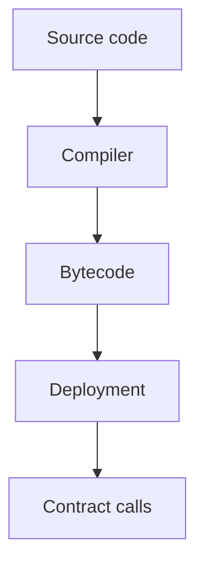

# Solidity and Vyper Basics

## Watch First

<div style={{position: 'relative', paddingBottom: '56.25%', height: 0, overflow: 'hidden', maxWidth: '100%', marginBottom: '1.5rem'}}>
 <iframe
 src="https://www.youtube.com/embed/umepbfKp5rI"
 title="Learn Solidity, Blockchain Development, &amp; Smart Contracts"
 style={{position: 'absolute', top: 0, left: 0, width: '100%', height: '100%', border: 0}}
 allow="accelerometer; autoplay; clipboard-write; encrypted-media; gyroscope; picture-in-picture; web-share"
 referrerPolicy="strict-origin-when-cross-origin"
 allowFullScreen
 />
</div>

## Learning Objectives

By the end of this lesson, you will be able to:

- Explain the role of smart-contract languages in the Ethereum-compatible ecosystem.
- Distinguish between Solidity and Vyper by design philosophy, not just features.
- Map language-level concepts (storage, functions, events) to on-chain execution.
- Use this mental model when you first read or write contracts in labs.

## Concept Map



## Quantitative Lens

Every state-changing call has a cost:

$$
Total\ fee = gasUsed \times gasPrice
$$

## Introduction

Smart contracts are programs that live on the blockchain and define rules, state, and interactions.
**Solidity** and **Vyper** are two languages that target Ethereum-style virtual machines (EVM).
They let you write logic that:

- Reads and updates global state,
- Enforces business rules, and
- Interacts with users through transactions.

In the Flow Research Initiative, you will not need to become an expert in every language detail.
Instead, you need an **engineering-grade intuition** for:

- what these languages *are for*,
- how they fit into the L1/L2 ecosystem, and
- how their design choices shape security and readability.

This lesson focuses on *concepts and trade-offs*, not a language reference.

## What Are Smart-Contract Languages?

A smart-contract language is a domain-specific dialect that:

- Compiles to bytecode for an execution environment (e.g., EVM).
- Exposes a small, opinionated API for interacting with the blockchain (state, messages, gas).
- Enforces certain constraints by design (e.g., gas accounting, visibility, safety).

From an engineer's view, Solidity and Vyper are **tooling choices** that sit on top of the core blockchain model you already learned: L1, L2, consensus, and tokens.

## Why Solidity and Vyper Exist

Ethereum-style chains introduced **programmable blockchains** - not just simple ledgers, but state machines that can run arbitrary logic.

To write that logic:

- Early developers used low-level assembly-style bytecode.
- Higher-level contract languages like Solidity emerged to make this less painful.
- Later, simpler languages like Vyper were created to limit sources of error.

In short:

- **Solidity** is a feature-rich, object-oriented-style language for complex contracts.
- **Vyper** is a minimal, Python-style language focused on clarity and security.

Your choice depends on:

- What the ecosystem supports,
- What the team prefers, and
- What kind of complexity you are comfortable with.

## Solidity at a High Level

Solidity is the most widely used EVM-targeting language. It looks like a mix of JavaScript and Java, but is compiled into EVM bytecode.

### Key Concepts in Solidity

1. **Contracts**
 A `contract` is a unit of code and state that lives at an address on the chain.
 It defines:

 - Storage variables (state),
 - Functions (behavior),
 - Events (logs).

2. **State and Storage**
 Contracts can store data on-chain (e.g., balances, mappings, structs).
 Storage is **expensive** (in gas and latency), so you should design it carefully.

3. **Functions**
 Functions:

 - Can be `view` (read-only) or `pure` (no state access).
 - Can be `public`, `external`, `internal`, or `private`.
 - Are called by transactions or by other contracts.

 Function calls are the **primary interface** between users and on-chain logic.

4. **Modifiers and Events**
 - **Modifiers** let you attach reusable logic to functions (e.g., access control).
 - **Events** emit logs that front-ends and indexers can watch.

5. **Inheritance**
 Solidity supports inheritance and interfaces, which lets you build reusable, modular contract libraries.

### Why Solidity Is Popular

- Huge ecosystem: tooling, tutorials, and libraries.
- Rich feature set for complex protocols.
- Community and standards (e.g., ERC-20, ERC-721).

### Where Solidity Gets Complex

- A large surface area for bugs (e.g., reentrancy, overflow, gas optimization mistakes).
- Syntax and patterns that are unfamiliar to many software engineers.
- A long learning curve for safe, auditable code.

---

## Vyper at a High Level

Vyper is a simpler, Python-style language for writing smart contracts on the EVM. It explicitly trades features for clarity and safety.

### Key Design Principles

- **Simplicity**: fewer language features than Solidity.
- **Security**: avoid constructs that are hard to audit or reason about.
- **Readability**: code that looks more like Python, with explicit control-flow.

### What Vyper Deliberately Avoids

- **Inheritance** - you cannot inherit from other contracts.
- **Overloaded functions** - no multiple functions with the same name.
- **Class-style object orientation** - you write functions and data structures explicitly.

Instead, you compose logic by:

- Using libraries or modules where needed.
- Writing clean, explicit functions.

### Core Vyper Concepts

1. **Contracts and Storage**
 Like Solidity, a Vyper contract defines:

 - State variables (e.g., mappings, balances).
 - Functions that read and modify state.
 - Events that emit logs.

 But the syntax is closer to Python and more restrictive.

2. **Functions and Visibility**
 Functions can be `public` or `private`.
 The model is simpler: "what can external actors call?" and "what is internal?"

3. **Immutability and Upgrades**
 Because Vyper avoids complex inheritance, upgrade patterns often rely on:

 - Proxies or other patterns.
 - Well-defined interfaces that separate logic from storage.

### Why Vyper Appeals to Engineers

- Easier to audit: fewer "hidden" control-flow paths.
- Closer to familiar Python-style thinking.
- Lower barrier to writing reasonably safe code.

### Where Vyper Falls Short

- Smaller ecosystem and tooling.
- Less existing code to reuse.
- Fewer "battle-tested" patterns for very complex protocols.

## Comparing Solidity and Vyper

| Aspect | Solidity | Vyper |
|---------------------|-----------------------------------------------|-----------------------------------------------|
| Language style | Object-oriented, JavaScript-influenced | Procedural, Python-style |
| Complexity | More features, more foot-guns | Fewer features, more opinionated |
| Inheritance | Supports inheritance and interfaces | No inheritance |
| Overloading | Supports function overloading | No overloading |
| Ecosystem | Large, mature, widely used | Smaller, but growing and auditable-focused |
| Best for | Complex protocols with many abstractions | Clarity-focused, security-sensitive contracts |

This is not a "better vs worse" table. It is a **trade-off map** that helps you choose the right language for the kind of system you are designing.

## How This Fits into the Flow Research Initiative

In Flow Research labs and tracks, you will soon:

- Read and write **simple contracts** in Solidity or Vyper.
- See how **state and functions** correspond to on-chain behavior.
- Connect contract logic to **tokens, gas, and L1/L2** primitives.

The key is:

- Use Solidity when you need rich abstractions and ecosystem support.
- Use Vyper when you want maximum clarity and are willing to trade some tooling.

As a Flow Research engineer, your goal is **understanding, not mastery**. You should be able to:

- Read a contract and point to the state, the functions, and the events.
- Map those pieces onto the blockchain model you already know.
- Identify at a high level whether the code is striving for complexity or clarity.

## Implementation Sketch

```solidity
contract Counter {
 uint256 public count;
 function increment() external { count += 1; }
}
```

## Practical Exercises

### Exercise 1: Sketch a Simple Contract Model

Pick a small contract you will see in a Flow Research lab (e.g., a balance-tracking contract):

- Write a short note describing:
 - What state it stores.
 - What functions it exposes.
 - What events it emits.

- Do this once in a "Solidity-style" conceptual model and once in a "Vyper-style" conceptual model (even if you don't write real code yet).

### Exercise 2: Compare Two Approaches

Find two tiny examples (one in Solidity, one in Vyper):

- Identify the same piece of logic in both (e.g., updating a balance).
- Write a short paragraph comparing:
 - How much code each uses.
 - How easy each is for you to read.
 - Where Solidity's features might help or hurt.

### Exercise 3: Relate to a Flow Research Lab

Look at a blockchain lab that mentions or uses Solidity or Vyper:

- Write one sentence describing what the contract is responsible for.
- Write one sentence describing what would change if you switched to the other language.
- Write one sentence describing what you would *not* change in the system.

This helps you see the language as a **style choice** within the larger system.

## Self-Assessment

Rate yourself from 1 to 5:

- I can explain what Solidity and Vyper are used for.
- I can distinguish their main design philosophies.
- I can see where each language is stronger or weaker.
- I can map contract concepts (state, functions, events) onto on-chain execution.

Action item: write a short note in your lab repo describing which language (Solidity or Vyper) you would prefer for a first-time contract and why.

## Further Reading

- [Solidity docs](https://docs.soliditylang.org/)
- [Vyper docs](https://docs.vyperlang.org/)
- [OpenZeppelin Contracts](https://docs.openzeppelin.com/contracts/)
- [Hardhat docs](https://hardhat.org/docs)

## Next Steps

- Read the next lesson in `01-smart-contracts`, such as `02-contract-design-patterns.md`, to see how these languages are used to structure real protocols.
- Use this conceptual model whenever you encounter a new contract-language tutorial or example.
- Treat Solidity and Vyper as **complementary tools** for designing executable rules on the blockchain, not as competing religions.

---

*This lesson gives Flow Research Initiative trainees an engineer-style overview of Solidity and Vyper, focusing on their design philosophies, trade-offs, and how they fit into blockchain-based smart-contract development.*
