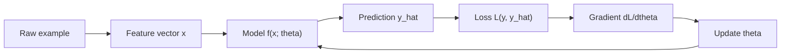

# Math for Machine Learning

## Learning Objectives

By the end of this lesson, you will be able to:

- Explain how vectors, matrices, probability, statistics, and gradients appear in everyday ML work.
- Read simple ML formulas without freezing when you see symbols.
- Connect a dataset, model, prediction, loss, and parameter update into one mental model.
- Write small NumPy examples that make the math concrete.

## Concept Map



Machine learning math is not a separate subject you study before you are allowed to build. It is the compact language engineers use to describe data, models, mistakes, and improvement.

The goal here is not to become a mathematician overnight. The goal is to become comfortable enough that when you see an equation in a paper, notebook, or library doc, you can ask: What is the input? What is being learned? What error is being measured?

:::tip Engineer's Lens
When a formula looks intimidating, label the parts. Most beginner ML equations are about four things: inputs, parameters, predictions, and error.
:::

## The Core Loop

A simple supervised learning workflow can be summarized like this:

```math
\text{data} \rightarrow \text{features} \rightarrow \text{prediction} \rightarrow \text{loss} \rightarrow \text{update}
```

For a linear model:

```math
\hat{y} = w^T x + b
```

- `x` is the feature vector for one example.
- `w` is the weight vector the model learns.
- `b` is a bias term that shifts the prediction.
- `y_hat` is the prediction.

If the true answer is `y`, the model needs a way to measure how wrong it was. A common regression loss is squared error:

```math
L(y, \hat{y}) = (y - \hat{y})^2
```

That number becomes the signal for improvement.

## Vectors: One Example as Numbers

A vector is an ordered list of numbers. In ML, a vector usually represents one example.

Imagine a learner recommendation system with three features:

- hours spent this week,
- quiz average,
- number of lessons completed.

One learner can be represented as:

```math
x = [4.5, 72, 8]
```

In Python:

```python
import numpy as np

learner = np.array([4.5, 72.0, 8.0])
print(learner.shape)
```

The shape is `(3,)`, meaning one vector with three features.

## Matrices: Many Examples Together

A matrix is a grid of numbers. In ML, a dataset is often a matrix where each row is one example and each column is one feature.

```math
X =
\begin{bmatrix}
4.5 & 72 & 8 \\
2.0 & 55 & 3 \\
6.0 & 88 & 11
\end{bmatrix}
```

In Python:

```python
import numpy as np

X = np.array([
    [4.5, 72.0, 8.0],
    [2.0, 55.0, 3.0],
    [6.0, 88.0, 11.0],
])

print(X.shape)  # 3 rows, 3 features
```

This is why NumPy arrays matter so much. Most ML libraries expect data to be shaped clearly.

## Probability: Modeling Uncertainty

ML systems often make uncertain predictions. A classifier might estimate:

```math
P(\text{will complete course} \mid \text{current activity}) = 0.78
```

That does not mean the model knows the future. It means the model assigns a probability based on patterns in the training data.

Probability helps you reason about:

- classification confidence,
- noisy labels,
- sampling,
- uncertainty,
- risk.

In production systems, uncertainty matters. A model used for learner support should not treat a 51 percent prediction with the same confidence as a 99 percent prediction.

## Statistics: Understanding the Data Before the Model

Statistics helps you describe the dataset before you train anything.

Useful summaries include:

- mean: the average value,
- median: the middle value,
- variance: how spread out values are,
- standard deviation: the typical distance from the mean.

```python
import numpy as np

quiz_scores = np.array([40, 55, 72, 88, 91])

print("mean:", quiz_scores.mean())
print("std:", quiz_scores.std())
```

Statistics is where you catch many project risks early. If one training group has a very different distribution from another, your model may learn patterns that do not generalize.

## Calculus: How Models Improve

Calculus enters beginner ML through derivatives and gradients.

A derivative tells you how a function changes when its input changes. In ML, that function is often the loss. The model asks:

```math
\frac{\partial L}{\partial w}
```

Read this as: "How does the loss change if this weight changes?"

Gradient descent uses that answer to update the parameter:

```math
w_{\text{new}} = w_{\text{old}} - \alpha \frac{\partial L}{\partial w}
```

- `alpha` is the learning rate.
- The gradient points toward the direction of steepest increase.
- Subtracting the gradient moves toward lower loss.

You do not need to derive every optimizer by hand today. You do need to understand that training is repeated measurement and adjustment.

## A Tiny End-to-End Example

```python
import numpy as np

# Feature: hours studied
X = np.array([1, 2, 3, 4, 5], dtype=float)

# Label: quiz score
y = np.array([45, 50, 60, 70, 75], dtype=float)

w = 5.0
b = 40.0

y_hat = w * X + b
loss = np.mean((y - y_hat) ** 2)

print("predictions:", y_hat)
print("mean squared error:", loss)
```

This is the whole beginner story in miniature: represent data, compute predictions, measure error.

## Why This Matters for Flow Engineers

Flow engineers will often work in environments where data is incomplete, infrastructure is uneven, and stakeholders need clear explanations. Math gives you the language to explain model behavior without hiding behind "the AI said so."

Use math to answer practical engineering questions:

- Are our features shaped correctly?
- Is the model learning or memorizing?
- Is the loss meaningful for the user problem?
- Are predictions calibrated enough to trust?

## Practical Exercises

### Exercise 1: Turn Profiles Into Vectors

Create three learner records with:

- hours studied,
- quiz average,
- lessons completed.

Write them as a matrix `X` in NumPy and print `X.shape`.

### Exercise 2: Compute a Prediction

Given:

```math
\hat{y} = 3x + 10
```

Compute the prediction for `x = 8`. Then explain what `3` and `10` represent.

### Exercise 3: Measure Error

Write a short Python snippet that computes squared error for:

- prediction: `72`,
- actual value: `80`.

Then change the prediction to `78` and compare the error.

## Self-Assessment

Rate yourself from 1 to 5:

- I can explain the difference between a vector and a matrix.
- I can read `y_hat = w^T x + b` in plain English.
- I understand why loss functions matter.
- I can explain why gradients are used to improve model parameters.

## Further Reading

- [NumPy: the absolute basics for beginners](https://numpy.org/doc/stable/user/absolute_beginners.html)
- [scikit-learn user guide](https://scikit-learn.org/stable/user_guide.html)
- [Matplotlib pyplot tutorial](https://matplotlib.org/stable/tutorials/pyplot.html)

## Next Steps

Next, study data pipelines. Math helps you understand the model, but the pipeline decides whether the model ever sees trustworthy data.
