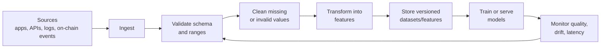

# Data Pipelines Basics

## Learning Objectives

By the end of this lesson, you will be able to:

- Explain what a data pipeline is and why it matters before model training begins.
- Identify the core stages: ingestion, validation, cleaning, transformation, storage, and monitoring.
- Sketch a pipeline for a Flow-style ML product.
- Write small pandas checks that catch broken or suspicious data early.

## Watch First

<div style={{position: 'relative', paddingBottom: '56.25%', height: 0, overflow: 'hidden', maxWidth: '100%', marginBottom: '1.5rem'}}>
  <iframe
    src="https://www.youtube.com/embed/6kEGUCrBEU0"
    title="Data Pipelines Explained"
    style={{position: 'absolute', top: 0, left: 0, width: '100%', height: '100%', border: 0}}
    allow="accelerometer; autoplay; clipboard-write; encrypted-media; gyroscope; picture-in-picture; web-share"
    referrerPolicy="strict-origin-when-cross-origin"
    allowFullScreen
  />
</div>

## Pipeline Map



Machine learning starts long before `model.fit()`. It starts with the system that moves raw observations into data a model can safely learn from.

A data pipeline is that system. It is not just a script that loads a CSV once. It is the repeatable path from the real world to a training set, dashboard, feature store, or model API.

:::info The Launch Rule
If the data path is not reproducible, the model is not launch-ready. You may still have a notebook, but you do not yet have an ML system.
:::

## What a Pipeline Does

A good ML pipeline should:

- collect data from known sources,
- validate that the data matches expected structure,
- clean obvious data quality problems,
- transform raw fields into useful features,
- store outputs in a versioned and accessible way,
- monitor changes after deployment.

In Flow projects, sources might include:

- learner activity from a web app,
- quiz attempts from a mobile client,
- protocol or on-chain events,
- mentor feedback,
- community contribution history.

The model only sees the final features. The pipeline decides whether those features are trustworthy.

## Stage 1: Ingestion

Ingestion is the entry point. Data might arrive from:

- CSV exports,
- application databases,
- REST APIs,
- event streams,
- blockchain indexers,
- manual forms.

At this stage, the engineering questions are practical:

- Did the job run?
- Did every expected source respond?
- Did the schema change?
- Can we retry safely if one source fails?

## Stage 2: Validation

Validation checks whether the data is shaped the way the system expects.

For example, a learner activity table might require:

- `learner_id` is present,
- `quiz_score` is between 0 and 100,
- `lesson_completed` is true or false,
- `event_time` can be parsed as a timestamp.

```python
import pandas as pd

events = pd.DataFrame({
    "learner_id": ["a1", "b2", "c3"],
    "quiz_score": [72, 105, 64],
    "lesson_completed": [True, False, True],
})

invalid_scores = events.loc[
    (events["quiz_score"] < 0) | (events["quiz_score"] > 100)
]

print(invalid_scores)
```

This tiny check catches a score of `105`, which may be a data entry issue, a grading bug, or a changed scoring policy.

## Stage 3: Cleaning

Cleaning turns raw data into usable data. Common steps include:

- handling missing values,
- standardizing date formats,
- removing duplicate events,
- filtering bot-like activity,
- correcting known invalid categories.

Cleaning should be documented as policy, not hidden as notebook improvisation. Future contributors need to know why a row was dropped or changed.

## Stage 4: Transformation and Features

Transformation turns clean records into model-ready features.

Examples:

- `days_since_last_login`,
- `quiz_attempts_last_30_days`,
- `average_score_by_module`,
- `completed_foundations_track`,
- `wallet_activity_count`.

Feature engineering is where domain knowledge enters the system. A public-good education model should not only optimize clicks. It should include signals that match the learning outcome you care about.

```python
events["passed_quiz"] = events["quiz_score"] >= 60
pass_rate = events["passed_quiz"].mean()

print(f"pass rate: {pass_rate:.2%}")
```

## Stage 5: Storage

Storage gives the pipeline memory. Useful outputs include:

- raw snapshots,
- cleaned datasets,
- feature tables,
- model training splits,
- metadata about schema and date ranges.

Versioning matters because you need to answer: Which data produced this model?

Without that answer, debugging becomes guesswork.

## Stage 6: Monitoring

Monitoring asks whether the pipeline is still healthy after launch.

Track:

- missing values,
- unexpected categories,
- row counts,
- freshness,
- latency,
- feature distribution drift.

For example, if most traffic suddenly comes from a new region, language, or device type, the model may see data that differs from training. That does not automatically mean the system is broken, but it does mean engineers should investigate.

```math
\text{drift} = \text{current distribution} - \text{training distribution}
```

## Common Anti-Patterns

### One-Off Scripts

A script that only one person can run is not a pipeline. Turn it into a repeatable job with clear inputs, outputs, and logs.

### No Validation

If you trust incoming data blindly, one changed column name can break training silently.

### No Ownership

Every launch-ready pipeline needs an owner. Someone must know where failures appear, how to retry, and when to alert the team.

## Flow-Style Example

Imagine a learning platform that recommends the next lesson.

The pipeline could be:

1. Ingest lesson events from web and mobile apps.
2. Validate required columns and timestamp formats.
3. Remove duplicate events and impossible quiz scores.
4. Build learner-level features such as average score and recent activity.
5. Store features by date and version.
6. Train a recommender.
7. Monitor feature drift and recommendation quality.

This is not glamorous work, but it is the work that lets ML survive contact with real users.

## Practical Exercises

### Exercise 1: Sketch a Pipeline

Choose one Flow-style use case:

- next lesson recommendation,
- quiz risk detection,
- mentor matching,
- on-chain activity classification.

Draw a 5-stage pipeline from data source to model output.

### Exercise 2: Add Validation

Create a pandas DataFrame with at least one invalid value. Write a validation check that catches it.

### Exercise 3: Define Monitoring

For your pipeline, list three metrics you would monitor after launch.

## Self-Assessment

Rate yourself from 1 to 5:

- I can explain why pipelines matter before modeling.
- I can identify ingestion, validation, cleaning, transformation, storage, and monitoring.
- I can write a small data quality check in pandas.
- I can sketch a launch-ready data path for a beginner ML project.

## Further Reading

- [pandas getting started](https://pandas.pydata.org/docs/getting_started/index.html)
- [pandas user guide](https://pandas.pydata.org/docs/user_guide/index.html)
- [TensorFlow TFX pipelines guide](https://www.tensorflow.org/tfx/guide/understanding_tfx_pipelines)

## Next Steps

Next, study the model lifecycle. A pipeline prepares the data; the lifecycle explains how the model moves from idea to production and maintenance.
