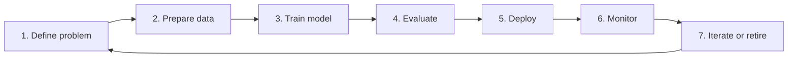

# Model Lifecycle

## Learning Objectives

By the end of this lesson, you will be able to:

- Explain the stages of the ML model lifecycle from problem definition to retirement.
- Connect lifecycle stages to concrete engineering artifacts: datasets, experiments, model files, APIs, dashboards, and alerts.
- Identify common lifecycle failure points before launch.
- Use evaluation and monitoring as ongoing product responsibilities, not one-time notebook tasks.

## Watch First

<div style={{position: 'relative', paddingBottom: '56.25%', height: 0, overflow: 'hidden', maxWidth: '100%', marginBottom: '1.5rem'}}>
  <iframe
    src="https://www.youtube.com/embed/gkmAnu8DtiM"
    title="Lifecycle of a machine learning model"
    style={{position: 'absolute', top: 0, left: 0, width: '100%', height: '100%', border: 0}}
    allow="accelerometer; autoplay; clipboard-write; encrypted-media; gyroscope; picture-in-picture; web-share"
    referrerPolicy="strict-origin-when-cross-origin"
    allowFullScreen
  />
</div>

## Lifecycle Map



Training is only one stage of machine learning. A model that looks good in a notebook still has to survive bad data, slow networks, changed user behavior, deployment constraints, and human trust.

The model lifecycle is the engineering workflow that manages all of that.

:::info Launch Mindset
A model is launch-ready when the team can reproduce it, evaluate it, deploy it, monitor it, and replace it responsibly.
:::

## Stage 1: Define the Problem

Start by writing the problem in product language before model language.

Weak version:

> Train an ML model for learners.

Better version:

> Predict which learners may need support before the next module, so mentors can intervene early.

That second version tells you:

- who the model serves,
- what decision it supports,
- what kind of mistakes matter,
- what data might be useful.

Good problem definition includes:

- target outcome,
- user or stakeholder,
- constraints,
- success metric,
- risks and ethical concerns.

## Stage 2: Prepare Data

Data preparation builds on the pipeline lesson. You decide:

- which raw sources matter,
- which rows are valid,
- which features represent the problem,
- how to split training, validation, and test data.

Use separate data splits so the model is tested on examples it did not learn from.

```python
from sklearn.model_selection import train_test_split

X_train, X_test, y_train, y_test = train_test_split(
    X,
    y,
    test_size=0.2,
    random_state=42,
)
```

The test set is not a decoration. It is your best beginner defense against fooling yourself.

## Stage 3: Train the Model

Training is where an algorithm learns parameters from data.

For a supervised model, the training goal is usually:

```math
\theta^* = \arg\min_{\theta} L(y, f(x; \theta))
```

Read it as: choose the parameters `theta` that minimize the loss between the real answer `y` and the model prediction `f(x; theta)`.

In practice, training includes:

- selecting an algorithm,
- fitting it on training data,
- tracking parameters and metrics,
- saving the trained artifact.

```python
from sklearn.linear_model import LogisticRegression

model = LogisticRegression(max_iter=1000)
model.fit(X_train, y_train)
```

## Stage 4: Evaluate

Evaluation asks whether the model is useful, safe, and reliable enough for the job.

Common metrics include:

- accuracy: overall fraction correct,
- precision: when the model predicts positive, how often it is right,
- recall: how many real positives the model catches,
- RMSE or MAE: regression error,
- latency: how quickly predictions return.

For public-good systems, you should also ask:

- Does performance differ across groups?
- Are false positives or false negatives harmful?
- Can a human understand and override the model?

```python
from sklearn.metrics import accuracy_score, classification_report

y_pred = model.predict(X_test)

print("accuracy:", accuracy_score(y_test, y_pred))
print(classification_report(y_test, y_pred))
```

## Stage 5: Deploy

Deployment makes the model available to users or other systems.

Common patterns:

- batch predictions saved to a dashboard,
- an API that returns predictions on request,
- an embedded model inside a service,
- a scheduled job that retrains and republishes artifacts.

Deployment adds software concerns:

- versioning,
- latency,
- security,
- fallbacks,
- logging,
- rollback.

For a Flow learning platform, a safe fallback might be a rule-based recommendation if the model API is unavailable.

## Stage 6: Monitor

After launch, the world changes. Monitoring tells you when the model is drifting away from reality.

Track:

- data freshness,
- missing values,
- prediction distribution,
- model accuracy when labels arrive,
- latency and error rates,
- drift between training and production features.

```math
\text{model health} = \text{data quality} + \text{prediction quality} + \text{system reliability}
```

Monitoring is not only about charts. It is about deciding what should happen when a chart goes bad.

## Stage 7: Iterate or Retire

Models should not live forever by accident. You may need to:

- retrain with newer data,
- add better features,
- change the model family,
- stop using a model that no longer helps.

Retirement is a real lifecycle stage. Archive the model, record why it was replaced, and update documentation so future engineers understand the decision.

## Common Failure Modes

### Notebook-Only Model

The model works on one laptop but nobody can reproduce the environment, data, or result.

### Leaky Evaluation

Training data leaks into the test set, making metrics look better than real-world performance.

### No Monitoring

The model is deployed, then silently degrades as the data changes.

### No Human Path

The model influences users, but there is no escalation, appeal, or override process.

## Flow-Style Example

Use case: predict learners who may need mentor support.

Lifecycle:

1. Define the goal: identify learners who may stall before the next module.
2. Prepare data: lesson progress, quiz attempts, recent activity, mentor notes.
3. Train: start with logistic regression or a decision tree.
4. Evaluate: recall matters because missing a struggling learner is costly.
5. Deploy: show risk scores in a mentor dashboard.
6. Monitor: track data freshness and false alarms.
7. Iterate: retrain monthly or retire if mentor feedback says the model is not useful.

## Practical Exercises

### Exercise 1: Lifecycle Sketch

Pick a beginner ML idea and write one sentence for each lifecycle stage.

### Exercise 2: Choose Metrics

For a learner-support model, decide whether precision or recall matters more. Explain your tradeoff.

### Exercise 3: Add a Monitoring Plan

List three alerts you would create before launching the model.

## Self-Assessment

Rate yourself from 1 to 5:

- I can explain why training is only one lifecycle stage.
- I can name the artifacts created during a model lifecycle.
- I can identify at least three launch risks.
- I can describe when a model should be retrained or retired.

## Further Reading

- [scikit-learn model selection and evaluation](https://scikit-learn.org/stable/model_selection.html)
- [scikit-learn train_test_split](https://scikit-learn.org/stable/modules/generated/sklearn.model_selection.train_test_split.html)
- [TensorFlow TFX pipelines guide](https://www.tensorflow.org/tfx/guide/understanding_tfx_pipelines)

## Next Steps

Next, move into the tools section. You will use Python, notebooks, and ML libraries to make this lifecycle concrete.
