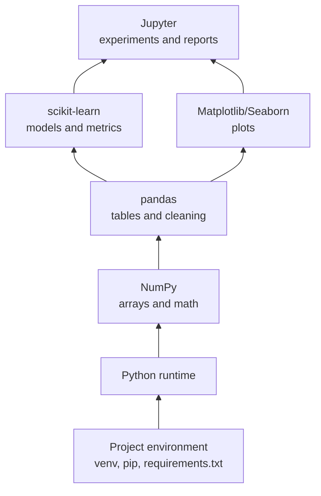

# The Python Ecosystem

## Learning Objectives

By the end of this lesson, you will be able to:

- Explain why Python is the default language for beginner and production ML workflows.
- Identify the roles of NumPy, pandas, scikit-learn, Matplotlib, Jupyter, and environment tools.
- Set up a project environment that can be reproduced by another engineer.
- Run a small end-to-end Python ML sanity check.

## Ecosystem Map



Python became the default ML language because it lets engineers move smoothly between data, math, experimentation, and deployment. The language is readable, the ecosystem is mature, and most ML libraries speak the same basic data structures.

For Flow learners, the goal is not to memorize every library. The goal is to understand what each layer is responsible for, so you can choose the right tool without feeling lost.

:::tip Practical Rule
Treat every ML project as a small software project: isolate dependencies, document how to run it, and keep notebooks reproducible.
:::

## The Base: Python and Environments

Python is the runtime. Your environment is the controlled space where project dependencies live.

Use a virtual environment so one project does not break another.

```powershell
py -m venv .venv
.\.venv\Scripts\Activate.ps1
python -m pip install --upgrade pip
pip install numpy pandas scikit-learn matplotlib seaborn jupyterlab
pip freeze > requirements.txt
```

On macOS or Linux:

```bash
python3 -m venv .venv
source .venv/bin/activate
python -m pip install --upgrade pip
pip install numpy pandas scikit-learn matplotlib seaborn jupyterlab
pip freeze > requirements.txt
```

The important launch habit is that another contributor can recreate your environment.

## NumPy: Arrays and Fast Math

NumPy provides arrays: efficient containers for numerical data.

In ML, a dataset often has shape:

```math
X \in \mathbb{R}^{n \times d}
```

Read this as: `X` is a matrix with `n` examples and `d` features.

```python
import numpy as np

X = np.array([
    [4.5, 72.0, 8.0],
    [2.0, 55.0, 3.0],
    [6.0, 88.0, 11.0],
])

print(X.shape)  # (3, 3)
print(X.mean(axis=0))
```

NumPy is the foundation under many other scientific Python libraries.

## pandas: Tables and Data Cleaning

pandas gives you DataFrames, which are ideal for tabular data from CSV files, spreadsheets, SQL exports, and APIs.

```python
import pandas as pd

learners = pd.DataFrame({
    "learner_id": ["a1", "b2", "c3"],
    "hours": [4.5, 2.0, 6.0],
    "score": [72, 55, 88],
})

learners["passed"] = learners["score"] >= 60
print(learners)
```

Use pandas when you need to:

- inspect rows and columns,
- filter records,
- handle missing values,
- group or aggregate data,
- export cleaned datasets.

## scikit-learn: Classical ML

scikit-learn is the best beginner library for classical ML. It gives you a consistent pattern:

1. create the model,
2. call `fit`,
3. call `predict`,
4. evaluate.

```python
import pandas as pd
from sklearn.linear_model import LinearRegression

data = pd.DataFrame({
    "hours": [1, 2, 3, 4, 5],
    "score": [45, 50, 60, 70, 75],
})

model = LinearRegression()
model.fit(data[["hours"]], data["score"])

prediction = model.predict([[6]])
print(prediction)
```

That pattern repeats across many algorithms.

## Matplotlib and Seaborn: Visual Understanding

Visualization helps you notice structure and errors that are hard to see in tables.

```python
import matplotlib.pyplot as plt

plt.scatter(data["hours"], data["score"])
plt.xlabel("Hours studied")
plt.ylabel("Quiz score")
plt.title("Study time vs quiz score")
plt.show()
```

Use plots to answer:

- Are values clustered?
- Are there outliers?
- Does a relationship look linear?
- Are train and test distributions similar?

## Jupyter: Experiments and Narratives

Jupyter notebooks combine:

- live code,
- Markdown explanation,
- equations,
- plots,
- outputs.

This makes notebooks excellent for exploration and teaching. They are less ideal as the only production artifact. When work matures, move reusable logic into scripts or packages.

## A Minimal Project Shape

For a beginner Flow ML lab, a clean structure could look like this:

```text
ai-ml-lab/
  data/
    raw/
    processed/
  notebooks/
    exploration.ipynb
  src/
    train.py
    features.py
  requirements.txt
  README.md
```

That structure separates exploration from reusable code and makes your work easier to review.

## Common Mistakes

### Installing Packages Globally

This makes projects conflict with each other. Use a virtual environment.

### Keeping All Logic in a Notebook

Notebooks are great for exploration. Shared pipelines and training logic should eventually move into scripts.

### Ignoring Versions

If a project worked on your machine but fails for everyone else, the environment is part of the bug.

## Practical Exercises

### Exercise 1: Create an Environment

Create a `.venv`, install the beginner ML stack, and generate `requirements.txt`.

### Exercise 2: Run a Sanity Check

Run the `LinearRegression` example above and change the input from `6` to `8`.

### Exercise 3: Sketch the Stack

Draw the Python ecosystem map from memory and write one sentence explaining each layer.

## Self-Assessment

Rate yourself from 1 to 5:

- I can explain the role of NumPy, pandas, scikit-learn, Matplotlib, and Jupyter.
- I can create a virtual environment.
- I can run a small ML example.
- I can organize a beginner ML project for review.

## Further Reading

- [Python Packaging User Guide: virtual environments](https://packaging.python.org/guides/installing-using-pip-and-virtualenv/)
- [NumPy absolute beginners guide](https://numpy.org/doc/stable/user/absolute_beginners.html)
- [pandas getting started](https://pandas.pydata.org/docs/getting_started/index.html)
- [scikit-learn user guide](https://scikit-learn.org/stable/user_guide.html)

## Next Steps

Next, use notebooks and visualization to turn this ecosystem into an interactive workflow.
