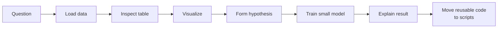

# Notebooks and Visualization

## Learning Objectives

By the end of this lesson, you will be able to:

- Explain how Jupyter notebooks support ML exploration and communication.
- Use Markdown, code, equations, and plots together in one workflow.
- Create basic visualizations for data quality and model behavior.
- Know when to move notebook logic into reusable scripts.

## Watch First

<div style={{position: 'relative', paddingBottom: '56.25%', height: 0, overflow: 'hidden', maxWidth: '100%', marginBottom: '1.5rem'}}>
  <iframe
    src="https://www.youtube.com/embed/KztbY361Kfk"
    title="Jupyter Notebook Tutorial - How to use Jupyter Notebooks"
    style={{position: 'absolute', top: 0, left: 0, width: '100%', height: '100%', border: 0}}
    allow="accelerometer; autoplay; clipboard-write; encrypted-media; gyroscope; picture-in-picture; web-share"
    referrerPolicy="strict-origin-when-cross-origin"
    allowFullScreen
  />
</div>

## Notebook Workflow



Notebooks are interactive documents. They let you mix code, explanation, equations, plots, and outputs in one place.

That makes them powerful for beginner ML because you are not only writing code. You are building understanding.

:::tip Notebook Discipline
A good notebook tells a story: what question you asked, what data you used, what you found, and what you would do next.
:::

## What a Notebook Contains

A Jupyter notebook is made of cells.

- Code cells run Python.
- Markdown cells explain your thinking.
- Output cells show tables, charts, logs, errors, and model results.

Markdown cells can include math:

```math
\hat{y} = w^T x + b
```

That makes notebooks useful for explaining both the "how" and the "why" behind ML work.

## Start With a Clean Setup Cell

The first code cell should import libraries and set basic display behavior.

```python
import numpy as np
import pandas as pd
import matplotlib.pyplot as plt

pd.set_option("display.max_columns", 50)
plt.style.use("default")
```

Keep setup boring and predictable. Future readers should not need to hunt through the notebook to understand what was imported.

## Load and Inspect Data

Before modeling, inspect the dataset.

```python
data = pd.DataFrame({
    "learner_id": ["a1", "b2", "c3", "d4", "e5"],
    "hours": [1.5, 2.0, 3.5, 4.0, 6.0],
    "score": [45, 55, 62, 70, 88],
    "track": ["ai-ml", "ai-ml", "blockchain", "ai-ml", "protocol"],
})

display(data.head())
display(data.describe(include="all"))
```

Ask:

- How many rows and columns are there?
- Which columns are numeric?
- Are there missing values?
- Are the values plausible?

## Visualization as Debugging

Charts are not decoration. They are debugging tools.

### Histogram: Distribution

```python
plt.hist(data["score"], bins=5)
plt.xlabel("Quiz score")
plt.ylabel("Learner count")
plt.title("Distribution of quiz scores")
plt.show()
```

Use a histogram to see whether a numeric column is skewed, clustered, or suspicious.

### Scatter Plot: Relationship

```python
plt.scatter(data["hours"], data["score"])
plt.xlabel("Hours studied")
plt.ylabel("Quiz score")
plt.title("Study time vs quiz score")
plt.show()
```

Use a scatter plot when you want to see how two numeric variables move together.

### Bar Plot: Categories

```python
track_counts = data["track"].value_counts()

track_counts.plot(kind="bar")
plt.xlabel("Track")
plt.ylabel("Learner count")
plt.title("Learners by track")
plt.show()
```

Use a bar plot when categories matter.

## Missing Values and Outliers

Real datasets are often incomplete. Visualize missing values before you choose how to handle them.

```python
missing = data.isna().sum()

missing.plot(kind="bar")
plt.ylabel("Missing values")
plt.title("Missing values per column")
plt.show()
```

For outliers:

```python
plt.boxplot(data["score"], vert=False)
plt.xlabel("Quiz score")
plt.title("Score outlier check")
plt.show()
```

The point is not to delete every unusual value. The point is to notice, investigate, and document your decision.

## Plotting Model Behavior

A simple model result can be easier to understand with a plot.

```python
from sklearn.linear_model import LinearRegression

X = data[["hours"]]
y = data["score"]

model = LinearRegression()
model.fit(X, y)

data["predicted_score"] = model.predict(X)

plt.scatter(data["hours"], data["score"], label="actual")
plt.plot(data["hours"], data["predicted_score"], label="prediction")
plt.xlabel("Hours studied")
plt.ylabel("Quiz score")
plt.title("Actual vs predicted score")
plt.legend()
plt.show()
```

This is a small example, but the habit scales: visualize what the model is doing.

## Good Notebook Habits

Use these habits in Flow labs:

- Put a short goal at the top.
- Run notebooks from top to bottom before sharing.
- Keep file paths relative.
- Use Markdown to explain decisions.
- Avoid hiding important logic in random cells.
- Move reusable code into `src/` when the notebook becomes stable.

## When Notebooks Are Not Enough

Notebooks are excellent for exploration, but production needs more structure.

Move code into scripts when:

- the same function is reused in multiple cells,
- a mentor needs to review it as software,
- the pipeline must run automatically,
- the model will be deployed.

Think of the notebook as the lab bench, not the factory.

## Practical Exercises

### Exercise 1: Create a Visual EDA Notebook

Create a notebook with:

- one setup cell,
- one data loading cell,
- one table inspection cell,
- three plots,
- one Markdown summary.

### Exercise 2: Add an Equation

Add a Markdown cell that explains:

```math
\text{error} = y - \hat{y}
```

Then show a Python cell that computes that error for one prediction.

### Exercise 3: Refactor One Function

Write a cleaning function in your notebook, then move it into a `.py` file and import it back.

## Self-Assessment

Rate yourself from 1 to 5:

- I can explain what notebooks are good for.
- I can make basic plots with Matplotlib.
- I can use visualization to debug data quality.
- I know when notebook code should become reusable source code.

## Further Reading

- [JupyterLab notebooks documentation](https://jupyterlab.readthedocs.io/en/stable/user/notebook.html)
- [Matplotlib pyplot tutorial](https://matplotlib.org/stable/tutorials/pyplot.html)
- [pandas getting started](https://pandas.pydata.org/docs/getting_started/index.html)

## Next Steps

Next, study the ML libraries directly. Notebooks help you explore; libraries give you the building blocks for models, metrics, and data transformations.
