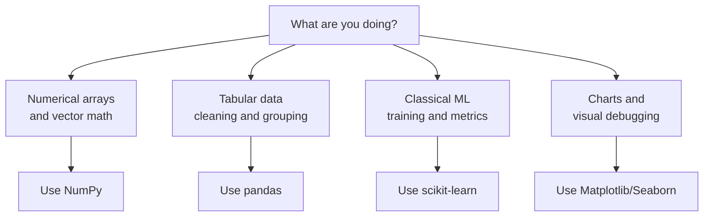
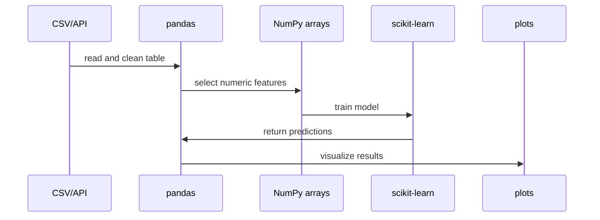

# ML Libraries

## Learning Objectives

By the end of this lesson, you will be able to:

- Choose the right beginner ML library for arrays, tables, models, metrics, and plots.
- Use NumPy, pandas, scikit-learn, and Matplotlib together in one workflow.
- Train and evaluate a small model with working Python code.
- Explain how library choices affect reproducibility and launch readiness.

## Library Selection Map



ML libraries are reusable engineering tools. They save you from writing every algorithm, metric, and data structure from scratch.

The beginner stack is intentionally simple:

- NumPy for arrays and numerical operations,
- pandas for tabular data,
- scikit-learn for classical models and metrics,
- Matplotlib or Seaborn for visualization.

:::info Beginner Promise
You can learn a lot of real ML with this stack before touching deep learning frameworks.
:::

## Install the Stack

Use a virtual environment first, then install:

```bash
pip install numpy pandas scikit-learn matplotlib seaborn
```

In Python, import the libraries with common aliases:

```python
import numpy as np
import pandas as pd
import matplotlib.pyplot as plt

from sklearn.linear_model import LinearRegression
from sklearn.metrics import mean_absolute_error, mean_squared_error
from sklearn.model_selection import train_test_split
```

These aliases are community conventions. Following them makes your code easier for other ML engineers to read.

## NumPy: Arrays

Use NumPy when you need efficient numeric operations.

```python
import numpy as np

scores = np.array([45, 50, 60, 70, 75])

print(scores.mean())
print(scores.std())
print(scores + 5)
```

In ML terms, vectors and matrices often become NumPy arrays:

```math
X =
\begin{bmatrix}
1 & 45 \\
2 & 50 \\
3 & 60
\end{bmatrix}
```

## pandas: Tables

Use pandas when the data has rows and columns.

```python
import pandas as pd

data = pd.DataFrame({
    "hours": [1, 2, 3, 4, 5],
    "score": [45, 50, 60, 70, 75],
})

data["passed"] = data["score"] >= 60
print(data.head())
```

pandas helps you:

- read files,
- select columns,
- filter rows,
- handle missing values,
- compute summary statistics,
- create derived columns.

## scikit-learn: Models and Metrics

scikit-learn gives you a consistent interface for many models.

Most estimators follow:

```python
model.fit(X_train, y_train)
predictions = model.predict(X_test)
```

Here is a complete example:

```python
import pandas as pd

from sklearn.linear_model import LinearRegression
from sklearn.metrics import mean_absolute_error, mean_squared_error
from sklearn.model_selection import train_test_split

data = pd.DataFrame({
    "hours": [1, 2, 3, 4, 5, 6, 7, 8],
    "practice_quizzes": [1, 1, 2, 2, 3, 3, 4, 4],
    "score": [45, 50, 58, 63, 70, 75, 82, 88],
})

X = data[["hours", "practice_quizzes"]]
y = data["score"]

X_train, X_test, y_train, y_test = train_test_split(
    X,
    y,
    test_size=0.25,
    random_state=42,
)

model = LinearRegression()
model.fit(X_train, y_train)

y_pred = model.predict(X_test)

mae = mean_absolute_error(y_test, y_pred)
mse = mean_squared_error(y_test, y_pred)

print("MAE:", mae)
print("MSE:", mse)
```

Two common regression metrics are:

```math
\text{MAE} = \frac{1}{n}\sum_{i=1}^{n}|y_i - \hat{y}_i|
```

```math
\text{MSE} = \frac{1}{n}\sum_{i=1}^{n}(y_i - \hat{y}_i)^2
```

MAE is easier to explain to stakeholders. MSE punishes large errors more strongly.

## Matplotlib and Seaborn: Visual Checks

Use plots to inspect data and model behavior.

```python
plt.scatter(y_test, y_pred)
plt.xlabel("Actual score")
plt.ylabel("Predicted score")
plt.title("Actual vs predicted scores")
plt.show()
```

If predictions are close to actual values, points should roughly follow an upward diagonal pattern.

Seaborn builds on Matplotlib and can make statistical plots faster:

```python
import seaborn as sns

sns.regplot(data=data, x="hours", y="score")
plt.title("Hours studied vs score")
plt.show()
```

## How the Libraries Work Together



This is the beginner workflow you will repeat many times.

## Choosing the Right Tool

| Need | Use | Why |
| --- | --- | --- |
| Fast numeric arrays | NumPy | Efficient vector and matrix operations |
| CSV or spreadsheet-like data | pandas | Easy row and column manipulation |
| Classical ML model | scikit-learn | Consistent `fit` and `predict` interface |
| Basic charts | Matplotlib | Flexible plotting foundation |
| Statistical plots | Seaborn | Faster high-level visualizations |

## Launch-Readiness Habits

Use libraries in a way another engineer can reproduce:

- pin dependencies in `requirements.txt`,
- keep data transformations visible,
- split train and test data,
- log model metrics,
- save plots or reports that explain results,
- move repeated logic out of notebooks.

## Practical Exercises

### Exercise 1: Rebuild the Example

Run the complete regression example. Change `test_size` from `0.25` to `0.5` and observe the metric changes.

### Exercise 2: Add a Feature

Add a new column called `attendance_rate` and include it in `X`. Compare the new MAE to the old MAE.

### Exercise 3: Explain the Stack

For each library, write:

- one sentence describing its job,
- one example of when you would use it,
- one mistake beginners should avoid.

## Self-Assessment

Rate yourself from 1 to 5:

- I can choose the right beginner ML library for a task.
- I can train and evaluate a simple scikit-learn model.
- I can explain MAE and MSE.
- I can create a basic plot to inspect model predictions.

## Further Reading

- [NumPy absolute beginners guide](https://numpy.org/doc/stable/user/absolute_beginners.html)
- [pandas getting started](https://pandas.pydata.org/docs/getting_started/index.html)
- [scikit-learn user guide](https://scikit-learn.org/stable/user_guide.html)
- [Matplotlib pyplot tutorial](https://matplotlib.org/stable/tutorials/pyplot.html)
- [Seaborn tutorial](https://seaborn.pydata.org/tutorial.html)

## Next Steps

You now have the beginner toolkit: math, data pipelines, lifecycle thinking, Python, notebooks, and ML libraries. The next step is applying these tools to supervised learning.
