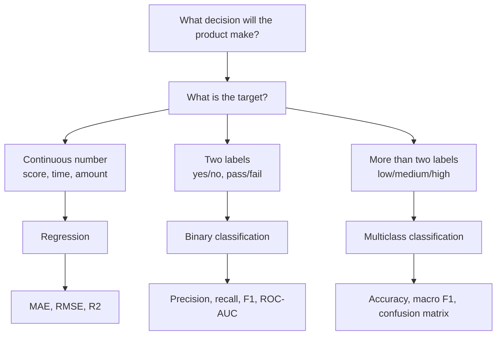
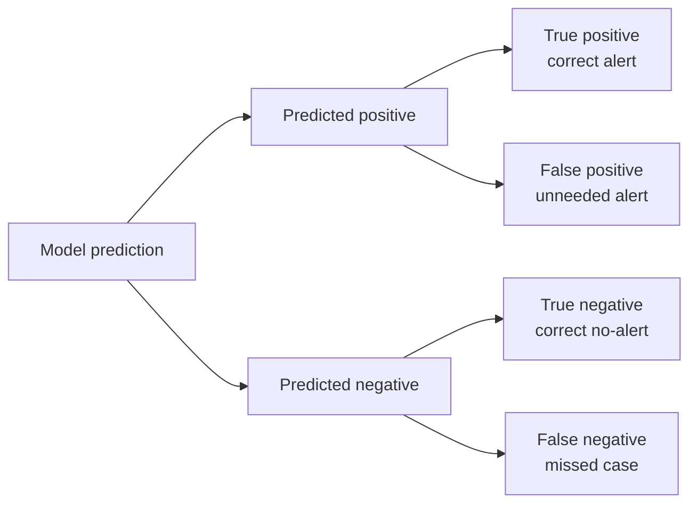

# Regression and Classification

## Learning Objectives

By the end of this lesson, you will be able to:

- Distinguish regression, binary classification, and multiclass classification problems.
- Choose metrics that match the product decision a model will support.
- Train and evaluate baseline regression and classification models with scikit-learn.
- Explain probability thresholds, error tradeoffs, and when the same product question can be framed more than one way.

## Watch First

<div style={{position: 'relative', paddingBottom: '56.25%', height: 0, overflow: 'hidden', maxWidth: '100%', marginBottom: '1.5rem'}}>
  <iframe
    src="https://www.youtube.com/embed/yIYKR4sgzI8"
    title="StatQuest: Logistic Regression"
    style={{position: 'absolute', top: 0, left: 0, width: '100%', height: '100%', border: 0}}
    allow="accelerometer; autoplay; clipboard-write; encrypted-media; gyroscope; picture-in-picture; web-share"
    referrerPolicy="strict-origin-when-cross-origin"
    allowFullScreen
  />
</div>

## Problem Framing Map



Regression and classification are not just algorithm categories. They are ways of translating a real product question into a target a model can learn.

In a Flow-style AI product, you might ask:

- Which learners may need mentor support?
- What completion score should we expect next week?
- Which governance proposals need extra review?
- Which protocol events look unusual?

The modeling decision starts with the target:

| Target shape | ML framing | Example |
| --- | --- | --- |
| Continuous number | Regression | Predict a learner's next quiz score |
| Yes/no label | Binary classification | Predict whether a learner may drop out |
| Multiple labels | Multiclass classification | Predict low, medium, or high engagement |
| Ranked probability | Classification with scores | Rank learners by intervention priority |

:::tip Launch Rule
Start with the decision the model supports, then choose the target and metric. Do not choose a model type first and force the product problem to fit it.
:::

## Regression

Regression predicts a numeric value.

Examples:

- expected quiz score,
- estimated study time,
- monthly active contributors,
- projected protocol transaction volume,
- expected reward amount.

The simplest regression model learns a function:

$$
\hat{y} = f(x)
$$

For linear regression:

$$
\hat{y} = w_1x_1 + w_2x_2 + \dots + w_nx_n + b
$$

The model learns weights that minimize prediction error. A common loss is mean squared error:

$$
MSE = \frac{1}{n}\sum_{i=1}^{n}(y_i - \hat{y}_i)^2
$$

### Baseline Regression Example

This example trains a small regression model on synthetic learner-style data.

```python
import numpy as np
from sklearn.datasets import make_regression
from sklearn.linear_model import LinearRegression
from sklearn.metrics import mean_absolute_error, mean_squared_error, r2_score
from sklearn.model_selection import train_test_split

X, y = make_regression(
    n_samples=300,
    n_features=3,
    noise=12,
    random_state=42,
)

X_train, X_test, y_train, y_test = train_test_split(
    X,
    y,
    test_size=0.2,
    random_state=42,
)

model = LinearRegression()
model.fit(X_train, y_train)

y_pred = model.predict(X_test)
rmse = np.sqrt(mean_squared_error(y_test, y_pred))

print("MAE:", mean_absolute_error(y_test, y_pred))
print("RMSE:", rmse)
print("R2:", r2_score(y_test, y_pred))
```

### Regression Metrics

Use metrics that match how people will use the prediction.

| Metric | Meaning | Use when |
| --- | --- | --- |
| MAE | Average absolute error in target units | Stakeholders need a readable error |
| RMSE | Squared-error penalty, then square root | Large mistakes are especially costly |
| R2 | Share of variance explained | You want a high-level fit measure |

For example, "average score error is 4.8 points" is easier for a mentor to understand than "MSE is 23.04".

## Classification

Classification predicts labels. A binary classifier often returns a probability:

$$
p(y=1 \mid x) = \sigma(w^Tx + b)
$$

where the sigmoid function is:

$$
\sigma(z) = \frac{1}{1 + e^{-z}}
$$

The model can convert that probability into a label using a threshold:

$$
\hat{y} =
\begin{cases}
1 & \text{if } p \geq t \\
0 & \text{if } p < t
\end{cases}
$$

The threshold `t` is a product decision, not only a math detail.

### Baseline Classification Example

```python
from sklearn.datasets import make_classification
from sklearn.linear_model import LogisticRegression
from sklearn.metrics import classification_report, confusion_matrix
from sklearn.model_selection import train_test_split

X, y = make_classification(
    n_samples=300,
    n_features=4,
    n_informative=3,
    n_redundant=0,
    class_sep=1.2,
    random_state=42,
)

X_train, X_test, y_train, y_test = train_test_split(
    X,
    y,
    test_size=0.2,
    random_state=42,
    stratify=y,
)

classifier = LogisticRegression(max_iter=1000)
classifier.fit(X_train, y_train)

y_pred = classifier.predict(X_test)

print(confusion_matrix(y_test, y_pred))
print(classification_report(y_test, y_pred))
```

### Classification Error Map



In a learner-support model:

- A false positive may waste mentor time.
- A false negative may miss a learner who needed help.

That tradeoff decides whether precision, recall, or F1 matters most.

| Metric | Question it answers |
| --- | --- |
| Accuracy | How often is the model correct overall? |
| Precision | When the model raises an alert, how often is it right? |
| Recall | Of all real cases, how many did the model catch? |
| F1 | What is the balance between precision and recall? |
| ROC-AUC | How well does the model rank positives above negatives? |

## Same Problem, Different Framing

The same product idea can often be framed multiple ways.

| Product question | Regression framing | Classification framing |
| --- | --- | --- |
| Learner support | Predict dropout risk score from 0 to 100 | Predict support-needed yes/no |
| Governance quality | Predict proposal health score | Predict review-needed yes/no |
| Course progress | Predict next score | Predict low/medium/high progress |

Choose regression when:

- the numeric value itself matters,
- stakeholders can act on magnitude,
- ranking or forecasting is the core use case.

Choose classification when:

- the product needs a discrete decision,
- actions are label-based,
- precision/recall tradeoffs matter.

## Threshold Tuning

The default threshold for binary classification is often `0.5`, but that is not always best.

```python
from sklearn.metrics import precision_score, recall_score

probabilities = classifier.predict_proba(X_test)[:, 1]

for threshold in [0.3, 0.5, 0.7]:
    custom_pred = (probabilities >= threshold).astype(int)
    precision = precision_score(y_test, custom_pred)
    recall = recall_score(y_test, custom_pred)
    print(threshold, "precision:", precision, "recall:", recall)
```

Lowering the threshold usually catches more positives but creates more false alarms. Raising it usually reduces false alarms but misses more positives.

For public-good ML systems, threshold choice should be documented because it encodes a policy preference.

## Common Mistakes

### Optimizing the Wrong Metric

Accuracy can look good when the positive class is rare. If only 5% of learners drop out, a model that predicts "no dropout" for everyone is 95% accurate and still useless.

### Treating Probabilities as Certainty

A probability of `0.72` is not a fact. It is a model estimate and should be used with uncertainty in mind.

### Hiding the Product Tradeoff

False positives and false negatives have different costs. Make the tradeoff explicit with stakeholders before launch.

## Practical Exercises

### Exercise 1: Frame the Same Problem Twice

Choose a Flow-style problem and write:

- one regression framing,
- one classification framing,
- one metric for each.

### Exercise 2: Train Both Baselines

Use the two code examples above. Change the dataset sizes, noise, and class separation. Observe how the metrics change.

### Exercise 3: Tune a Threshold

Train a classifier, compute probabilities, and compare precision and recall at thresholds `0.2`, `0.5`, and `0.8`.

## Self-Assessment

Rate yourself from 1 to 5:

- I can identify whether a target is regression or classification.
- I can choose a metric based on product consequences.
- I can train baseline scikit-learn models for both problem types.
- I can explain why threshold choice matters.

## Further Reading

- [scikit-learn supervised learning](https://scikit-learn.org/stable/supervised_learning.html)
- [scikit-learn model evaluation](https://scikit-learn.org/stable/modules/model_evaluation.html)
- [IBM: Classification vs. regression](https://www.ibm.com/think/topics/classification-vs-regression)
- [StatQuest: Linear Regression, Clearly Explained](https://www.youtube.com/watch?v=7ArmBVF2dCs)

## Next Steps

Next, study feature engineering. Better targets and metrics help you frame the problem; better features help the model learn the signal.
