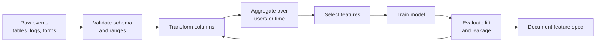
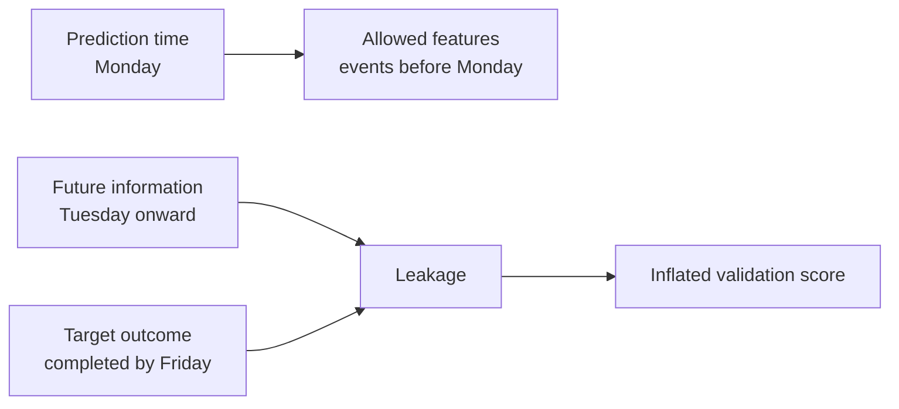

# Feature Engineering

## Learning Objectives

By the end of this lesson, you will be able to:

- Explain feature engineering as the design of model inputs, not just data cleaning.
- Apply scaling, encoding, time features, aggregations, interactions, and binning.
- Build a reusable scikit-learn preprocessing pipeline.
- Detect feature leakage before it produces misleading evaluation results.

## Watch First

<div style={{position: 'relative', paddingBottom: '56.25%', height: 0, overflow: 'hidden', maxWidth: '100%', marginBottom: '1.5rem'}}>
  <iframe
    src="https://www.youtube.com/embed/3gfhbXt9TcQ"
    title="Discussing All The Types Of Feature Transformation In Machine Learning"
    style={{position: 'absolute', top: 0, left: 0, width: '100%', height: '100%', border: 0}}
    allow="accelerometer; autoplay; clipboard-write; encrypted-media; gyroscope; picture-in-picture; web-share"
    referrerPolicy="strict-origin-when-cross-origin"
    allowFullScreen
  />
</div>

## Feature Design Loop



Models do not see reality. They see features.

Feature engineering is the process of choosing, transforming, and combining data so a model can learn useful patterns. In practice, strong features often matter more than a more complicated algorithm.

:::tip Launch Rule
A feature is launch-ready when it is reproducible, available at prediction time, documented, and tested for leakage.
:::

## What Counts as a Feature?

A feature is any input column or derived value the model receives.

For a learning platform, raw data might include:

- quiz attempts,
- lesson views,
- timestamps,
- selected track,
- mentor notes,
- contribution events.

Engineered features might include:

- average quiz score in the last 14 days,
- days since last lesson,
- number of completed modules,
- weekend activity ratio,
- selected track encoded as indicator columns,
- interaction between study time and quiz attempts.

## Scaling Numeric Features

Some models are sensitive to feature scale. Linear models, distance-based methods, and gradient-based methods often behave better when numeric features have comparable ranges.

Standardization converts a value into a z-score:

$$
z = \frac{x - \mu}{\sigma}
$$

where `mu` is the feature mean and `sigma` is the standard deviation.

Min-max scaling maps values into a fixed range:

$$
x_{scaled} = \frac{x - x_{min}}{x_{max} - x_{min}}
$$

```python
import pandas as pd
from sklearn.preprocessing import MinMaxScaler, StandardScaler

data = pd.DataFrame({
    "hours_studied": [1.5, 2.0, 3.5, 6.0],
    "quiz_score": [45, 55, 72, 88],
})

standard = StandardScaler()
standardized = standard.fit_transform(data)

minmax = MinMaxScaler()
scaled_0_1 = minmax.fit_transform(data)

print(standardized)
print(scaled_0_1)
```

## Encoding Categorical Features

Models need numbers, but many useful signals are categories.

Use one-hot encoding for unordered categories:

```python
import pandas as pd

data = pd.DataFrame({
    "track": ["ai-ml", "blockchain", "ai-ml", "protocol"],
    "role": ["learner", "mentor", "learner", "builder"],
})

encoded = pd.get_dummies(data, columns=["track", "role"])
print(encoded)
```

Use ordinal encoding only when the order is real. For example, `low < medium < high` can be ordinal. Country, track, or user role should not be treated as ordered numbers.

## Time-Based Features

Raw timestamps are rarely model-ready. Turn them into features that express behavior.

```python
import pandas as pd

events = pd.DataFrame({
    "learner_id": ["a1", "a1", "b2", "c3"],
    "timestamp": pd.to_datetime([
        "2026-04-01 09:00",
        "2026-04-04 18:30",
        "2026-04-05 10:00",
        "2026-04-07 21:15",
    ]),
})

events["day_of_week"] = events["timestamp"].dt.dayofweek
events["hour"] = events["timestamp"].dt.hour
events["is_weekend"] = events["day_of_week"].isin([5, 6]).astype(int)

print(events)
```

Useful time features include:

- hour of day,
- day of week,
- weekend flag,
- days since last activity,
- count of actions in the last 7 or 30 days,
- rolling average score.

## Aggregation Features

Many ML products start with event-level data but need user-level predictions. Aggregation turns many rows into one row per entity.

```python
events = pd.DataFrame({
    "learner_id": ["a1", "a1", "b2", "b2", "b2"],
    "quiz_score": [70, 82, 55, 60, 68],
    "lesson_id": ["l1", "l2", "l1", "l2", "l3"],
    "minutes_spent": [25, 32, 15, 18, 21],
})

user_features = (
    events
    .groupby("learner_id")
    .agg(
        avg_score=("quiz_score", "mean"),
        lessons_attempted=("lesson_id", "nunique"),
        total_minutes=("minutes_spent", "sum"),
    )
    .reset_index()
)

print(user_features)
```

These features are often more predictive than raw event rows because they describe behavior over a useful window.

## Interaction and Polynomial Features

Sometimes the signal lives in a relationship between columns.

For example:

$$
\text{study_efficiency} = \frac{\text{quiz_score}}{\text{hours_studied}}
$$

or:

$$
x_{interaction} = x_1 \times x_2
$$

```python
data = pd.DataFrame({
    "hours_studied": [2, 4, 5],
    "quiz_score": [60, 78, 81],
    "mentor_sessions": [0, 1, 2],
})

data["score_per_hour"] = data["quiz_score"] / data["hours_studied"]
data["study_x_mentor"] = data["hours_studied"] * data["mentor_sessions"]

print(data)
```

Use interactions when a domain hypothesis supports them. Creating hundreds of random interactions can overfit.

## Binning and Bucketing

Binning converts continuous values into categories.

```python
data = pd.DataFrame({"score": [38, 55, 72, 91]})

bins = [0, 50, 75, 100]
labels = ["needs_support", "on_track", "advanced"]

data["score_band"] = pd.cut(
    data["score"],
    bins=bins,
    labels=labels,
    include_lowest=True,
)

print(data)
```

Use bins when:

- stakeholders need readable groups,
- the relationship is not smooth,
- a policy threshold already exists.

## Reusable Preprocessing Pipeline

For launch-ready work, avoid one-off notebook transformations. Put feature logic into a reusable pipeline.

```python
import pandas as pd
from sklearn.compose import ColumnTransformer
from sklearn.linear_model import LogisticRegression
from sklearn.pipeline import Pipeline
from sklearn.preprocessing import OneHotEncoder, StandardScaler

data = pd.DataFrame({
    "hours_studied": [2, 4, 1, 6, 5],
    "quiz_score": [60, 78, 45, 88, 74],
    "track": ["ai-ml", "ai-ml", "blockchain", "protocol", "ai-ml"],
    "completed": [0, 1, 0, 1, 1],
})

X = data[["hours_studied", "quiz_score", "track"]]
y = data["completed"]

numeric_features = ["hours_studied", "quiz_score"]
categorical_features = ["track"]

preprocess = ColumnTransformer(
    transformers=[
        ("num", StandardScaler(), numeric_features),
        ("cat", OneHotEncoder(handle_unknown="ignore"), categorical_features),
    ]
)

model = Pipeline(
    steps=[
        ("preprocess", preprocess),
        ("classifier", LogisticRegression()),
    ]
)

model.fit(X, y)
print(model.predict(X))
```

The pipeline keeps transformations and model training together, which reduces training-serving skew.

## Leakage Check

Feature leakage happens when the model receives information that would not be available at prediction time.



Examples of leakage:

- using "final course score" to predict course completion,
- using events after the prediction timestamp,
- computing global aggregates using the test set,
- encoding a target-like status into a feature.

Ask this question for every feature:

> Could the system know this value at the moment it makes the prediction?

If the answer is no, remove or rewrite the feature.

## Practical Exercises

### Exercise 1: Build a Feature Spec

Choose a learner-support or protocol-health model. Write a feature spec with:

- feature name,
- source table,
- transformation,
- prediction-time availability,
- reason it may help.

### Exercise 2: Add Aggregations

Create event-level sample data and produce one row per learner or contributor with at least three aggregate features.

### Exercise 3: Leakage Review

List ten candidate features for a model. Mark each as safe, risky, or leaking. Rewrite the risky ones.

## Self-Assessment

Rate yourself from 1 to 5:

- I can explain why feature engineering matters.
- I can apply scaling, encoding, time, aggregation, interaction, and binning features.
- I can create a scikit-learn preprocessing pipeline.
- I can identify feature leakage.

## Further Reading

- [scikit-learn preprocessing](https://scikit-learn.org/stable/modules/preprocessing.html)
- [scikit-learn ColumnTransformer](https://scikit-learn.org/stable/modules/compose.html#column-transformer)
- [pandas groupby user guide](https://pandas.pydata.org/docs/user_guide/groupby.html)

## Next Steps

Next, study hyperparameter tuning. Feature engineering shapes what the model sees; tuning controls how the model learns from those features.
