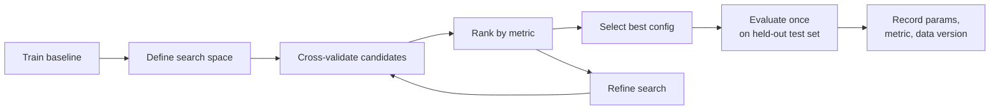
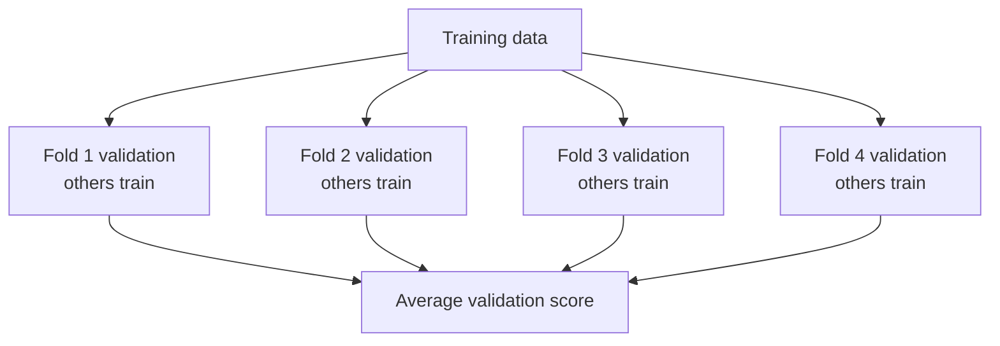

# Hyperparameter Tuning

## Learning Objectives

By the end of this lesson, you will be able to:

- Distinguish learned model parameters from engineer-chosen hyperparameters.
- Use cross-validation to compare hyperparameter settings fairly.
- Apply `GridSearchCV` and `RandomizedSearchCV` in scikit-learn.
- Set a tuning budget and avoid over-optimizing a weak dataset or noisy target.

## Watch First

<div style={{position: 'relative', paddingBottom: '56.25%', height: 0, overflow: 'hidden', maxWidth: '100%', marginBottom: '1.5rem'}}>
  <iframe
    src="https://www.youtube.com/embed/DTcfH5W6o08"
    title="Hyperparameter Tuning - GridSearchCV and RandomizedSearchCV"
    style={{position: 'absolute', top: 0, left: 0, width: '100%', height: '100%', border: 0}}
    allow="accelerometer; autoplay; clipboard-write; encrypted-media; gyroscope; picture-in-picture; web-share"
    referrerPolicy="strict-origin-when-cross-origin"
    allowFullScreen
  />
</div>

## Tuning Loop



After you choose a model family and feature set, tuning controls how the model learns.

Hyperparameter tuning is not magic. It is a disciplined search over model settings, measured by validation performance.

:::tip Launch Rule
Keep the test set untouched until the final evaluation. If the search repeatedly looks at the test set, the test set becomes part of training.
:::

## Parameters vs. Hyperparameters

| Concept | Chosen by | Example |
| --- | --- | --- |
| Parameter | The learning algorithm | Linear regression weights |
| Hyperparameter | The engineer before training | Tree depth, regularization strength, number of trees |

For a model with hyperparameters `h`, tuning tries to solve:

$$
h^* = \arg\max_{h \in H} score(model_h, validation\ data)
$$

In plain language: try candidate settings from a search space `H`, then choose the one with the best validation score.

## What to Tune First

Tune a small number of influential hyperparameters first.

| Model family | Good first hyperparameters |
| --- | --- |
| Logistic regression | `C`, `penalty`, `class_weight` |
| Ridge/Lasso | `alpha` |
| Decision tree | `max_depth`, `min_samples_leaf` |
| Random forest | `n_estimators`, `max_depth`, `max_features`, `min_samples_leaf` |
| Gradient boosting | `learning_rate`, `n_estimators`, `max_depth`, `subsample` |

Avoid trying everything at once. Each added hyperparameter expands the search.

## Cross-Validation

Cross-validation estimates performance by training and validating on multiple folds.



For `k` folds:

$$
CV\ Score = \frac{1}{k}\sum_{i=1}^{k} score_i
$$

Cross-validation reduces the chance that one lucky split chooses a bad configuration.

## Grid Search

Grid search tries every combination in a predefined grid.

```python
from sklearn.datasets import make_classification
from sklearn.ensemble import RandomForestClassifier
from sklearn.metrics import classification_report
from sklearn.model_selection import GridSearchCV, train_test_split

X, y = make_classification(
    n_samples=600,
    n_features=8,
    n_informative=5,
    random_state=42,
)

X_train, X_test, y_train, y_test = train_test_split(
    X,
    y,
    test_size=0.2,
    random_state=42,
    stratify=y,
)

model = RandomForestClassifier(random_state=42)

param_grid = {
    "n_estimators": [50, 100, 200],
    "max_depth": [None, 5, 10],
    "min_samples_leaf": [1, 3, 5],
}

search = GridSearchCV(
    estimator=model,
    param_grid=param_grid,
    scoring="f1",
    cv=5,
    n_jobs=-1,
)

search.fit(X_train, y_train)

print("Best params:", search.best_params_)
print("Best CV score:", search.best_score_)

y_pred = search.best_estimator_.predict(X_test)
print(classification_report(y_test, y_pred))
```

Grid search is clear and exhaustive inside the grid, but the number of runs grows quickly:

$$
\text{runs} = \prod_{j=1}^{m} values_j \times folds
$$

In the example above:

$$
3 \times 3 \times 3 \times 5 = 135
$$

training runs.

## Random Search

Random search samples combinations from distributions. It is often better when the search space is large or only a few hyperparameters matter.

```python
from scipy.stats import randint
from sklearn.model_selection import RandomizedSearchCV

param_dist = {
    "n_estimators": randint(50, 300),
    "max_depth": randint(3, 20),
    "min_samples_leaf": randint(1, 10),
}

random_search = RandomizedSearchCV(
    estimator=RandomForestClassifier(random_state=42),
    param_distributions=param_dist,
    n_iter=25,
    scoring="f1",
    cv=5,
    random_state=42,
    n_jobs=-1,
)

random_search.fit(X_train, y_train)

print("Best params:", random_search.best_params_)
print("Best CV score:", random_search.best_score_)
```

Random search is useful when:

- you want a fixed compute budget,
- the grid would be too large,
- you are exploring ranges rather than exact known values.

## Choosing the Scoring Metric

Your tuning metric should match the product risk.

| Problem | Better tuning metric |
| --- | --- |
| Balanced classification | `accuracy`, `f1` |
| Rare positive class | `recall`, `precision`, `f1`, `roc_auc` |
| Multi-class classification | `f1_macro`, `accuracy` |
| Regression with readable errors | `neg_mean_absolute_error` |
| Regression where large errors are costly | `neg_root_mean_squared_error` |

scikit-learn uses "higher is better" scoring. That is why some regression losses are named with `neg_`.

## Tuning With Pipelines

When preprocessing is part of the model, tune the whole pipeline so cross-validation applies transformations correctly inside each fold.

```python
import pandas as pd
from sklearn.compose import ColumnTransformer
from sklearn.linear_model import LogisticRegression
from sklearn.pipeline import Pipeline
from sklearn.preprocessing import OneHotEncoder, StandardScaler

data = pd.DataFrame({
    "hours": [1, 2, 3, 5, 8, 13, 21, 3, 7, 11],
    "score": [42, 55, 61, 68, 81, 91, 96, 62, 76, 84],
    "track": ["ai-ml", "ai-ml", "blockchain", "protocol", "ai-ml",
              "protocol", "ai-ml", "blockchain", "protocol", "ai-ml"],
    "completed": [0, 0, 0, 1, 1, 1, 1, 0, 1, 1],
})

X = data[["hours", "score", "track"]]
y = data["completed"]

preprocess = ColumnTransformer(
    transformers=[
        ("num", StandardScaler(), ["hours", "score"]),
        ("cat", OneHotEncoder(handle_unknown="ignore"), ["track"]),
    ]
)

pipeline = Pipeline(
    steps=[
        ("preprocess", preprocess),
        ("model", LogisticRegression(max_iter=1000)),
    ]
)

param_grid = {
    "model__C": [0.1, 1.0, 10.0],
    "model__class_weight": [None, "balanced"],
}

search = GridSearchCV(pipeline, param_grid=param_grid, cv=3, scoring="f1")
search.fit(X, y)

print(search.best_params_)
```

Notice the `model__C` syntax. It tells scikit-learn to tune the `C` parameter inside the pipeline step named `model`.

## When to Stop Tuning

Stop tuning when:

- validation gains are tiny,
- the search is slower than the value it adds,
- the model is still limited by poor data quality,
- results are unstable across folds,
- a simpler model is easier to deploy and explain.

Tuning can improve a good setup. It cannot rescue a badly framed target, leaking features, or missing labels.

## Practical Exercises

### Exercise 1: Tune a Baseline

Train a default random forest. Then run `GridSearchCV` with three hyperparameters and compare test performance.

### Exercise 2: Compare Search Strategies

Use the same model and dataset:

- one `GridSearchCV`,
- one `RandomizedSearchCV`,
- similar total number of candidates.

Compare time, best score, and best parameters.

### Exercise 3: Write a Tuning Budget

Before tuning your next model, write:

- metric to optimize,
- max number of training runs,
- max wall-clock time,
- minimum acceptable improvement over baseline.

## Self-Assessment

Rate yourself from 1 to 5:

- I can explain parameters vs. hyperparameters.
- I can use cross-validation during tuning.
- I can run grid search and random search.
- I can decide when further tuning is not worth it.

## Further Reading

- [scikit-learn grid search and randomized search](https://scikit-learn.org/stable/modules/grid_search.html)
- [scikit-learn model evaluation scoring](https://scikit-learn.org/stable/modules/model_evaluation.html#scoring-parameter)
- [Google Cloud: Hyperparameter tuning overview](https://docs.cloud.google.com/vertex-ai/docs/training/hyperparameter-tuning-overview)

## Next Steps

Next, move into MLOps. Tuning helps you choose a better model configuration; CI/CD helps you promote it safely and reproducibly.
