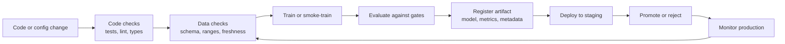
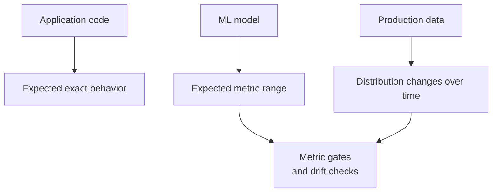
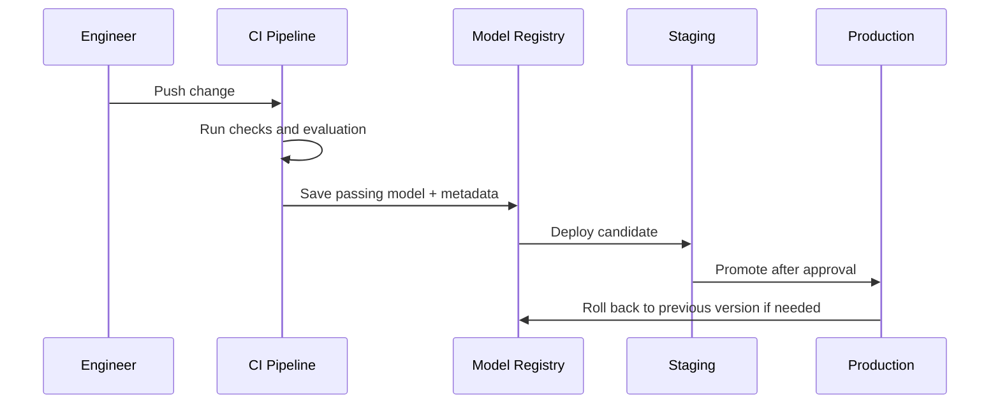

# CI/CD for Models

## Learning Objectives

By the end of this lesson, you will be able to:

- Explain how CI/CD changes when the artifact is a model, not only application code.
- Identify model pipeline stages: code checks, data validation, training, evaluation, registry, and deployment gates.
- Write a local model-quality gate that can fail a build.
- Sketch a lightweight CI/CD workflow for a Flow-style ML service.

## Watch First

<div style={{position: 'relative', paddingBottom: '56.25%', height: 0, overflow: 'hidden', maxWidth: '100%', marginBottom: '1.5rem'}}>
  <iframe
    src="https://www.youtube.com/embed/6X8BqtmXoVo"
    title="Introduction to CI/CD in MLOps"
    style={{position: 'absolute', top: 0, left: 0, width: '100%', height: '100%', border: 0}}
    allow="accelerometer; autoplay; clipboard-write; encrypted-media; gyroscope; picture-in-picture; web-share"
    referrerPolicy="strict-origin-when-cross-origin"
    allowFullScreen
  />
</div>

## Model Delivery Pipeline



Traditional CI/CD answers: "Can this software change be built, tested, and released safely?"

CI/CD for models adds another question: "Can this trained artifact be trusted enough to serve real decisions?"

That means ML delivery must track:

- code,
- data,
- feature definitions,
- training configuration,
- model artifact,
- evaluation metrics,
- deployment state.

:::tip Launch Rule
A model is not release-ready just because training completed. It needs reproducible inputs, recorded metadata, evaluation gates, and a rollback path.
:::

## CI, CD, and CT

| Practice | Meaning in ML |
| --- | --- |
| Continuous Integration | Validate code, data contracts, feature logic, and training scripts on each change |
| Continuous Delivery | Package and stage a model artifact after checks pass |
| Continuous Deployment | Automatically serve a passing model without manual approval |
| Continuous Training | Trigger retraining when data, schedule, or drift rules say it is needed |

Many learning projects do not need full continuous deployment. A small team can still use the discipline:

- run repeatable checks,
- record what produced the model,
- promote models intentionally,
- keep previous versions available.

## What Makes ML CI/CD Different?

Software tests usually check deterministic behavior. ML checks often evaluate statistical behavior.



An ML pipeline must account for:

- data schema changes,
- missing or delayed labels,
- random training variation,
- metric tradeoffs,
- model versioning,
- training-serving skew,
- silent failure after deployment.

## Minimal Artifact Set

Every promoted model should carry enough metadata to answer "what is this?"

| Artifact | Example |
| --- | --- |
| Model file | `model_2026_04_29.joblib` |
| Training commit | Git SHA |
| Dataset version | Snapshot date, query ID, data hash |
| Feature spec | Feature names and transformations |
| Hyperparameters | JSON config |
| Metrics | F1, recall, MAE, latency |
| Evaluation split | Train/validation/test policy |
| Owner notes | Why this model was promoted |

This is the lightweight version of a model registry.

## Data and Feature Checks

Before training, validate the data.

```python
import pandas as pd

REQUIRED_COLUMNS = {
    "learner_id",
    "hours_studied",
    "quiz_score",
    "completed",
}

def validate_training_data(data: pd.DataFrame) -> None:
    missing_columns = REQUIRED_COLUMNS - set(data.columns)
    if missing_columns:
        raise ValueError(f"Missing columns: {sorted(missing_columns)}")

    if data["learner_id"].isna().any():
        raise ValueError("learner_id contains nulls")

    if not data["quiz_score"].between(0, 100).all():
        raise ValueError("quiz_score must be between 0 and 100")

    if not set(data["completed"].unique()).issubset({0, 1}):
        raise ValueError("completed must be binary: 0 or 1")


sample = pd.DataFrame({
    "learner_id": ["a1", "b2", "c3"],
    "hours_studied": [2.0, 4.5, 1.0],
    "quiz_score": [60, 82, 49],
    "completed": [0, 1, 0],
})

validate_training_data(sample)
print("data checks passed")
```

These checks are small, but they catch problems before they become mysterious model failures.

## Evaluation Gates

After training, use a gate. A gate is a rule that determines whether a model is allowed to move forward.

For a classifier:

$$
promote =
\begin{cases}
true & \text{if } F1 \geq 0.75 \text{ and recall } \geq 0.70 \\
false & \text{otherwise}
\end{cases}
$$

For a regression model, you might require:

$$
MAE_{new} \leq MAE_{current} + \epsilon
$$

That allows a small tolerance while preventing major regressions.

```python
from sklearn.metrics import f1_score, recall_score

def check_classifier_gate(y_true, y_pred) -> None:
    f1 = f1_score(y_true, y_pred)
    recall = recall_score(y_true, y_pred)

    print({"f1": f1, "recall": recall})

    if f1 < 0.75 or recall < 0.70:
        raise SystemExit("model gate failed")

    print("model gate passed")
```

In CI, a non-zero exit code fails the job.

## Local CI Script Pattern

You can start without a cloud platform. A local script can still behave like CI.

```python
# ci_model.py
import pandas as pd
from sklearn.linear_model import LogisticRegression
from sklearn.metrics import f1_score, recall_score
from sklearn.model_selection import train_test_split

REQUIRED_COLUMNS = {
    "learner_id",
    "hours_studied",
    "quiz_score",
    "completed",
}

def validate_training_data(data: pd.DataFrame) -> None:
    missing_columns = REQUIRED_COLUMNS - set(data.columns)
    if missing_columns:
        raise ValueError(f"Missing columns: {sorted(missing_columns)}")

    if not data["quiz_score"].between(0, 100).all():
        raise ValueError("quiz_score must be between 0 and 100")

data = pd.read_csv("training_data.csv")
validate_training_data(data)

X = data[["hours_studied", "quiz_score"]]
y = data["completed"]

X_train, X_test, y_train, y_test = train_test_split(
    X,
    y,
    test_size=0.2,
    random_state=42,
    stratify=y,
)

model = LogisticRegression(max_iter=1000)
model.fit(X_train, y_train)

y_pred = model.predict(X_test)
f1 = f1_score(y_test, y_pred)
recall = recall_score(y_test, y_pred)

print({"f1": f1, "recall": recall})

if f1 < 0.75 or recall < 0.70:
    raise SystemExit("model quality gate failed")
```

Run it locally:

```bash
python ci_model.py
```

The same script can later run in GitHub Actions, GitLab CI, Jenkins, or another CI system.

## Example CI Workflow

This is a minimal GitHub Actions shape. Adapt paths to your own project.

```yaml
name: model-ci

on:
  pull_request:
  push:
    branches: [main]

jobs:
  model-checks:
    runs-on: ubuntu-latest
    steps:
      - uses: actions/checkout@v4
      - uses: actions/setup-python@v5
        with:
          python-version: "3.11"
      - run: pip install -r requirements.txt
      - run: python -m pytest
      - run: python ci_model.py
```

Keep CI fast. Full retraining can run on a schedule or after manual approval if the dataset is large.

## Promotion and Rollback

A good promotion flow is explicit.



Rollback is easier when the previous model is still registered and deployable.

## Common Anti-Patterns

### No-Op CI

A green job that only prints "OK" is not protecting the project.

### Full Training on Every Pull Request

Expensive training in every PR slows the team. Use smoke training in CI and full training on schedule or after approval.

### Overwriting `model.pkl`

If every model has the same filename and no metadata, you cannot reproduce or roll back safely.

### Promoting on One Metric Alone

One metric rarely captures the full product risk. Combine performance, data quality, latency, and fairness checks where relevant.

## Practical Exercises

### Exercise 1: Sketch a Pipeline

Choose a model project and draw its CI/CD stages from pull request to production.

### Exercise 2: Add a Data Gate

Write a validation function that checks required columns, missing values, and target range.

### Exercise 3: Add a Model Gate

Write a script that trains a small model and exits with failure if the metric is below a threshold.

## Self-Assessment

Rate yourself from 1 to 5:

- I can explain CI/CD for models.
- I can identify ML-specific checks beyond normal software tests.
- I can write a simple data or metric gate.
- I can describe how model registration and rollback work.

## Further Reading

- [Google Cloud: MLOps continuous delivery and automation pipelines](https://cloud.google.com/architecture/mlops-continuous-delivery-and-automation-pipelines-in-machine-learning)
- [GitHub Actions documentation](https://docs.github.com/en/actions)
- [scikit-learn model persistence](https://scikit-learn.org/stable/model_persistence.html)

## Next Steps

Next, study monitoring and drift. CI/CD helps you ship a model; monitoring tells you whether it keeps working after launch.
