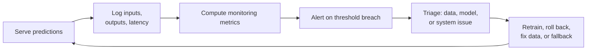
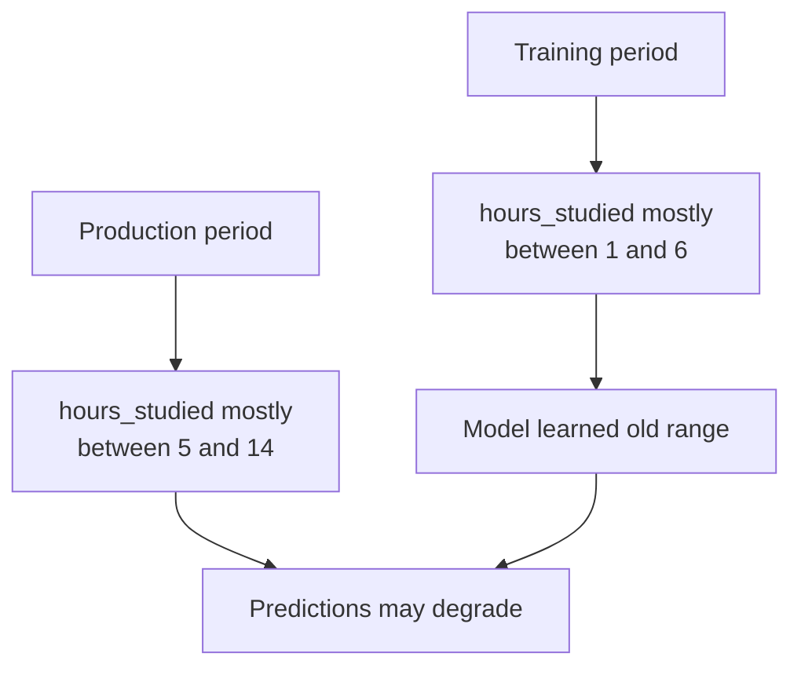
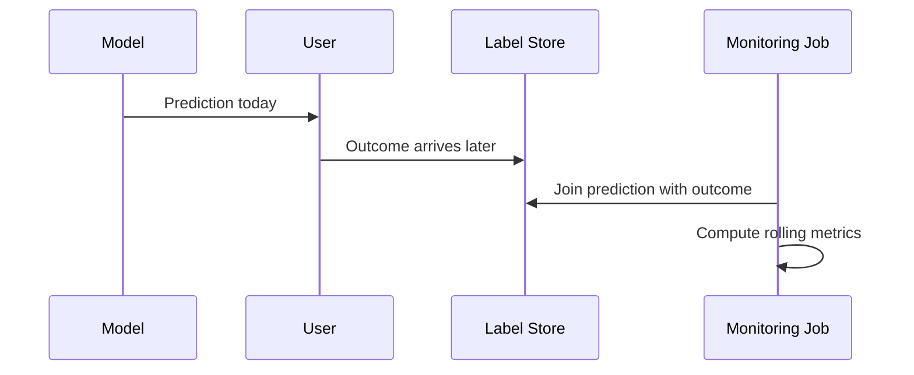
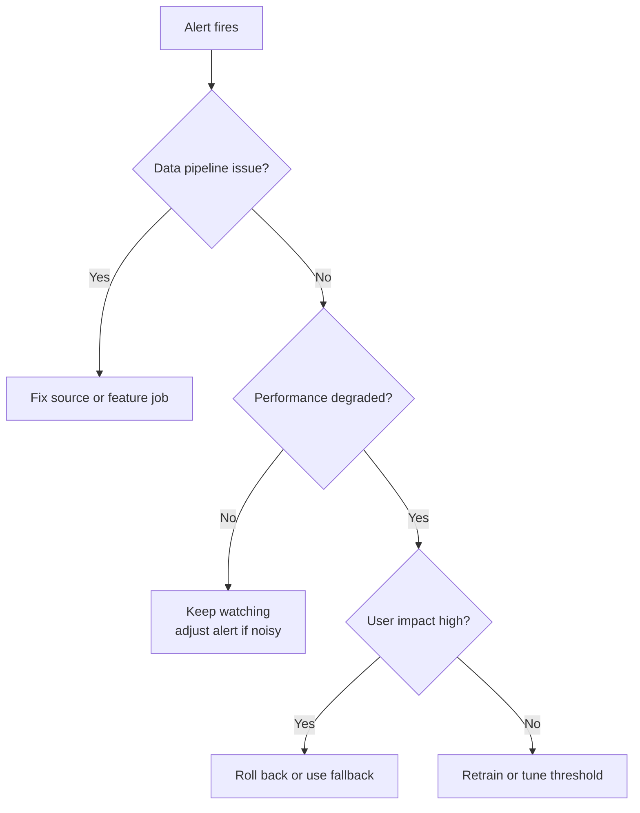

# Monitoring and Drift

## Learning Objectives

By the end of this lesson, you will be able to:

- Explain why deployed models need monitoring after release.
- Distinguish data drift, label drift, and concept drift.
- Track input, prediction, performance, and system metrics.
- Implement a simple drift check and decide when to investigate, retrain, roll back, or add a fallback.

## Watch First

<div style={{position: 'relative', paddingBottom: '56.25%', height: 0, overflow: 'hidden', maxWidth: '100%', marginBottom: '1.5rem'}}>
  <iframe
    src="https://www.youtube.com/embed/QJTRNxUxmuc"
    title="Machine Learning Model Drift - Concept Drift and Data Drift"
    style={{position: 'absolute', top: 0, left: 0, width: '100%', height: '100%', border: 0}}
    allow="accelerometer; autoplay; clipboard-write; encrypted-media; gyroscope; picture-in-picture; web-share"
    referrerPolicy="strict-origin-when-cross-origin"
    allowFullScreen
  />
</div>

## Monitoring Loop



A model can pass every offline test and still fail after launch. Production data changes, labels arrive late, user behavior shifts, and systems break.

Monitoring is how you notice before users or stakeholders notice for you.

:::warning Launch Rule
Do not launch a model without knowing what you will monitor, who receives alerts, and what action happens when an alert fires.
:::

## What to Monitor

Monitor four layers.

| Layer | Examples | Why it matters |
| --- | --- | --- |
| Data inputs | missing values, ranges, schema, feature distributions | The model depends on feature quality |
| Predictions | score distribution, class balance, confidence, outliers | Silent behavior changes often show up here first |
| Performance | accuracy, recall, F1, MAE, calibration | Confirms whether predictions still match reality |
| System health | latency, errors, throughput, timeouts | A correct model is still useless if the service fails |

For public-good ML systems, add group-level monitoring where relevant. A model can look healthy overall while becoming worse for a subgroup.

## Drift Types

### Data Drift

Data drift means the input distribution changes.

$$
P_{train}(X) \neq P_{prod}(X)
$$

Example: a learning platform redesign changes how learners navigate lessons, so `time_on_page` and `video_watch_rate` shift.

### Label Drift

Label drift means the target distribution changes.

$$
P_{train}(Y) \neq P_{prod}(Y)
$$

Example: a new mentorship program reduces dropout rate, so the positive class becomes rarer.

### Concept Drift

Concept drift means the relationship between inputs and target changes.

$$
P_{train}(Y \mid X) \neq P_{prod}(Y \mid X)
$$

Example: high activity used to predict completion, but after a curriculum change, many learners browse widely without completing modules. The same input behavior no longer means the same outcome.

## Drift Illustration



Drift is not automatically bad. It is a signal that the model may be seeing a different world than the one it learned from.

## Simple Drift Check With PSI

Population Stability Index (PSI) compares two distributions. It is common in risk and monitoring workflows.

For bins `i`:

$$
PSI = \sum_i (p_i - q_i)\ln\left(\frac{p_i}{q_i}\right)
$$

where `p` is the reference distribution and `q` is the current distribution.

```python
import numpy as np

def population_stability_index(reference, current, bins=10):
    reference = np.asarray(reference)
    current = np.asarray(current)

    edges = np.percentile(reference, np.linspace(0, 100, bins + 1))
    edges = np.unique(edges)

    ref_counts, _ = np.histogram(reference, bins=edges)
    cur_counts, _ = np.histogram(current, bins=edges)

    ref_pct = ref_counts / max(ref_counts.sum(), 1)
    cur_pct = cur_counts / max(cur_counts.sum(), 1)

    eps = 1e-6
    ref_pct = np.clip(ref_pct, eps, None)
    cur_pct = np.clip(cur_pct, eps, None)

    return np.sum((ref_pct - cur_pct) * np.log(ref_pct / cur_pct))


rng = np.random.default_rng(42)
training_hours = rng.normal(loc=4, scale=1.0, size=500)
production_hours = rng.normal(loc=6, scale=1.4, size=500)

psi = population_stability_index(training_hours, production_hours)
print("PSI:", round(psi, 3))

if psi > 0.2:
    print("Investigate drift")
```

Do not treat PSI thresholds as universal truth. Use them as alert triggers that start investigation.

## Prediction Monitoring

Sometimes labels arrive late, so you cannot immediately measure accuracy. You can still track prediction behavior.

```python
import pandas as pd

predictions = pd.DataFrame({
    "date": pd.to_datetime([
        "2026-04-01", "2026-04-01", "2026-04-02", "2026-04-02",
        "2026-04-03", "2026-04-03",
    ]),
    "risk_score": [0.22, 0.31, 0.28, 0.35, 0.71, 0.76],
})

daily = (
    predictions
    .groupby("date")
    .agg(
        avg_risk=("risk_score", "mean"),
        high_risk_rate=("risk_score", lambda s: (s >= 0.7).mean()),
    )
)

print(daily)
```

A sudden jump in high-risk predictions may indicate:

- a real behavior change,
- a broken feature pipeline,
- a model-serving bug,
- a changed upstream product flow.

## Monitoring With Delayed Labels

Many ML systems receive ground truth days or weeks later.



When labels arrive, compute rolling performance:

- daily or weekly recall,
- precision by cohort,
- calibration by score band,
- regression MAE by segment.

## Alert Design

Good alerts are specific and actionable.

| Signal | Example alert | Likely first action |
| --- | --- | --- |
| Missing values | `quiz_score_missing_rate > 5%` | Check upstream logging |
| Data drift | `hours_studied_psi > 0.2` | Compare product or pipeline changes |
| Prediction shift | `high_risk_rate doubled in one day` | Inspect recent feature values |
| Performance drop | `weekly_recall < 0.70` | Review labels, retrain, or adjust threshold |
| Latency | `p95_latency > 300ms` | Inspect service and infrastructure |

Avoid vague alerts like "model bad". A useful alert says what changed, by how much, and where to look first.

## Response Playbook



Possible actions:

- investigate upstream data,
- retrain on recent labels,
- update features,
- change threshold,
- roll back to previous model,
- disable the model and use a rule-based fallback.

## Practical Exercises

### Exercise 1: Monitoring Plan

Pick a model and list:

- three input metrics,
- two prediction metrics,
- one performance metric,
- one system metric.

For each metric, write an alert threshold and first response.

### Exercise 2: Simulate Drift

Use the PSI function above. Generate a training distribution and a shifted production distribution. Change the shift until the alert fires.

### Exercise 3: Delayed Labels

Create a table of predictions and a later table of labels. Join them and compute weekly recall.

## Self-Assessment

Rate yourself from 1 to 5:

- I can explain why models fail silently.
- I can distinguish data, label, and concept drift.
- I can write a simple drift check.
- I can describe when to retrain, roll back, or fallback.

## Further Reading

- [Google Cloud: MLOps continuous delivery and automation pipelines](https://cloud.google.com/architecture/mlops-continuous-delivery-and-automation-pipelines-in-machine-learning)
- [Evidently: ML monitoring concepts](https://docs.evidentlyai.com/)
- [scikit-learn model evaluation](https://scikit-learn.org/stable/modules/model_evaluation.html)

## Next Steps

Next, study deployment patterns. Monitoring tells you whether a served model remains healthy; deployment patterns decide how that model is served in the first place.
