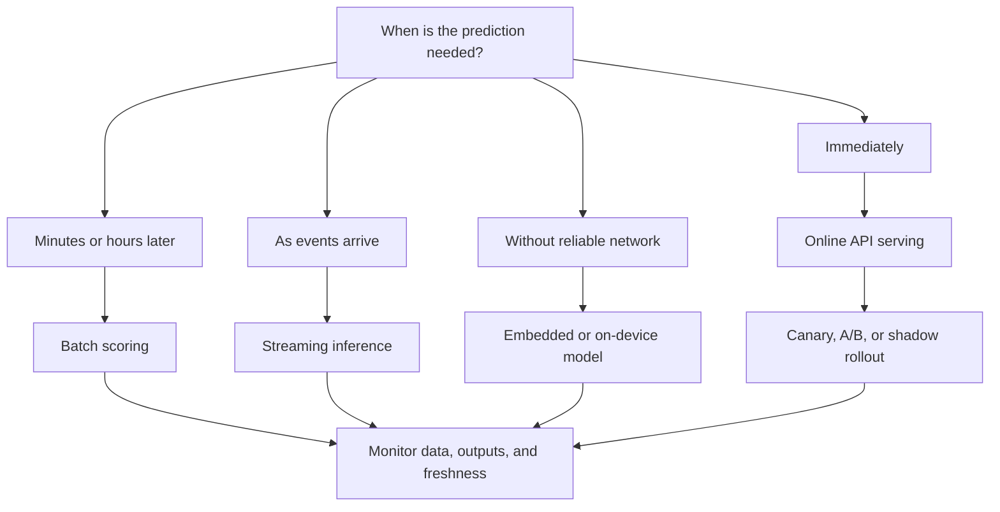
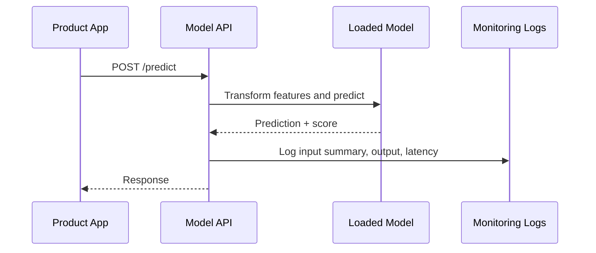
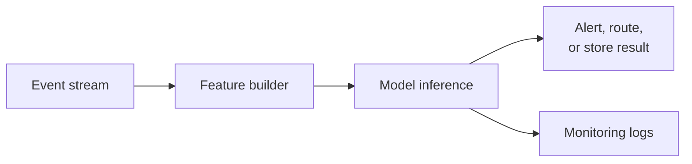
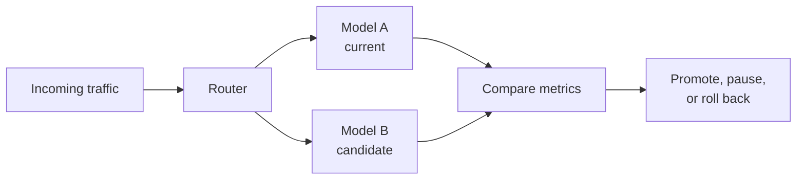
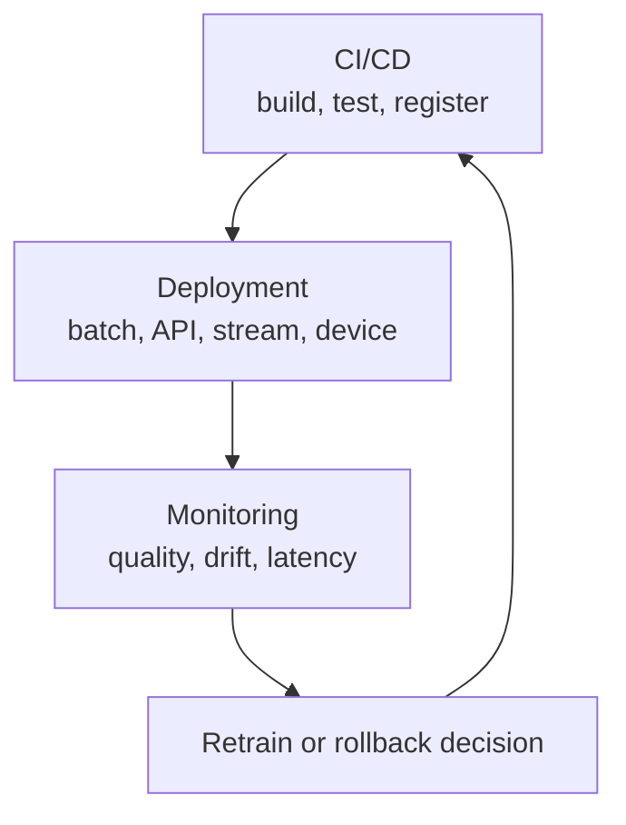

# Deployment Patterns

## Learning Objectives

By the end of this lesson, you will be able to:

- Compare batch scoring, online APIs, streaming inference, embedded models, and staged rollout patterns.
- Choose a deployment pattern based on latency, cost, freshness, privacy, and operational complexity.
- Sketch a model-serving architecture that connects to CI/CD and monitoring.
- Implement minimal batch and FastAPI-style serving examples.

## Watch First

<div style={{position: 'relative', paddingBottom: '56.25%', height: 0, overflow: 'hidden', maxWidth: '100%', marginBottom: '1.5rem'}}>
  <iframe
    src="https://www.youtube.com/embed/x57vAQdBohQ"
    title="Deploy Machine Learning Models with FastAPI and Docker"
    style={{position: 'absolute', top: 0, left: 0, width: '100%', height: '100%', border: 0}}
    allow="accelerometer; autoplay; clipboard-write; encrypted-media; gyroscope; picture-in-picture; web-share"
    referrerPolicy="strict-origin-when-cross-origin"
    allowFullScreen
  />
</div>

## Deployment Decision Map



Training produces a model artifact. Deployment makes that artifact useful.

The best deployment pattern depends on the product constraint:

- How fresh must predictions be?
- How much latency can users tolerate?
- Where does the data live?
- How often does the model change?
- Can the system fall back if the model is unavailable?

:::tip Launch Rule
Choose the simplest deployment pattern that satisfies the product need. Real-time serving is powerful, but it is not automatically better than batch scoring.
:::

## Pattern 1: Batch Scoring

Batch scoring runs predictions on many records at once and stores the results.

Use batch when:

- latency is not urgent,
- predictions feed dashboards or scheduled workflows,
- cost matters more than real-time freshness,
- you want simpler operations.

Examples:

- nightly learner-risk list for mentors,
- weekly protocol-health report,
- daily recommendation refresh,
- monthly contribution scoring.

```python
import joblib
import pandas as pd

model = joblib.load("model_latest.joblib")

data = pd.read_csv("learners_to_score.csv")
X = data[["hours_studied", "quiz_score"]]

data["risk_score"] = model.predict_proba(X)[:, 1]
data.to_csv("scored_learners.csv", index=False)
```

Batch deployments still need monitoring:

- Did the job run?
- Were all records scored?
- Did the input schema match?
- Did the prediction distribution shift?

## Pattern 2: Online API Serving

Online serving exposes the model through an API.

Use online serving when:

- a product needs a prediction during a user request,
- each request is small,
- prediction freshness matters,
- latency requirements are clear.

Architecture:



Minimal FastAPI example:

```python
# app.py
import joblib
import numpy as np
from fastapi import FastAPI
from pydantic import BaseModel

app = FastAPI()
model = joblib.load("model_latest.joblib")

class LearnerFeatures(BaseModel):
    hours_studied: float
    quiz_score: float

@app.post("/predict")
def predict(features: LearnerFeatures):
    X = np.array([[features.hours_studied, features.quiz_score]])
    score = model.predict_proba(X)[0, 1]
    return {
        "risk_score": float(score),
        "needs_support": bool(score >= 0.7),
    }
```

Run locally:

```bash
uvicorn app:app --reload
```

Online serving adds operational concerns:

- request validation,
- authentication,
- rate limiting,
- logging,
- latency,
- rollback,
- dependency management.

## Pattern 3: Streaming Inference

Streaming inference scores events as they arrive.

Use streaming when:

- event freshness is important,
- actions depend on near-real-time signals,
- records arrive continuously.

Examples:

- suspicious protocol event detection,
- live recommendation updates,
- real-time learner intervention triggers.



Streaming is more complex than batch. Start here only when the product really needs it.

## Pattern 4: Embedded or On-Device Models

Embedded models run inside a mobile app, browser, desktop app, or edge device.

Use embedded deployment when:

- connectivity is unreliable,
- data should stay on-device,
- latency must be very low,
- the model is small enough to ship with the app.

Tradeoffs:

| Benefit | Cost |
| --- | --- |
| Works offline | Harder to update |
| Low latency | Harder to monitor |
| Better privacy | Model size constraints |
| Fewer server calls | Version fragmentation |

Examples:

- offline learner recommendations in a mobile app,
- local content quality checks,
- lightweight ranking in a browser.

## Pattern 5: Canary, A/B, and Shadow Deployment

Staged rollouts reduce risk when replacing a model.



| Pattern | How it works | Use when |
| --- | --- | --- |
| Canary | Send a small percentage to the new model | You want a cautious rollout |
| A/B test | Split users into variants and compare outcomes | You need product-level evidence |
| Shadow | Run the new model silently without affecting users | You want safety checks before exposure |

Shadow deployment is especially useful when mistakes could affect people. The new model sees real traffic, but its predictions are logged, not acted on.

## Choosing a Pattern

| Requirement | Strong candidate |
| --- | --- |
| Dashboard updated daily | Batch |
| User waits for prediction in product flow | Online API |
| Event must be handled immediately | Streaming |
| Offline or privacy-sensitive app | Embedded |
| Replacing a risky model | Canary, A/B, or shadow |

Latency targets should be written as service-level objectives.

For example:

$$
P(\text{latency} \leq 200ms) \geq 0.95
$$

That means at least 95% of predictions should return within 200 milliseconds.

## Connecting Deployment to CI/CD and Monitoring

A launch-ready deployment connects three systems.



Before launch, document:

- model version,
- deployment pattern,
- input contract,
- output contract,
- fallback behavior,
- monitoring metrics,
- rollback procedure,
- owner.

## Practical Exercises

### Exercise 1: Choose a Pattern

Pick one model idea and choose a deployment pattern. Explain why not the other patterns.

### Exercise 2: Build Batch Scoring

Train a small classifier, save it with `joblib`, then write a batch script that scores a CSV.

### Exercise 3: Build a Minimal API

Wrap the same model in FastAPI. Return both a probability and a decision threshold.

### Exercise 4: Design a Rollout

Write a canary or shadow deployment plan for a model that influences learner support.

## Self-Assessment

Rate yourself from 1 to 5:

- I can compare batch, online, streaming, embedded, and staged rollout patterns.
- I can choose a deployment pattern based on product constraints.
- I can sketch a model-serving architecture.
- I can connect deployment to CI/CD, monitoring, and rollback.

## Further Reading

- [FastAPI first steps](https://fastapi.tiangolo.com/tutorial/first-steps/)
- [scikit-learn model persistence](https://scikit-learn.org/stable/model_persistence.html)
- [Google Cloud: MLOps continuous delivery and automation pipelines](https://cloud.google.com/architecture/mlops-continuous-delivery-and-automation-pipelines-in-machine-learning)

## Next Steps

Next, combine the intermediate ideas: frame the problem, engineer features, tune the model, ship it through CI/CD, monitor it, and deploy it using the simplest pattern that serves the product well.
