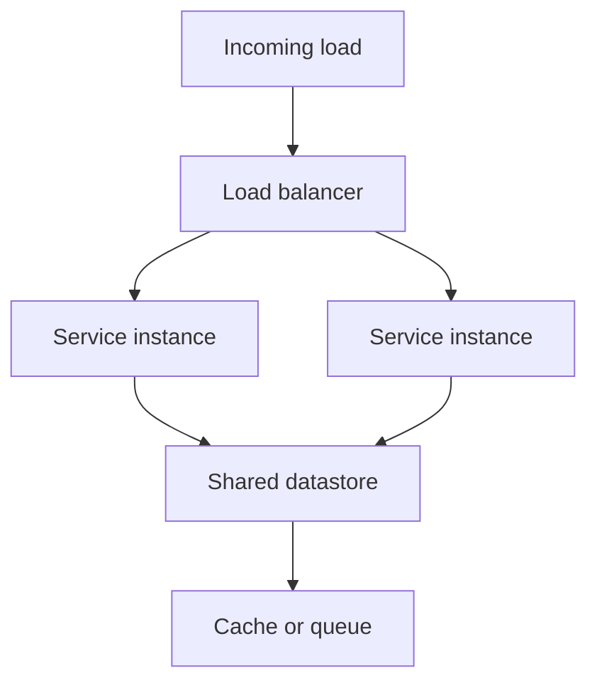

# Scaling Design

## Watch First

<div style={{position: 'relative', paddingBottom: '56.25%', height: 0, overflow: 'hidden', maxWidth: '100%', marginBottom: '1.5rem'}}>
 <iframe
 src="https://www.youtube.com/embed/b4ZbVba7fZA"
 title="Scalability and Load Balancing"
 style={{position: 'absolute', top: 0, left: 0, width: '100%', height: '100%', border: 0}}
 allow="accelerometer; autoplay; clipboard-write; encrypted-media; gyroscope; picture-in-picture; web-share"
 referrerPolicy="strict-origin-when-cross-origin"
 allowFullScreen
 />
</div>

## Learning Objectives

By the end of this lesson, you will be able to:

- Explain the difference between **vertical** and **horizontal scaling** and why protocols are usually designed for the latter.
- Identify common **scaling bottlenecks** in protocol-style systems (e.g., state, consensus, or event-processing).
- Sketch simple **scaling patterns** (replication, partitioning, sharding, and batching) for Flow Research-style protocols.
- Connect scaling design to **deployment-pattern** and **MLOps** concerns in the larger Flow Research-style stack.

## Concept Map



## Quantitative Lens

Utilization is the first pressure gauge:

$$
\rho = \frac{\lambda}{\mu}
$$

When arrival rate $\lambda$ approaches service rate $\mu$, queues and tail latency rise quickly.

## Introduction

So far you have:

- specified your protocol,
- tested compatibility between implementations,
- and modeled state-based behavior.

Now you must ask:

> "How does this protocol behave **when the number of users, nodes, or events grows by 10x, 100x, or 1000x?**"

This is **scaling design**. It is not about raw performance tuning; it is about **architectural choices** that determine how easily your protocol can grow.

In Flow Research-style systems, good scaling design lets you:

- add more learners, proposals, votes, or ML-based events
- without collapsing the core protocol into a brittle, centralized bottleneck.

---

## Vertical vs Horizontal Scaling

Two main scaling strategies:

- **Vertical scaling** (scale-up): make a single node **more powerful** (more CPU, RAM, storage).
- **Horizontal scaling** (scale-out): add **more nodes** and distribute the load across them.

For protocols and distributed systems:

- **Horizontal scaling** is usually preferred because it:

 - improves **fault tolerance** (if one node fails, others continue),
 - and lets you grow **incrementally**.

Vertical scaling hits **physical limits** and can become a **single-point-of-failure**.

Flow Research-style takeaway:

- design your protocol to **assume multiple nodes** from the start, even if you deploy one node at first.

---

## Key Scaling Patterns

### 1. Replication

**Replication** means keeping **multiple copies** of the same data or service to:

- increase **availability** and
- distribute **read load**.

Examples:

- multiple **read-replicas** for a governance-state database.
- several **dashboard nodes** that all read from the same protocol layer.

Protocols can use replication by:

- specifying **which nodes may read** (e.g., dashboard, analytics, governance-tool)
- without changing the **write protocol**.

### 2. Partitioning (Sharding)

**Partitioning** (or **sharding**) splits data or work across **many nodes**, so each node only handles a **subset**.

For example:

- hash learners or proposals by `id` into different partitions.
- each partition is handled by a dedicated set of nodes.

Challenges:

- **cross-partition operations** (e.g., global statistics) become more complex.
- you must carefully choose **keys** and **boundaries**.

For Flow Research-style systems:

- you can shard by:

 - learner cohort,
 - governance community,
 - or region.

This keeps individual nodes from becoming overloaded.

### 3. Batching and Aggregation

Some protocols can:

- **batch** many small operations into fewer, larger ones, or
- **aggregate** events over time.

Examples:

- batch many reward-updates into a single state update.
- aggregate learner-activity events into periodic reports instead of real-time streams.

Benefits:

- reduces **message overhead** and
- amortizes **consensus or storage cost**.

Trade-off:

- introduces **latency**; events are not immediately visible.

Flow Research-style balance:

- use **batching** for cheaper, non-critical updates,
- keep **immediate updates** for critical flows (e.g., proposal approval).

### 4. State-Minimization and Stateless Design

The more **state** a protocol must coordinate and store, the harder it is to scale.

To reduce state:

- prefer **stateless or minimal-state** operations where possible (e.g., idempotent writes, event-source log instead of mutable state).
- offload heavy state to **separate services or databases** governed by simpler protocols.

For example:

- store proposals in a DB and only keep **lightweight state** (e.g., current state, vote tallies) in the core protocol nodes.

---

## Bottlenecks in Protocol-Style Systems

When designing for scale, watch for these common bottlenecks:

### 1. State Synchronization

- Every time nodes must **synchronize global state** (e.g., governance-state, ledger), you hit:

 - network overhead,
 - storage pressure, and
 - latency.

Mitigations:

- partition or shard the state,
- or move to **event-driven, append-only** logs with replay-based state reconstruction.

### 2. Consensus and Coordination

- Protocols that require **heavy coordination** (e.g., full-set voting on every event) become **very expensive** at scale.

Mitigations:

- reduce the **scope** of consensus (e.g., only on critical state transitions).
- use **lighterweight** or **hierarchical** consensus schemes (e.g., per-shard consensus).

### 3. Event-Processing and Throughput

- High-velocity event-driven workflows (e.g., governance-events, learner-activity, ML-events) can overwhelm:

 - queues,
 - databases,
 - and downstream dashboards.

Mitigations:

- introduce **buffers** (queues),
- **drop or throttle** non-critical events, and
- use **sampling** for analytics and ML-style batch jobs.

---

## How This Fits Into Flow Research-Style Systems

Flow Research-style systems often combine:

- **state-rich governance-style protocols**,
- **high-volume learner-activity streams**, and
- **ML-style batch scoring**.

To keep them scalable, you can:

- **separate layers**:

 - a **core protocol layer** that handles critical state transitions.
 - an **event-processing layer** (e.g., pub/sub or message-queue) that feeds analytics, dashboards, and ML-services.

- **scale each layer independently**:

 - add more nodes or shards to the protocol layer if governance-state becomes hot.
 - add more consumers or workers to the event-processing layer if learners generate more activity.

This is a **principled way** to pay for **only** the parts of the system that actually need to scale.

---

## Implementation Sketch

```yaml
scaling_policy:
  metric: p95_latency_ms
  scale_out_above: 300
  scale_in_below: 120
  cooldown_seconds: 180
```

## Practical Exercises

### Exercise 1: Sketch a Scaled-Out Flow Research-Style Protocol

Take a Flow Research-style protocol you designed:

- Sketch how you would **horizontally scale** the core nodes:

 - decide how to **replicate** or **partition** state.
- Sketch how you would **scale** the event-processing layer:

 - what queues or brokers you would use,
 - and how many consumers you would run.

Write a short note explaining the trade-offs (e.g., latency vs cost).

### Exercise 2: Identify Bottlenecks

- For the same protocol:

 - List all operations that must synchronize **global state**.
 - List all operations that **read** only local state.

Ask yourself:

- Which of these are likely to become bottlenecks?
- What scaling pattern (replication, sharding, batching) would help?

### Exercise 3: Design a Hybrid Vertical-Horizontal Strategy

- Imagine your protocol must support dramatically more traffic.
- Sketch a **hybrid strategy**:

 - start with **vertical scaling** on a small cluster,
 - then transition to **horizontal scaling** (e.g., sharding, more nodes) as traffic grows.

Explain when to switch from one to the other.

---

## Self-Assessment

Rate yourself from 1 to 5:

- I can explain vertical vs horizontal scaling and why protocols usually favor horizontal scaling.
- I can identify common bottlenecks (state sync, consensus, event-throughput) in a protocol-style system.
- I can sketch replication, partitioning, batching, and state-minimization patterns for a Flow Research-style protocol.
- I can see how scaling design connects to deployment-pattern and MLOps choices.

Action item: write a short note in your lab repo describing how you would scale one Flow Research-style protocol and what trade-offs that design introduces.

---

## Further Reading

- [Pact contract testing](https://docs.pact.io/)
- [Semantic Versioning](https://semver.org/)
- [OpenAPI specification](https://spec.openapis.org/oas/latest.html)
- [Enterprise Integration Patterns](https://www.enterpriseintegrationpatterns.com/)

## Next Steps

- Read `03-load-and-stress-testing.md` next to learn how to empirically test whether your scaling design actually works under load.
- Treat scaling as an **architectural constraint** during protocol design, not a performance-tuning exercise after the fact.
- When you release a Flow Research-style protocol, include a **scaling-model sketch** (e.g., "supports up to N learners per shard") so future teams can plan capacity.

---

*This lesson gives Flow Research Initiative trainees an intermediate-level understanding of scaling design for protocol-style systems, focusing on vertical vs horizontal scaling, replication, partitioning, batching, and state-minimization, and how to sketch scaled-out architectures for Flow Research-style governance-style and ML-driven protocols.*
