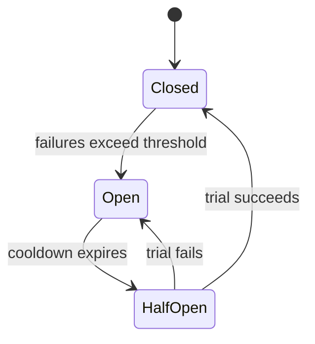

# Resilience Patterns

## Watch First

<div style={{position: 'relative', paddingBottom: '56.25%', height: 0, overflow: 'hidden', maxWidth: '100%', marginBottom: '1.5rem'}}>
 <iframe
 src="https://www.youtube.com/embed/JiBSltuT0cM"
 title="Circuit Breaker Pattern in Microservices"
 style={{position: 'absolute', top: 0, left: 0, width: '100%', height: '100%', border: 0}}
 allow="accelerometer; autoplay; clipboard-write; encrypted-media; gyroscope; picture-in-picture; web-share"
 referrerPolicy="strict-origin-when-cross-origin"
 allowFullScreen
 />
</div>

## Learning Objectives

By the end of this lesson, you will be able to:

- Explain what **resilience** means in distributed and protocol-style systems.
- Identify common **resilience patterns**: **timeouts, retries, circuit breakers, bulkheads, idempotency, fallbacks, and load-aware design**.
- Sketch how to apply at least three of these patterns to a Flow Research-style protocol (e.g., governance-voting, learner-on-ramp, reward-flow).
- Connect resilience patterns to **MLOps** and **deployment-pattern** decisions in the larger Flow Research-style stack.

## Concept Map



## Quantitative Lens

A retry policy must not multiply load during an outage:

$$
EffectiveLoad = baseLoad \times (1 + retries)
$$

Retries need backoff, limits, and circuit breakers.

## Introduction

You already know how to:

- write and version protocol specs,
- test protocol compatibility, and
- design for scale.

Now it is time to ask:

> "How does this system behave when **parts of it fail, get slow, or behave unpredictably?**"

This is **resilience** design.
In distributed systems, **failures are normal** rather than exceptional.
Resilience patterns are **reusable design ideas** that let your protocol:

- **tolerate** partial failures,
- **recover**,
- and keep providing **some useful behavior** instead of simply crashing.

For Flow Research-style systems, resilience is especially important because:

- your protocol may sit under dashboards, governance tools, and ML-style scoring,
- and it must not poison those layers with cascading failures.

---

## What Is Resilience in Protocols?

In distributed systems, **resilience** means:

- the ability to **continue operating** (perhaps in a degraded mode) when some components fail, slow down, or enter transient errors.

For a protocol, this usually means:

- ensuring that:

 - individual node failures do not take down the whole protocol,
 - network hiccups do not corrupt state,
 - and temporary service outages do not permanently block users.

Resilience is **not** about making everything perfectly reliable; it is about **graceful degradation** and **controlled failure**.

---

## Core Resilience Patterns

### 1. Timeouts

A **timeout** limits how long a component waits for a response before giving up.

In a protocol:

- every call or message exchange should have a **reasonable timeout** (e.g., "wait at most 5 seconds for a vote-aggregation response").
- if the timeout expires, the system can:

 - fail the operation,
 - fall back to a safe state,
 - or retry with a new strategy.

Without timeouts:

- failing nodes or slow networks can cause **hung clients** and resource exhaustion.

Flow Research-style motivation:

- users on learner-on-ramp flows should not sit forever because one governance node is slow.

### 2. Retries and Exponential Backoff

**Retries** let a system try again when a request fails transiently (e.g., network glitch, overloaded node).

Common patterns:

- **Immediate retry** (avoid): retrying instantly multiplies load.
- **Fixed-interval retry**: wait a fixed time between retries.
- **Exponential backoff**: increase delay between retries (e.g., 1s, 2s, 4s, 8s) up to a cap.
- **Exponential backoff + jitter**: add randomness so retries don't sync into a "thundering-herd".

Use these:

- only for **idempotent** operations (same message twice has the same effect).
- always with **maximum retry limits** to avoid infinite loops.

In Flow Research-style protocols:

- retries can be used for:

 - re-sending governance-events,
 - or retrying writes to a state backend,
 provided the semantics stay safe.

### 3. Circuit Breaker

The **circuit breaker** pattern stops a failing service from being pounded by repeated requests.

Typical behavior:

- **Closed**: normal traffic flows.
- **Open**: after too many failures, the system **stops sending traffic** to the failing service, returning fast errors or defaults.
- **Half-open**: after a cooldown, a few test calls are allowed to see if the service has recovered.

This protects:

- upstream clients from waiting on slow or failing nodes,
- and downstream services from being overwhelmed by retries.

Flow Research-style use-case:

- if a reward-calculation service is unhealthy, a circuit breaker can prevent the governance-protocol from stalling every time a reward is needed.

### 4. Bulkheads and Resource Isolation

**Bulkheads** isolate resources (threads, queues, DB connections) so that failure in one component does not starve others.

Examples:

- different **thread pools** for governance-events vs learner-analytics.
- separate **connection pools** to different backends.

This way:

- a slow governance-node cannot exhaust all connections needed by the on-ramp protocol.

Flow Research-style benefit:

- keeps **critical flows** (e.g., learner-on-ramp) responsive even when secondary flows (e.g., analytics) are under load.

### 5. Idempotency

An **idempotent** operation produces the same result whether it is applied once or many times.

For protocols:

- whenever you support retries, **ensure the semantics are idempotent**.

Examples:

- use **token-based or sequence-numbered** requests so that duplicates are detected and ignored.
- design state-updates so that repeated application of the same event does not multiply its effect.

Without idempotency, retries become dangerous.

Flow Research-style example:

- a "mark learner complete" event should not grant a reward twice if it is resent due to a network glitch.

### 6. Fallbacks and Degraded Modes

A **fallback** is what the system does when the primary path fails.

Examples:

- return cached or stale data instead of blocking for a fresh read.
- allow a governance flow to proceed with **local approval rules** if the main consensus node is unreachable (if policy allows it).

"Degraded mode" means:

- providing **limited but still useful** functionality when the system is under stress or partial failure.

For Flow Research-style protocols:

- a dashboard can:

 - fall back to showing **older state** rather than blank screens,
 - or a learner-on-ramp flow can bypass **optional** checks if the corresponding service is down.

This keeps the system **usable**, even when not perfect.

### 7. Load-Aware Design and Throttling

To avoid overload and cascading failures, design your protocol with **load awareness**:

- **Rate limiting** and **throttling** can cap the number of requests or events from a given source.
- **Queue-based back-pressure** can smooth out bursts (e.g., bursts of learner registrations or governance-events).

Flow Research-style benefits:

- protect governance nodes and ML-scoring services from being swamped by traffic spikes.
- allow the system to trade latency for stability.

---

## How to Apply Resilience Patterns to Flow Research-Style Protocols

When designing a protocol, ask:

- **Where can failures happen?**

 - Network between nodes?
 - External backends (databases, queues, ML-services)?

- **Which operations are transient vs permanent?**

 - Temporary network outages?
 - Hardware failures?

Then, for each critical path, decide:

- **Timeouts**: how long to wait for a response.
- **Retries**: with what strategy and limits (e.g., exponential backoff + jitter).
- **Circuit breaker**: when to stop pounding a failing service.
- **Idempotency**: how to make retried events safe.
- **Fallbacks**: what to do when the primary path is unavailable.

In Flow Research-style thinking:

- you can **"bullet-proof"** the most critical flows (e.g., governance-proposal approval, learner-on-ramp)
- while leaving non-critical flows (e.g., analytics, optional notifications) to fail more gracefully.

---

## Implementation Sketch

```typescript
if (failureRate > threshold) {
  circuit = "open";
  nextRetryAt = Date.now() + cooldownMs;
}
```

## Practical Exercises

### Exercise 1: Add Resilience to a Flow Research-Style Flow

Take a small Flow Research-style protocol you designed (e.g., proposal approval, reward-flow):

- Sketch where you would add:

 - timeout,
 - retry with exponential backoff,
 - and a simple circuit-breaker behavior.

Do not need to implement it fully; sketch where these patterns would sit in the flow.

### Exercise 2: Make an Operation Idempotent

Given one event or message in that protocol:

- Design an **idempotency mechanism** (e.g., sequence number, request token, or deduplication map).
- Write a short note explaining how this would prevent double-application of the same message.

This trains you to think about **what happens if this message is resent**.

### Exercise 3: Design a Degraded-Mode Strategy

- For the same flow, design a **degraded-mode**:

 - what happens when the primary consensus node or backend is unavailable?
 - what fallbacks or alternative behaviors are acceptable?

Write a short note summarizing the trade-offs (e.g., safety vs availability).

---

## Self-Assessment

Rate yourself from 1 to 5:

- I can explain what resilience means in distributed and protocol-style systems.
- I can describe at least five resilience patterns (timeouts, retries, circuit breakers, bulkheads, idempotency, fallbacks).
- I can sketch how to apply several of these to a Flow Research-style protocol.
- I can connect resilience patterns to deployment-pattern and MLOps decisions.

Action item: write a short note in your lab repo describing how you would apply resilience patterns to one Flow Research-style protocol and what trade-offs that introduces.

---

## Further Reading

- [Pact contract testing](https://docs.pact.io/)
- [Semantic Versioning](https://semver.org/)
- [OpenAPI specification](https://spec.openapis.org/oas/latest.html)
- [Enterprise Integration Patterns](https://www.enterpriseintegrationpatterns.com/)

## Next Steps

- Read `04-chaos-and-failure-testing.md` next to learn how to deliberately **break** your protocol in a controlled way and see if your resilience patterns hold.
- Treat resilience as a **first-class design requirement**, not an afterthought.
- When you design a Flow Research-style protocol, document your chosen resilience patterns (e.g., "all writes are idempotent; retries use exponential backoff with a max of 3 attempts").

---

*This lesson gives Flow Research Initiative trainees an intermediate-level understanding of resilience patterns in distributed and protocol-style systems, focusing on timeouts, retries, circuit breakers, bulkheads, idempotency, fallbacks, and load-aware design, and how to apply them to Flow Research-style governance-style and ML-driven protocols to tolerate failures and partial outages.*
