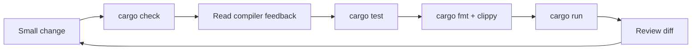

# Rust Mindset, Toolchain, and Engineering Loop

## Watch First

<div style={{position: 'relative', paddingBottom: '56.25%', height: 0, overflow: 'hidden', maxWidth: '100%', marginBottom: '1.5rem'}}>
  <iframe
    src="https://www.youtube.com/embed/5C_HPTJg5ek"
    title="Rust in 100 Seconds"
    style={{position: 'absolute', top: 0, left: 0, width: '100%', height: '100%', border: 0}}
    allow="accelerometer; autoplay; clipboard-write; encrypted-media; gyroscope; picture-in-picture; web-share"
    referrerPolicy="strict-origin-when-cross-origin"
    allowFullScreen
  />
</div>

## Why This Matters

The first Rust skill is not memorizing syntax. It is learning the engineering loop: write a small change, ask the compiler what is unclear, run fast checks, improve the design, and keep moving.

Rust feels much less intimidating when learners treat the compiler as a design partner instead of a judge.

## What You Will Build

Create the first `rust-lab` artifact: a small CLI called `task-normalize` that reads a JSON task file, validates required fields, normalizes the output, and returns useful errors instead of panicking.

## Concept

Rust is valuable when correctness, performance, concurrency, maintainability, and operational clarity matter together. It is not the right tool for every script, but it is a strong fit for services, CLIs, workers, protocol tooling, data processing, and infrastructure.

In an AI-coding workflow, Rust also changes the review problem. AI can generate code quickly, but the compiler, tests, and human review still need to verify ownership, errors, boundaries, security, and behavior.

The compiler is especially valuable because it gives structured feedback. A beginner often reads the first red line and feels blocked. A Rust engineer reads the error in layers:

- the error code, such as `E0308` for a type mismatch,
- the exact expression that did not satisfy the type checker,
- the note explaining what was expected,
- the help text suggesting one possible fix,
- the surrounding design question: should this function borrow, own, clone, return an error, or change type?

Do not apply suggestions blindly. Sometimes the compiler suggests a technically valid patch that is not the best design. For example, adding `.clone()` might silence an ownership error, but the better fix may be changing a helper to borrow `&Task` instead of taking `Task`.



## Rust Pattern

Start with a boring toolchain. Install Rust through `rustup`, because it gives you the compiler, Cargo, standard library sources, formatter, linter, documentation tooling, and the ability to switch toolchains without guessing where your operating system package manager put things.

On macOS and Linux, the official installer is:

```bash
curl --proto '=https' --tlsv1.2 -sSf https://sh.rustup.rs | sh
```

On Windows, use the installer from [rustup.rs](https://rustup.rs/) and follow the Visual Studio Build Tools prompt if it appears.

After installation, open a new terminal and verify the tools:

```bash
rustc --version
cargo --version
rustup show
```

Add editor support early. In VS Code, install `rust-analyzer`; in JetBrains IDEs, enable the Rust plugin; in Neovim, use `rust-analyzer` through your LSP setup. Editor diagnostics are not a replacement for `cargo check`, but they shorten the feedback loop while you are learning ownership and type errors.

Create a small project and run the daily loop:

```bash
rustup update
cargo new rust-lab
cd rust-lab
cargo check
cargo test
cargo fmt
cargo clippy
cargo run
cargo doc --open
```

The Rust Book already explains installation well. Use [Getting Started](https://doc.rust-lang.org/book/ch01-01-installation.html) when you need the official step-by-step reference, then return here for the engineering workflow around the tools.

Add dependencies deliberately. A good early `Cargo.toml` should be small and readable:

```toml
[package]
name = "task-normalize"
version = "0.1.0"
edition = "2024"

[dependencies]
anyhow = "1"
serde = { version = "1", features = ["derive"] }
serde_json = "1"
```

## Practice

Keep this mistake out of your first implementation.

Do not start by installing a large framework, generating a full app, or copying a complex architecture before the learner has built a small artifact.

Bad early loop:

```text
generate large project -> fight compiler -> add clones -> add unwraps -> stop trusting Rust
```

Better early loop:

```text
write tiny artifact -> run cargo check -> read one error -> fix design -> test behavior
```

Keep these concrete mistakes out of your work.

- Adding `unwrap()` in paths that should return errors.
- Adding dependencies before proving they are needed.
- Producing a large project shape for a small CLI.
- Treating compiler suggestions as patches to apply blindly instead of design feedback.

Use this sequence. Do not move to the next row until you have produced the artifact in the right column.

| Step | Focus | Artifact |
| --- | --- | --- |
| Why Rust, why now | Rust's practical fit and what not to overclaim | One-page note on when Rust is worth using |
| The compiler as a design partner | Reading error messages in layers | Annotated compiler error |
| Toolchain setup | `rustup`, `cargo`, `rustfmt`, `clippy`, rust-analyzer | Working local toolchain |
| The daily Rust loop | Check, test, format, lint, run, doc | `justfile` or short README commands |
| Navigating Rust documentation | docs.rs, local docs, crate examples | Resource note for one dependency |
| First artifact | JSON input, validation, normalized output | `task-normalize` CLI |

Build this now. Keep each change small enough that you can run `cargo check`, `cargo test`, and inspect the diff.

Create a JSON file:

```json
{
  "title": "Write release notes",
  "priority": "high",
  "tags": ["docs", "release"]
}
```

Write a CLI that:

- reads the file path from command-line arguments,
- rejects missing `title`,
- normalizes tags to lowercase,
- prints normalized JSON,
- returns a readable error for invalid JSON.

Then refactor one helper function so it accepts borrowed input instead of owning everything.

After your own attempt, use another reviewer or an AI tool as a second pass. Accept a suggestion only when you can explain why it preserves the lesson design.

Ask an AI tool to generate the CLI. Review the patch before running it:

- Where does it use `unwrap()`?
- Does it return useful errors?
- Did it add unnecessary dependencies?
- Are type names domain-specific or vague?

Rewrite the smallest part that improves the design.

You can move on when these statements are true.

- Can a new contributor run the project with three commands?
- Are errors returned instead of panics?
- Are dependencies justified?
- Does the README explain the daily Rust loop?
- Did the compiler feedback lead to simpler code, not just quieter code?

## Curated Resources

- [The Rust Programming Language](https://doc.rust-lang.org/book/) — the official language path; use it as the reference, not something to rewrite.
- [Rust by Example](https://doc.rust-lang.org/rust-by-example/) — quick runnable examples when a syntax detail needs a smaller demonstration.
- [Cargo Book](https://doc.rust-lang.org/cargo/) — the reference for project layout, dependencies, features, and builds.
- [rust-analyzer manual](https://rust-analyzer.github.io/manual.html) — editor support matters because fast feedback changes how Rust feels.

## Next Step

Continue to [Rust Syntax Fast Start](02-rust-syntax-fast-start.md).
