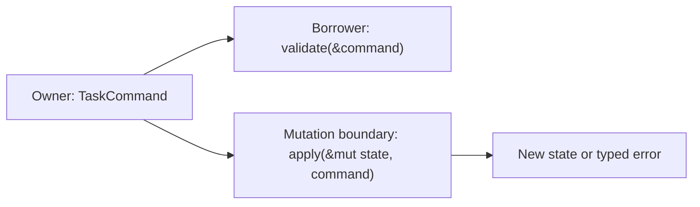

# Ownership, Borrowing, Lifetimes, and Memory Thinking

## Watch First

<div style={{position: 'relative', paddingBottom: '56.25%', height: 0, overflow: 'hidden', maxWidth: '100%', marginBottom: '1.5rem'}}>
  <iframe
    src="https://www.youtube.com/embed/rAl-9HwD858"
    title="Crust of Rust: Lifetime Annotations"
    style={{position: 'absolute', top: 0, left: 0, width: '100%', height: '100%', border: 0}}
    allow="accelerometer; autoplay; clipboard-write; encrypted-media; gyroscope; picture-in-picture; web-share"
    referrerPolicy="strict-origin-when-cross-origin"
    allowFullScreen
  />
</div>

## Why This Matters

Ownership is not an obstacle course. It is Rust's way of asking: who is responsible for this value, who may observe it, who may mutate it, and how long must it remain valid?

That is system design, not just syntax.

## What You Will Build

Refactor a messy task processor into clear owned command types, borrowed helper functions, and explicit mutation boundaries.

## Concept

Rust makes memory responsibility visible. Values can be moved, borrowed immutably, borrowed mutably, cloned intentionally, or shared explicitly with smart pointers.



The core rule is practical: many readers or one writer. This helps prevent accidental shared mutation, use-after-free, and unclear lifecycle assumptions.

## Rust Pattern

Use owned types at boundaries and borrowed types inside narrow helpers:

```rust
#[derive(Debug, Clone)]
pub struct CreateTask {
    pub title: String,
    pub tags: Vec<String>,
}

pub fn validate_title(title: &str) -> Result<(), String> {
    if title.trim().is_empty() {
        return Err("title cannot be empty".to_string());
    }
    Ok(())
}

pub fn normalize_tags(tags: &mut Vec<String>) {
    tags.iter_mut().for_each(|tag| *tag = tag.to_lowercase());
}
```

The command owns its data because it crosses a boundary. The helper borrows because it only needs temporary access.

## Practice

Keep this mistake out of your first implementation.

Generated or rushed Rust often adds `.clone()` everywhere:

```rust
let title = command.title.clone();
let tags = command.tags.clone();
let duplicated = command.clone();
```

Cloning can be fine, but it should be a decision. Unnecessary clones often hide unclear ownership.

Keep these concrete mistakes out of your work.

- Cloning large values to silence the compiler.
- Using references in long-lived structs when ownership would be simpler.
- Adding lifetime parameters to application types too early.
- Wrapping state in shared pointers before there is a real sharing problem.

Use this sequence. Do not move to the next row until you have produced the artifact in the right column.

| Step | Focus | Artifact |
| --- | --- | --- |
| Stack, heap, and ownership | Where values live and who cleans them up | Memory responsibility sketch |
| Move semantics | Moves, `Copy`, use-after-move errors | Small move/copy example |
| Borrowing | `&T`, `&mut T`, many readers or one writer | Refactored helper signatures |
| Slices and strings | `String` vs `&str`, `Vec<T>` vs `&[T]` | Borrowed validation helpers |
| Lifetimes without fear | Lifetimes describe reference relationships | One explained lifetime error |
| Cloning intentionally | When clone is useful vs suspicious | Clone review note |
| Shared ownership | `Rc`, `Arc`, explicit sharing | Short comparison table |

Build this now. Keep each change small enough that you can run `cargo check`, `cargo test`, and inspect the diff.

Given a function that accepts `Vec<Task>` and returns another `Vec<Task>`, refactor it into:

- one function that borrows `&[Task]` for read-only reporting,
- one function that accepts `&mut [Task]` for in-place normalization,
- one function that consumes `Vec<Task>` only when ownership transfer is the right model.

Write a note answering: who owns the tasks at each step?

After your own attempt, use another reviewer or an AI tool as a second pass. Accept a suggestion only when you can explain why it preserves the lesson design.

Ask AI to fix a borrow checker error in a small program. Reject any fix that:

- clones the entire data structure without explaining why,
- changes all fields to `String` or `Arc<String>` without need,
- adds lifetime annotations to every type,
- removes useful type boundaries.

You can move on when these statements are true.

- Who owns this value?
- Who can mutate it?
- How long should it live?
- Is this clone intentional?
- Would owning the value make the design simpler than borrowing it?
- Is shared ownership explicit and limited?

## Curated Resources

- [Rust Book: Ownership](https://doc.rust-lang.org/book/ch04-00-understanding-ownership.html) — the canonical explanation of moves, borrows, and slices.
- [Rust Book: Lifetimes](https://doc.rust-lang.org/book/ch10-03-lifetime-syntax.html) — use after the learner understands why references need relationships.
- [Rust API Guidelines: Ownership](https://rust-lang.github.io/api-guidelines/ownership.html) — useful for designing public APIs that avoid unnecessary ownership friction.

## Next Step

Continue to [Data Modeling, Errors, and Control Flow](04-data-modeling-errors-control-flow.md).
