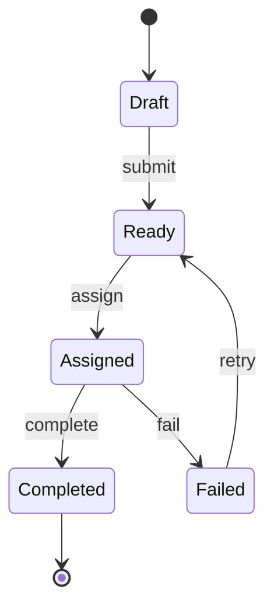

# Data Modeling, Errors, and Control Flow

## Watch First

<div style={{position: 'relative', paddingBottom: '56.25%', height: 0, overflow: 'hidden', maxWidth: '100%', marginBottom: '1.5rem'}}>
  <iframe
    src="https://www.youtube.com/embed/-E2qL4bLDKo"
    title="Intro to RustLang (Enums and Options)"
    style={{position: 'absolute', top: 0, left: 0, width: '100%', height: '100%', border: 0}}
    allow="accelerometer; autoplay; clipboard-write; encrypted-media; gyroscope; picture-in-picture; web-share"
    referrerPolicy="strict-origin-when-cross-origin"
    allowFullScreen
  />
</div>

## Why This Matters

Rust's type system is most valuable when it expresses product meaning. A system with clear types is easier to test, review, refactor, and operate.

Do not model important states as loose strings when an enum can make impossible states impossible.

## What You Will Build

Build a task state machine with typed commands, typed errors, and tests for valid and invalid transitions.

## Concept

Structs model domain nouns. Enums model choices and states. Pattern matching makes the transition logic visible. `Option` and `Result` replace null-heavy and exception-heavy control flow with explicit outcomes.



## Rust Pattern

```rust
#[derive(Debug, Clone, Copy, PartialEq, Eq)]
pub enum TaskStatus {
    Draft,
    Ready,
    Assigned,
    Completed,
    Failed,
}

#[derive(Debug, thiserror::Error, PartialEq, Eq)]
pub enum TaskError {
    #[error("task not found")]
    NotFound,
    #[error("invalid transition from {from:?} to {to:?}")]
    InvalidTransition { from: TaskStatus, to: TaskStatus },
    #[error("permission denied")]
    PermissionDenied,
}

pub fn transition(from: TaskStatus, to: TaskStatus) -> Result<TaskStatus, TaskError> {
    match (from, to) {
        (TaskStatus::Draft, TaskStatus::Ready)
        | (TaskStatus::Ready, TaskStatus::Assigned)
        | (TaskStatus::Assigned, TaskStatus::Completed)
        | (TaskStatus::Assigned, TaskStatus::Failed)
        | (TaskStatus::Failed, TaskStatus::Ready) => Ok(to),
        _ => Err(TaskError::InvalidTransition { from, to }),
    }
}
```

## Practice

Keep this mistake out of your first implementation.

Stringly typed state:

```rust
pub struct Task {
    pub status: String,
}
```

This makes invalid states easy:

```text
"done"
"completed"
"Complete"
"compelted"
```

The compiler cannot protect the system when the domain is hidden in strings.

Keep these concrete mistakes out of your work.

- Using `String` for meaningful categories.
- Returning `Result<T, String>` from core logic.
- Collapsing all errors into `anyhow::Error` before the API boundary is clear.
- Treating validation as a comment instead of a constructor or conversion.

Use this sequence. Do not move to the next row until you have produced the artifact in the right column.

| Step | Focus | Artifact |
| --- | --- | --- |
| Structs as domain nouns | Named fields, tuple structs, unit structs, `impl` blocks | `Task`, `UserId`, `Artifact` |
| Enums as state machines | Data-carrying enums and impossible states | `TaskStatus`, `JobState` |
| Pattern matching | `match`, `if let`, `let else`, exhaustive handling | Transition function |
| `Option` and `Result` | Absence and failure without exceptions | Find and transition APIs |
| Typed domain errors | Meaningful error variants | `TaskError` |
| `thiserror` and `anyhow` | Library/domain vs application context | Error strategy note |
| Boundary validation | DTOs into commands | `TryFrom<CreateTaskRequest>` |

Build this now. Keep each change small enough that you can run `cargo check`, `cargo test`, and inspect the diff.

Add `Cancelled` to the state machine. Decide:

- which states can transition to `Cancelled`,
- whether `Completed` can be cancelled,
- what error should be returned for invalid cancellation,
- which tests prove the rule.

After your own attempt, use another reviewer or an AI tool as a second pass. Accept a suggestion only when you can explain why it preserves the lesson design.

Give AI this prompt: "Create a task status model in Rust." Review whether it:

- uses enums or strings,
- tests invalid transitions,
- exposes typed errors,
- keeps HTTP concerns out of domain errors.

Rewrite the model so the state rules are enforced by types and tests.

You can move on when these statements are true.

- Are important concepts represented as types?
- Can invalid states be constructed accidentally?
- Are errors part of the API contract?
- Does `anyhow` stay at application edges rather than replacing domain errors?
- Do tests cover both allowed and denied transitions?

## Curated Resources

- [Rust Book: Structs](https://doc.rust-lang.org/book/ch05-00-structs.html) — foundation for modeling domain nouns.
- [Rust Book: Enums and Pattern Matching](https://doc.rust-lang.org/book/ch06-00-enums.html) — the core tool for modeling states and choices.
- [Rust Book: Error Handling](https://doc.rust-lang.org/book/ch09-00-error-handling.html) — the official distinction between recoverable and unrecoverable errors.
- [thiserror documentation](https://docs.rs/thiserror/latest/thiserror/) — practical typed error derivation for domain and library code.

## Next Step

Continue to [Reuse Without OOP](05-reuse-without-oop.md).
