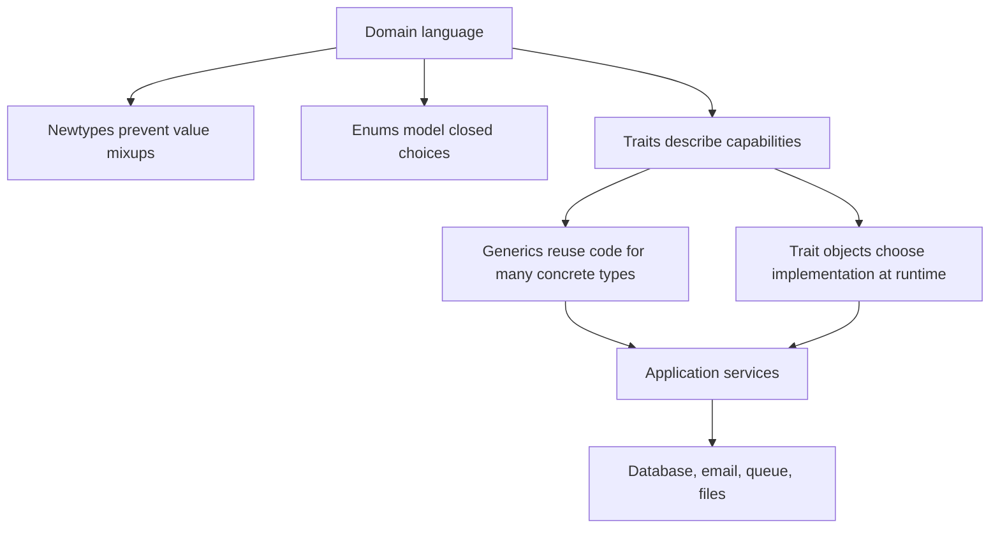

# Reuse Without OOP

## Watch First

<div style={{position: 'relative', paddingBottom: '56.25%', height: 0, overflow: 'hidden', maxWidth: '100%', marginBottom: '1.5rem'}}>
  <iframe
    src="https://www.youtube.com/embed/BJeoM4axWUA"
    title="Rust traits with Generics and trait bounds"
    style={{position: 'absolute', top: 0, left: 0, width: '100%', height: '100%', border: 0}}
    allow="accelerometer; autoplay; clipboard-write; encrypted-media; gyroscope; picture-in-picture; web-share"
    referrerPolicy="strict-origin-when-cross-origin"
    allowFullScreen
  />
</div>

## Why This Matters

Many learners arrive from inheritance-heavy languages and ask: where are the base classes? Rust answers with composition, traits, generics, newtypes, modules, and explicit boundaries.

The goal is not to avoid abstraction. The goal is to make abstraction pay rent.

## What You Will Build

Create a small domain crate with typed IDs, conversion traits, display/debug implementations, and capability traits for storage and notification.

## Concept

Rust reuse comes from stable concepts, not from forcing every resource into a universal parent class.



In object-oriented languages, reuse often starts with a superclass. A `BaseModel` owns fields, methods, validation hooks, persistence hooks, and behavior that subclasses inherit. Rust pushes you toward a different question: what capability does this function need?

If a function only needs to turn a value into text, require `Display`. If it only needs to compare values, require `Ord`. If it needs a clock, define a small `Clock` trait. If it needs a database repository, depend on a repository trait at the application boundary or use a concrete repository when there is no real substitution yet.

Generics answer "which types can this code work with?" Traits answer "what behavior must those types provide?" Newtypes answer "which raw values should never be confused?" Composition answers "which smaller pieces should this larger thing contain?" Most Rust reuse is a combination of those four ideas.

## Rust Pattern

Use newtypes to prevent mixing unrelated raw values:

```rust
#[derive(Debug, Clone, PartialEq, Eq, Hash)]
pub struct TaskId(String);

impl TaskId {
    pub fn new(value: impl Into<String>) -> Self {
        Self(value.into())
    }
}

impl std::fmt::Display for TaskId {
    fn fmt(&self, f: &mut std::fmt::Formatter<'_>) -> std::fmt::Result {
        f.write_str(&self.0)
    }
}
```

Newtypes are cheap. `TaskId(String)` is a distinct type from `UserId(String)`, even though both contain a `String`. That means the compiler can reject accidental mixups:

```rust
#[derive(Debug, Clone, PartialEq, Eq, Hash)]
pub struct UserId(String);

pub fn assign_task(task_id: TaskId, user_id: UserId) {
    println!("assign {task_id} to {}", user_id.0);
}

let task_id = TaskId::new("task_123");
let user_id = UserId("user_456".to_string());

assign_task(task_id, user_id);
```

Use traits where there is a real boundary:

```rust
pub trait Clock {
    fn now(&self) -> time::OffsetDateTime;
}

pub trait TaskNotifier {
    fn task_assigned(&self, task_id: &TaskId) -> Result<(), NotifyError>;
}
```

A trait should describe behavior a caller depends on. This makes it useful for production implementations and tests:

```rust
pub struct AssignmentService<C, N>
where
    C: Clock,
    N: TaskNotifier,
{
    clock: C,
    notifier: N,
}

impl<C, N> AssignmentService<C, N>
where
    C: Clock,
    N: TaskNotifier,
{
    pub fn assign(&self, task_id: TaskId) -> Result<(), NotifyError> {
        let assigned_at = self.clock.now();
        println!("assigned {task_id} at {assigned_at}");
        self.notifier.task_assigned(&task_id)
    }
}
```

This is static dispatch: the compiler knows the concrete `Clock` and `TaskNotifier` types when it builds the program. Static dispatch is fast and type-safe, but it can make type signatures longer.

Use `impl Trait` when the caller does not need to name the concrete type:

```rust
pub fn normalize_titles(items: impl IntoIterator<Item = String>) -> Vec<String> {
    items
        .into_iter()
        .map(|title| title.trim().to_lowercase())
        .filter(|title| !title.is_empty())
        .collect()
}
```

Use `Box<dyn Trait>` or `Arc<dyn Trait>` when the implementation must be chosen at runtime, stored behind one field, or swapped through configuration:

```rust
pub struct RuntimeAssignmentService {
    clock: Box<dyn Clock + Send + Sync>,
    notifier: Box<dyn TaskNotifier + Send + Sync>,
}
```

Dynamic dispatch is not "bad"; it is a tradeoff. You pay a small runtime indirection and lose some concrete type information, but you gain runtime flexibility and shorter struct types.

Standard traits are also part of reuse. Derive or implement the traits that make the type pleasant and honest to use:

```rust
#[derive(Debug, Clone, PartialEq, Eq)]
pub enum TaskStatus {
    Draft,
    Ready,
    Blocked,
    Done,
}

impl std::fmt::Display for TaskStatus {
    fn fmt(&self, f: &mut std::fmt::Formatter<'_>) -> std::fmt::Result {
        let label = match self {
            Self::Draft => "draft",
            Self::Ready => "ready",
            Self::Blocked => "blocked",
            Self::Done => "done",
        };
        f.write_str(label)
    }
}
```

`Debug` is for developers. `Display` is for user-facing text. `Clone` should mean copying is acceptable. `Default` should only exist when there is an unsurprising default. Deriving everything because it is convenient can hide weak modeling.

## Rust's Replacement for Reusable OOP CRUD

Do not start with a base `Model` or giant generic `CrudService<T>`. First identify what is actually shared:

- typed IDs,
- pagination,
- error mapping,
- audit fields,
- validation patterns,
- repository helper functions,
- narrow capability traits.

Keep business rules in resource-specific services until repetition becomes mechanical and stable.

For example, `TaskService::create`, `ArtifactService::create`, and `JobRunService::create` may each have different validation and authorization rules, while sharing these mechanics:

```rust
#[derive(Debug, Clone, Copy)]
pub struct PageRequest {
    pub limit: i64,
    pub offset: i64,
}

pub struct Page<T> {
    pub items: Vec<T>,
    pub total: i64,
}

pub trait HasTableName {
    fn table_name() -> &'static str;
}
```

The shared type is useful when it removes repeated mechanics. The service stays resource-specific because the use case is still resource-specific.

## Practice

Keep this mistake out of your first implementation.

Over-abstracted reuse:

```rust
pub trait Entity {
    fn table_name() -> &'static str;
    fn fields() -> Vec<&'static str>;
}
```

This looks reusable, but it hides resource behavior, weakens SQL review, and often creates a private framework before the product is understood.

The better question is not "can I make this generic?" The better question is "will this abstraction make tomorrow's change easier to review?" If the next contributor has to understand five type parameters before changing one field, the abstraction has not paid for itself.

Keep these concrete mistakes out of your work.

- Creating a trait for every struct.
- Generating a base CRUD layer before the first use case is clear.
- Using generics where concrete types would be easier to read.
- Hiding domain rules behind macros or reflection-like patterns.

Use this sequence. Do not move to the next row until you have produced the artifact in the right column.

| Step | Focus | Artifact |
| --- | --- | --- |
| Rust reuse is not class inheritance | Composition, traits, generics, modules, newtypes | OOP-to-Rust comparison note |
| Traits as capabilities | Small behavior boundaries | `Clock`, `Storage`, `Notifier` |
| Generics and trait bounds | `T: Trait`, `where` clauses | One generic helper |
| Static vs dynamic dispatch | `impl Trait`, `Box<dyn Trait>` | Dispatch decision note |
| Newtype pattern | IDs, emails, scores, safe wrappers | `TaskId`, `EmailAddress` |
| Builders and conversion traits | `From`, `TryFrom`, builders | Validated command construction |
| Extension traits | Local behavior around external types | One restrained extension trait |
| Standard traits | `Debug`, `Display`, `Default`, `Clone`, `PartialEq` | Useful trait derives |

Build this now. Keep each change small enough that you can run `cargo check`, `cargo test`, and inspect the diff.

Start with a service that passes raw `String` IDs everywhere. Refactor it so:

- task IDs and user IDs cannot be mixed,
- public display is intentional,
- parsing invalid input returns a typed error,
- tests prove the wrong ID cannot be passed without explicit conversion.

After your own attempt, use another reviewer or an AI tool as a second pass. Accept a suggestion only when you can explain why it preserves the lesson design.

Ask AI to create "a reusable CRUD abstraction for all resources." Review the output and mark:

- which abstractions hide important resource behavior,
- which helpers are genuinely reusable,
- which traits have only one implementation,
- which pieces should be deleted.

Then write the simpler Rust version.

You can move on when these statements are true.

- Does this abstraction reduce real complexity?
- Is the trait at a boundary or just mirroring one struct?
- Would concrete code be clearer?
- Do newtypes prevent real mistakes?
- Are generics readable by the next contributor?
- Can tests use fakes without turning every implementation into a mock?

## Curated Resources

- [Rust Book: Traits](https://doc.rust-lang.org/book/ch10-02-traits.html) — the starting point for capability-based design.
- [Rust Book: Generics](https://doc.rust-lang.org/book/ch10-01-syntax.html) — use generics after the concrete shape is clear.
- [Rust API Guidelines](https://rust-lang.github.io/api-guidelines/) — high-signal guidance for public APIs, conversions, builders, and type safety.

## Next Step

Continue to [Modules, Crates, Workspaces, and Project Shape](06-modules-crates-workspaces-project-shape.md).
