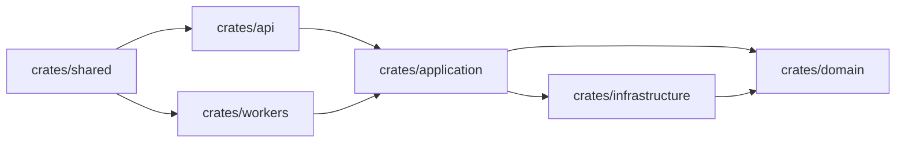

# Modules, Crates, Workspaces, and Project Shape

## Watch First

<div style={{position: 'relative', paddingBottom: '56.25%', height: 0, overflow: 'hidden', maxWidth: '100%', marginBottom: '1.5rem'}}>
  <iframe
    src="https://www.youtube.com/embed/5LdnfzFdWhE"
    title="Understanding Rust Structure: Packages, Crates, Modules - Full Crash Rust Tutorial for Beginners"
    style={{position: 'absolute', top: 0, left: 0, width: '100%', height: '100%', border: 0}}
    allow="accelerometer; autoplay; clipboard-write; encrypted-media; gyroscope; picture-in-picture; web-share"
    referrerPolicy="strict-origin-when-cross-origin"
    allowFullScreen
  />
</div>

## Why This Matters

Rust projects become hard to change when every module can see everything. Good project shape makes dependencies obvious and keeps the domain from leaking into HTTP, SQL, config, and worker concerns.

Architecture is not folders. Architecture is knowing what should not know about what.

## What You Will Build

Convert `rust-lab` into a workspace with clean crates and an ADR explaining the chosen architecture.

## Concept

Use crate boundaries when they clarify ownership of concepts. Use module visibility to keep internal details internal.



## Rust Pattern

Recommended starting layout:

```text
rust-lab/
  Cargo.toml
  crates/
    api/
    domain/
    application/
    infrastructure/
    workers/
    shared/
  docs/
    adr/
  migrations/
  tests/
```

Keep the workspace root simple:

```toml
[workspace]
resolver = "3"
members = [
  "crates/api",
  "crates/domain",
  "crates/application",
  "crates/infrastructure",
  "crates/workers",
  "crates/shared",
]
```

## Practice

Keep this mistake out of your first implementation.

Do not create a workspace on day one if the project is still a tiny CLI. Split when the boundaries are starting to matter.

Also avoid making everything `pub`. Visibility is a design tool:

```rust
pub(crate) mod parser;
mod normalize;
pub mod commands;
```

Keep these concrete mistakes out of your work.

- Generating too many crates too early.
- Making every module public.
- Putting config reads deep inside business logic.
- Creating feature flags before there is a tested need.

Use this sequence. Do not move to the next row until you have produced the artifact in the right column.

| Step | Focus | Artifact |
| --- | --- | --- |
| Binary vs library crate | `main.rs`, `lib.rs`, reusable code | Split CLI from library |
| Modules and visibility | `mod`, `pub`, `pub(crate)` | Private internals |
| Cargo workspaces | Shared lockfile, shared build output | Workspace root |
| Recommended workspace | Domain/application/infrastructure/interfaces/workers | Folder structure |
| Configuration | Typed settings and `.env.example` | Config loader |
| Feature flags | Useful toggles vs complexity | Feature decision note |
| ADRs | Record architecture decisions | `docs/adr/0001-architecture.md` |

Build this now. Keep each change small enough that you can run `cargo check`, `cargo test`, and inspect the diff.

Move validation and normalization logic out of the CLI entry point into a library crate. Keep the CLI responsible only for:

- reading command-line arguments,
- reading files,
- calling library functions,
- printing results,
- mapping errors to process exit behavior.

After your own attempt, use another reviewer or an AI tool as a second pass. Accept a suggestion only when you can explain why it preserves the lesson design.

Ask AI to restructure the project into a workspace. Reject the version if:

- domain logic imports the HTTP framework,
- infrastructure types leak into public domain APIs,
- every module is public,
- the workspace adds crates that have no responsibility yet.

You can move on when these statements are true.

- Can a contributor tell where new code belongs?
- Does the domain avoid framework imports?
- Are public APIs deliberately small?
- Is configuration passed in from the edge?
- Is there an ADR for major choices?
- Did splitting crates make dependencies clearer?

## Curated Resources

- [Cargo Book: Workspaces](https://doc.rust-lang.org/cargo/reference/workspaces.html) — the reference for multi-crate project management.
- [Rust Book: Packages, Crates, and Modules](https://doc.rust-lang.org/book/ch07-00-managing-growing-projects-with-packages-crates-and-modules.html) — the official model for code organization.
- [Cargo Book: Features](https://doc.rust-lang.org/cargo/reference/features.html) — useful when optional capabilities are real, risky when used as premature architecture.

## Next Step

Continue to [Smart Pointers, Shared State, and Concurrency Basics](07-smart-pointers-shared-state-concurrency.md).
