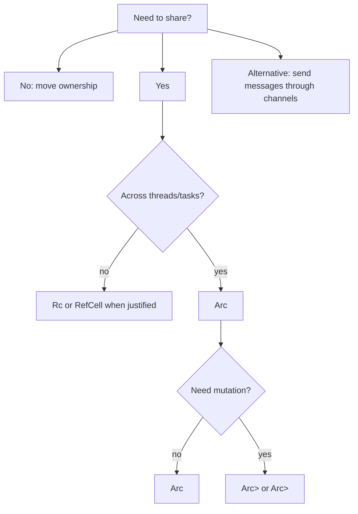

# Smart Pointers, Shared State, and Concurrency Basics

## Watch First

<div style={{position: 'relative', paddingBottom: '56.25%', height: 0, overflow: 'hidden', maxWidth: '100%', marginBottom: '1.5rem'}}>
  <iframe
    src="https://www.youtube.com/embed/8O0Nt9qY_vo"
    title="Crust of Rust: Smart Pointers and Interior Mutability"
    style={{position: 'absolute', top: 0, left: 0, width: '100%', height: '100%', border: 0}}
    allow="accelerometer; autoplay; clipboard-write; encrypted-media; gyroscope; picture-in-picture; web-share"
    referrerPolicy="strict-origin-when-cross-origin"
    allowFullScreen
  />
</div>

## Why This Matters

Rust makes shared state explicit. That is a strength, but it can feel verbose if learners reach for `Arc<Mutex<_>>` as the default answer.

The engineering skill is deciding when to own, share, lock, copy, pass messages, or redesign the state boundary.

## What You Will Build

Build a small concurrent event counter and worker prototype using channels, `Arc`, and a lock only where the lock is justified.

## Concept

Smart pointers describe ownership patterns:

- `Box<T>`: one owner, heap allocation.
- `Rc<T>`: shared ownership on one thread.
- `Arc<T>`: shared ownership across threads or tasks.
- `RefCell<T>`: runtime borrow checking for single-threaded interior mutability.
- `Mutex<T>` and `RwLock<T>`: shared mutable state with lock discipline.



## Rust Pattern

Prefer message passing when it models the system cleanly:

```rust
use std::sync::mpsc;
use std::thread;

#[derive(Debug)]
enum Event {
    TaskCreated,
    TaskCompleted,
}

let (tx, rx) = mpsc::channel::<Event>();

let worker = thread::spawn(move || {
    let mut completed = 0;
    for event in rx {
        if matches!(event, Event::TaskCompleted) {
            completed += 1;
        }
    }
    completed
});

tx.send(Event::TaskCreated)?;
tx.send(Event::TaskCompleted)?;
drop(tx);

let completed = worker.join().expect("worker panicked");
```

The worker owns its counter. The main thread sends events. No lock is needed.

## Practice

Keep this mistake out of your first implementation.

Do not wrap the whole application in shared mutable state:

```rust
type AppState = std::sync::Arc<std::sync::Mutex<Everything>>;
```

This design creates contention, unclear mutation boundaries, and lock-order problems.

Keep these concrete mistakes out of your work.

- Wrapping every value in `Arc<Mutex<_>>`.
- Holding locks longer than necessary.
- Holding a lock across `.await` in async code.
- Using shared mutation where channels or ownership transfer would be clearer.

Use this sequence. Do not move to the next row until you have produced the artifact in the right column.

| Step | Focus | Artifact |
| --- | --- | --- |
| `Box` | Heap allocation, recursive types, trait objects | Recursive command tree |
| `Rc` and `RefCell` | Single-threaded shared ownership and runtime borrow checking | Small graph example |
| `Arc` | Thread-safe shared ownership | Shared read-only config |
| `Mutex` and `RwLock` | Lock scope and mutation discipline | Event counter |
| Atomics | Simple shared values and counters | Atomic request counter |
| Threads and channels | Message passing and ownership transfer | Worker thread |
| `Send` and `Sync` | Values crossing thread/task boundaries | Explanation note |

Build this now. Keep each change small enough that you can run `cargo check`, `cargo test`, and inspect the diff.

Start with a design that stores `Vec<Event>` behind `Arc<Mutex<_>>`. Refactor it so:

- producers send events through a channel,
- one worker owns the mutable event summary,
- the public API exposes a snapshot instead of the mutable vector,
- tests prove concurrent sends are counted correctly.

After your own attempt, use another reviewer or an AI tool as a second pass. Accept a suggestion only when you can explain why it preserves the lesson design.

Ask AI to make an event counter thread-safe. Review whether it:

- locks the smallest possible state,
- avoids lock use when message passing is simpler,
- avoids holding locks while calling user code,
- explains why shared state is necessary.

You can move on when these statements are true.

- Does shared mutable state earn its place?
- Can ownership transfer replace a lock?
- Is the lock scope minimal?
- Could this lock be held across `.await` later?
- Are `Send` and `Sync` requirements understood instead of patched around?

## Curated Resources

- [Rust Book: Smart Pointers](https://doc.rust-lang.org/book/ch15-00-smart-pointers.html) — official grounding for `Box`, `Rc`, and interior mutability.
- [Rust Book: Fearless Concurrency](https://doc.rust-lang.org/book/ch16-00-concurrency.html) — core thread, channel, mutex, `Send`, and `Sync` concepts.
- [std::sync documentation](https://doc.rust-lang.org/std/sync/) — reference for synchronization primitives.

## Next Step

Continue to [Async Rust and Tokio](08-async-rust-and-tokio.md).
