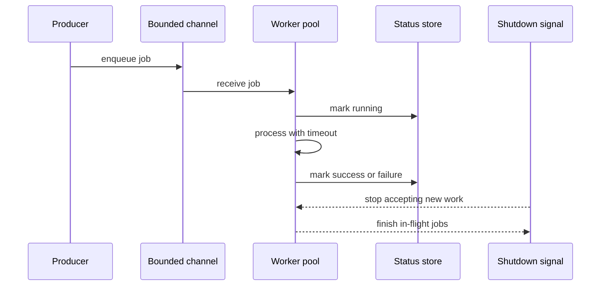

# Async Rust and Tokio

## Watch First

<div style={{position: 'relative', paddingBottom: '56.25%', height: 0, overflow: 'hidden', maxWidth: '100%', marginBottom: '1.5rem'}}>
  <iframe
    src="https://www.youtube.com/embed/ThjvMReOXYM"
    title="Crust of Rust: async/await"
    style={{position: 'absolute', top: 0, left: 0, width: '100%', height: '100%', border: 0}}
    allow="accelerometer; autoplay; clipboard-write; encrypted-media; gyroscope; picture-in-picture; web-share"
    referrerPolicy="strict-origin-when-cross-origin"
    allowFullScreen
  />
</div>

## Why This Matters

Async Rust is for efficiently waiting on I/O: network requests, database calls, timers, queues, files, and external services. It is not a reason to make every function async.

Good async design includes timeouts, cancellation, bounded concurrency, and graceful shutdown from the start.

## What You Will Build

Build a background task runner that accepts jobs, processes them with bounded concurrency, records status, and shuts down gracefully.

## Concept

A future is a value representing work that may complete later. `.await` is a suspension point. Every suspension point is also a design point because borrowed values, locks, cancellation, and task lifetimes matter.



## Rust Pattern

Use bounded channels and explicit shutdown:

```rust
use tokio::sync::{mpsc, watch};
use tokio::time::{timeout, Duration};

#[derive(Debug)]
struct Job {
    id: u64,
}

async fn process_job(job: Job) -> anyhow::Result<()> {
    println!("processing {}", job.id);
    Ok(())
}

async fn worker(mut jobs: mpsc::Receiver<Job>, mut shutdown: watch::Receiver<bool>) {
    loop {
        tokio::select! {
            Some(job) = jobs.recv() => {
                let result = timeout(Duration::from_secs(10), process_job(job)).await;
                if result.is_err() {
                    tracing::warn!("job timed out");
                }
            }
            _ = shutdown.changed() => {
                if *shutdown.borrow() {
                    break;
                }
            }
        }
    }
}
```

## Practice

Keep this mistake out of your first implementation.

Do not spawn unlimited tasks:

```rust
for job in jobs {
    tokio::spawn(async move {
        process_job(job).await;
    });
}
```

This can overwhelm memory, database pools, external APIs, or the runtime itself. Bounded work is architecture.

Keep these concrete mistakes out of your work.

- Adding `async` to functions that do no I/O.
- Spawning tasks without cancellation or join handling.
- Using unbounded channels by default.
- Ignoring retry budgets, timeouts, and backpressure.

Use this sequence. Do not move to the next row until you have produced the artifact in the right column.

| Step | Focus | Artifact |
| --- | --- | --- |
| What async is for | I/O waiting, not magic speed | Async decision note |
| Futures and async/await | Futures as values, `.await` as suspension | Small future example |
| Tokio runtime | Scheduler, I/O, timers, sync tools | Runtime entry point |
| Spawning tasks | `tokio::spawn`, task lifetimes, `Send + 'static` | One supervised task |
| Channels and workers | `mpsc`, `oneshot`, `watch`, `broadcast` | Job queue |
| Timeouts, retries, cancellation | Budgets and shutdown | Timeout wrapper |
| Backpressure | Bounded channels and worker pool sizing | Bounded worker pool |
| Streams | Async streams for events and logs | Optional stream reader |

Build this now. Keep each change small enough that you can run `cargo check`, `cargo test`, and inspect the diff.

Build a queue that accepts `Job` values and processes at most four at a time. Add:

- bounded channel capacity,
- per-job timeout,
- success and failure counters,
- graceful shutdown signal,
- tests for timeout and shutdown behavior.

After your own attempt, use another reviewer or an AI tool as a second pass. Accept a suggestion only when you can explain why it preserves the lesson design.

Ask AI to create a Tokio worker pool. Review whether it:

- bounds concurrency,
- handles task join errors,
- stops cleanly,
- avoids holding locks across `.await`,
- avoids unbounded retries.

You can move on when these statements are true.

- Does this function actually need to be async?
- Where are cancellation points?
- What limits concurrency?
- What happens when the queue is full?
- What happens on shutdown?
- Are retries capped and observable?

## Curated Resources

- [Tokio tutorial](https://tokio.rs/tokio/tutorial) — the best practical starting point for Tokio concepts.
- [Tokio documentation](https://docs.rs/tokio/latest/tokio/) — reference for runtime, tasks, channels, timers, and synchronization.
- [Async Book](https://rust-lang.github.io/async-book/) — useful when learners need deeper conceptual grounding.

## Next Step

Continue to [Axum-First Web Engineering](09-axum-first-web-engineering.md).
