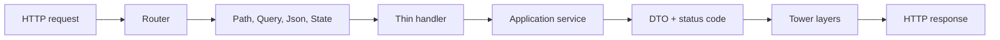

# Axum-First Web Engineering

## Watch First

<div style={{position: 'relative', paddingBottom: '56.25%', height: 0, overflow: 'hidden', maxWidth: '100%', marginBottom: '1.5rem'}}>
  <iframe
    src="https://www.youtube.com/embed/FDWKlJmHv6k"
    title="Creating an Axum Web Server in Rust is easy!"
    style={{position: 'absolute', top: 0, left: 0, width: '100%', height: '100%', border: 0}}
    allow="accelerometer; autoplay; clipboard-write; encrypted-media; gyroscope; picture-in-picture; web-share"
    referrerPolicy="strict-origin-when-cross-origin"
    allowFullScreen
  />
</div>

## Why This Matters

Axum lets Rust web APIs stay close to plain Rust functions while still using typed request extraction, shared state, Tower middleware, and structured responses.

The engineering goal is thin handlers and clear boundaries, not a web framework-shaped application.

## What You Will Build

Build an Axum API with `/health`, `/tasks`, `/artifacts`, and `/jobs`, using typed extractors, clean response DTOs, and route-level structure.

## Concept

Axum's mental model is small:

- routers connect paths to handlers,
- extractors parse request input,
- handlers call application services,
- responses turn service results into HTTP,
- state carries shared dependencies,
- middleware handles cross-cutting concerns.



## Rust Pattern

Keep handlers thin:

```rust
use axum::{extract::State, http::StatusCode, Json};
use serde::{Deserialize, Serialize};

#[derive(Clone)]
pub struct AppState {
    pub tasks: TaskService,
}

#[derive(Debug, Deserialize)]
pub struct CreateTaskRequest {
    pub title: String,
}

#[derive(Debug, Serialize)]
pub struct TaskResponse {
    pub id: String,
    pub title: String,
}

pub async fn create_task(
    State(state): State<AppState>,
    Json(request): Json<CreateTaskRequest>,
) -> Result<(StatusCode, Json<TaskResponse>), ApiError> {
    let task = state.tasks.create(request.try_into()?).await?;
    Ok((StatusCode::CREATED, Json(task.into())))
}
```

The handler extracts, converts, calls a service, and maps the response. Business rules live elsewhere.

## Practice

Keep this mistake out of your first implementation.

Large handlers become unreviewable:

```text
handler = parse JSON + validate + SQL + authorization + domain rules + logging + response mapping
```

Split by responsibility before the handler becomes the application.

Keep these concrete mistakes out of your work.

- Mixing SQL, validation, authorization, and response mapping in one handler.
- Using global mutable state instead of `State<AppState>`.
- Returning inconsistent error response shapes.
- Generating route files with no visible service boundary.

Use this sequence. Do not move to the next row until you have produced the artifact in the right column.

| Step | Focus | Artifact |
| --- | --- | --- |
| Axum mental model | Router, route, handler, extractor, response, state, Tower | Architecture note |
| Routing cleanly | Nested routers, versioning when needed | Route modules |
| Handlers | Thin handlers and service calls | `create_task` handler |
| Extractors | `Path`, `Query`, `Json`, `State`, headers | Typed request parsing |
| Application state | Pools, config, services, clients | `AppState` |
| Responses and DTOs | Status codes, JSON bodies, pagination, error envelopes | Response types |
| Middleware and Tower | Request IDs, tracing, CORS, auth, timeouts | Middleware stack |
| OpenAPI | Generated docs from types | API docs route |

Build this now. Keep each change small enough that you can run `cargo check`, `cargo test`, and inspect the diff.

Implement these endpoints:

- `GET /health`
- `POST /tasks`
- `GET /tasks/:id`
- `GET /tasks?limit=20`
- `POST /artifacts`

Then refactor one oversized handler into request DTO, command conversion, service call, and response DTO.

After your own attempt, use another reviewer or an AI tool as a second pass. Accept a suggestion only when you can explain why it preserves the lesson design.

Ask AI to generate an Axum CRUD route. Review whether it:

- keeps the handler thin,
- maps domain errors into HTTP errors consistently,
- uses typed extractors,
- avoids database calls in the handler,
- includes tests for success and failure cases.

You can move on when these statements are true.

- Is the handler mostly glue?
- Are request and response types explicit?
- Does the domain avoid Axum imports?
- Are error envelopes consistent?
- Is app state passed deliberately?
- Are routes grouped by feature?

## Curated Resources

- [Axum documentation](https://docs.rs/axum/latest/axum/) — the core reference for routers, handlers, extractors, responses, and state.
- [Tower documentation](https://docs.rs/tower/latest/tower/) — Axum middleware is Tower-based, so this explains the service/layer model.
- [tower-http documentation](https://docs.rs/tower-http/latest/tower_http/) — practical middleware for tracing, CORS, compression, request IDs, and timeouts.

## Next Step

Continue to [Persistence and Reusable CRUD With SQLx](10-persistence-reusable-crud-sqlx.md).
