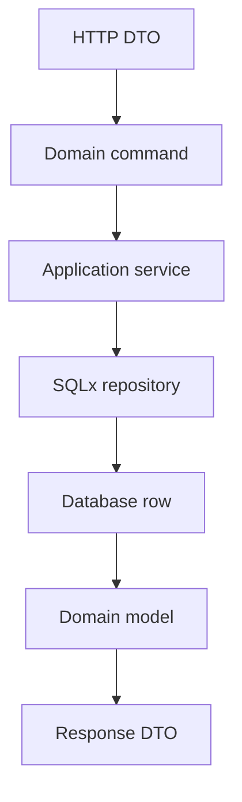

# Persistence and Reusable CRUD With SQLx

## Watch First

<div style={{position: 'relative', paddingBottom: '56.25%', height: 0, overflow: 'hidden', maxWidth: '100%', marginBottom: '1.5rem'}}>
  <iframe
    src="https://www.youtube.com/embed/2ISxv8rrVew"
    title="Rust - How to use Sqlx to query Postgres Part1"
    style={{position: 'absolute', top: 0, left: 0, width: '100%', height: '100%', border: 0}}
    allow="accelerometer; autoplay; clipboard-write; encrypted-media; gyroscope; picture-in-picture; web-share"
    referrerPolicy="strict-origin-when-cross-origin"
    allowFullScreen
  />
</div>

## Why This Matters

Most production services need persistence. Rust makes it possible to keep SQL visible, types explicit, and business rules separate from database mechanics.

Reusable CRUD should reduce repeated mechanics without hiding important resource behavior.

## What You Will Build

Build CRUD for `Task`, `Artifact`, and `JobRun`, then extract only the stable shared pieces: typed IDs, pagination, common error mapping, transaction handling, and narrow helper traits.

## Concept

SQLx is a good default for this path because explicit SQL is easy to inspect, review, profile, and debug. SeaORM and Diesel are useful alternatives for teams that want different tradeoffs, but the main path starts with SQLx.



The boundary matters more than the folder name. HTTP handlers should translate requests into commands. Application services should enforce use-case rules. Repositories should perform database work. Rows should match storage shape. Domain models should express the meaning your application cares about.

Reusable CRUD sits inside the repository layer, not above the whole application. It helps with repeated database mechanics: table names, insert columns, update bind values, generated IDs, soft-delete filters, pagination, and common error mapping. It should not decide whether a user is allowed to create a task, whether a job run can move from `Running` to `Succeeded`, or whether an artifact belongs to a parent task.

## Rust Pattern

Keep SQL close to repository methods and keep resource rules in services:

```rust
pub struct TaskRepository {
    pool: sqlx::PgPool,
}

impl TaskRepository {
    pub async fn find_by_id(&self, id: &TaskId) -> Result<Option<TaskRow>, sqlx::Error> {
        sqlx::query_as!(
            TaskRow,
            r#"
            select id, title, status, created_at
            from tasks
            where id = $1 and deleted_at is null
            "#,
            id.to_string()
        )
        .fetch_optional(&self.pool)
        .await
    }
}
```

That explicit method is easy to review. The query shows the table, selected columns, filter, and soft-delete rule. When a production bug appears, nobody has to mentally expand a hidden ORM expression to know which SQL ran.

After two or three resources repeat the same mechanics, extract narrow traits. A practical reusable CRUD core can look like this:

```rust
use sqlx::{Postgres, QueryBuilder};
use uuid::Uuid;

pub trait ModelName {
    fn table_name() -> &'static str;
}

pub trait Insertable {
    fn generate_id() -> Option<Uuid> {
        Some(Uuid::now_v7())
    }

    fn columns() -> Vec<&'static str>;

    fn bind_values<'a>(&'a self, query: &mut QueryBuilder<'a, Postgres>);
}

pub enum UpdateResult {
    NoChanges,
    Changed,
}

pub trait Updateable {
    fn bind_updates<'a>(&'a self, query: &mut QueryBuilder<'a, Postgres>) -> UpdateResult;
}
```

`ModelName` lets shared helpers know the table name. `Insertable` tells the helper which columns exist and how values are bound. `Updateable` lets a patch object add only the changed fields. The traits do not know your business rules. They only describe the database mechanics a type can provide.

A `TaskCreate` command might implement the insert side:

```rust
pub struct TaskCreate {
    pub title: String,
    pub body: String,
}

impl ModelName for TaskCreate {
    fn table_name() -> &'static str {
        "tasks"
    }
}

impl Insertable for TaskCreate {
    fn columns() -> Vec<&'static str> {
        vec!["id", "title", "body"]
    }

    fn bind_values<'a>(&'a self, query: &mut QueryBuilder<'a, Postgres>) {
        let id = Self::generate_id().expect("default id generation is enabled");
        query
            .push_bind(id)
            .push(", ")
            .push_bind(&self.title)
            .push(", ")
            .push_bind(&self.body);
    }
}
```

The shared insert helper can now handle the repetitive shape while preserving typed binding:

```rust
pub fn build_insert<'a, T>(value: &'a T) -> QueryBuilder<'a, Postgres>
where
    T: ModelName + Insertable,
{
    let mut query = QueryBuilder::new("insert into ");
    query.push(T::table_name()).push(" (");

    let columns = T::columns();
    query.push(columns.join(", ")).push(") values (");
    value.bind_values(&mut query);
    query.push(") returning *");

    query
}
```

In real SQLx code, be careful with placeholder style and prefer helper APIs such as `separated()` when building longer dynamic statements. The design point is the important part: the generic helper owns repetition, while the resource type owns its columns and bindings.

Patch-style updates benefit from the same split:

```rust
#[derive(Default)]
pub struct TaskPatch {
    pub title: Option<String>,
    pub body: Option<String>,
}

impl Updateable for TaskPatch {
    fn bind_updates<'a>(&'a self, query: &mut QueryBuilder<'a, Postgres>) -> UpdateResult {
        let mut changed = false;

        if let Some(title) = &self.title {
            if changed {
                query.push(", ");
            }
            query.push("title = ").push_bind(title);
            changed = true;
        }

        if let Some(body) = &self.body {
            if changed {
                query.push(", ");
            }
            query.push("body = ").push_bind(body);
            changed = true;
        }

        if changed {
            UpdateResult::Changed
        } else {
            UpdateResult::NoChanges
        }
    }
}
```

This prevents boilerplate without erasing important choices. A task can still have task-specific validation. An artifact can still require a parent task. A job run can still protect state transitions. The reusable layer only removes repeated SQL-building mechanics.

## Reusable Does Not Mean Generic Everywhere

Bad first abstraction:

```rust
pub struct CrudService<T, C, U, F, E> {
    _marker: std::marker::PhantomData<(T, C, U, F, E)>,
}
```

Better first extraction:

- `PageRequest`
- `Page<T>`
- typed IDs,
- common API error mapping,
- a transaction helper,
- small traits at real boundaries.

Resource-specific services should remain explicit until the repetition is mechanical and stable.

The application service remains the place where behavior is named:

```rust
pub struct TaskService {
    repository: TaskRepository,
}

impl TaskService {
    pub async fn create_task(&self, command: TaskCreate) -> Result<Task, AppError> {
        if command.title.trim().is_empty() {
            return Err(AppError::Validation("title is required".into()));
        }

        self.repository.insert(command).await.map_err(AppError::from)
    }
}
```

That is the balance to aim for: predictable repository mechanics, explicit use-case names, visible SQL, typed values, and no magical base class that every resource must obey.

## Practice

Keep these concrete mistakes out of your work.

- Hiding all SQL behind generic layers.
- Creating traits with one implementation for testability theater.
- Opening a new database connection per request.
- Trusting scope IDs from request bodies instead of route paths.
- Ignoring transactions for multi-step changes.

Use this sequence. Do not move to the next row until you have produced the artifact in the right column.

| Step | Focus | Artifact |
| --- | --- | --- |
| Database access choices | SQLx default, SeaORM and Diesel context | Tradeoff note |
| Migrations | Schema, local and CI application, seed data | Initial migration |
| Connection pools | Pool ownership and `AppState` | Shared `PgPool` |
| Rows, DTOs, domain models | Boundary conversions | `TaskRow`, `Task`, `TaskResponse` |
| Basic CRUD | Create, read, list, update, soft delete | CRUD repository |
| Reusable CRUD, wrong way | Generic magic and hidden behavior | Anti-pattern review |
| Reusable CRUD, Rust way | Typed IDs, helpers, resource services | Shared pagination |
| Repository pattern, carefully | Concrete first, traits when earned | Repository decision |
| Transactions | Unit of work in application services | Transactional assignment |
| Filtering and pagination | Typed filters, limits, stable sort | List endpoint |
| Scoped resources | Parent-child and tenant boundaries | `/tasks/{task_id}/artifacts` |

Build this now. Keep each change small enough that you can run `cargo check`, `cargo test`, and inspect the diff.

Implement task listing with:

- typed query parameters,
- validated `limit`,
- stable sorting,
- a response shape with `items` and `next_cursor` or `total`,
- tests for invalid limits and empty results.

Then extract pagination only after two resources share the same mechanics.

After your own attempt, use another reviewer or an AI tool as a second pass. Accept a suggestion only when you can explain why it preserves the lesson design.

Ask AI to build a generic CRUD service for every resource. Review:

- which domain rules disappeared,
- whether SQL is still reviewable,
- whether the generic layer handles scoped resources correctly,
- whether tests prove behavior instead of just compilation.

You can move on when these statements are true.

- Is SQL visible enough to review?
- Are DTOs, rows, commands, and domain models separate when they need to be?
- Are transactions owned by application services?
- Are scoped IDs taken from trusted path/context?
- Did abstraction remove real duplication or just hide behavior?
- Does the repository trait exist for a real boundary?

## Curated Resources

- [SQLx documentation](https://docs.rs/sqlx/latest/sqlx/) — reference for pools, queries, macros, transactions, and runtime support.
- [SQLx CLI documentation](https://github.com/launchbadge/sqlx/tree/main/sqlx-cli) — useful for migrations and offline query preparation.
- [PostgreSQL documentation](https://www.postgresql.org/docs/) — SQL performance, indexes, constraints, and transaction behavior belong to the database too.

## Next Step

Continue to [Service-Layer Architecture and Domain Boundaries](11-service-layer-architecture-domain-boundaries.md).
