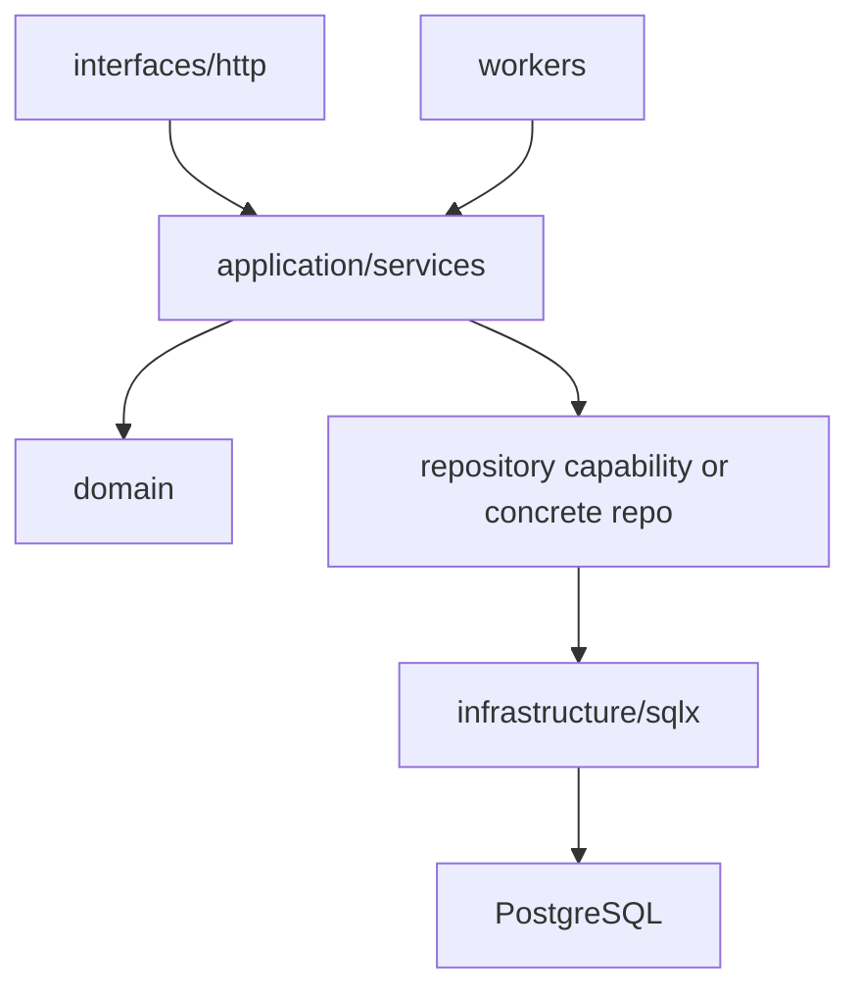

# Service-Layer Architecture and Domain Boundaries

## Watch First

<div style={{position: 'relative', paddingBottom: '56.25%', height: 0, overflow: 'hidden', maxWidth: '100%', marginBottom: '1.5rem'}}>
  <iframe
    src="https://www.youtube.com/embed/Ka7mRKsTCyE"
    title="Complete Axum 0.8 Tutorial: Build Production REST APIs in Rust (2026 Full Course)"
    style={{position: 'absolute', top: 0, left: 0, width: '100%', height: '100%', border: 0}}
    allow="accelerometer; autoplay; clipboard-write; encrypted-media; gyroscope; picture-in-picture; web-share"
    referrerPolicy="strict-origin-when-cross-origin"
    allowFullScreen
  />
</div>

## Why This Matters

Rust services become difficult to change when Axum handlers, SQLx queries, domain rules, worker logic, and configuration all point at each other.

Clean boundaries let web requests and background workers reuse the same use cases without duplicating business logic.

## What You Will Build

Refactor the Axum CRUD API into a vertical-slice architecture:

```text
interfaces/http -> application/services -> infrastructure/repositories -> database
workers         -> application/services -> infrastructure/repositories -> database
```

## Concept

Each layer has a job:

- Handler: HTTP concern.
- Service: use-case and orchestration concern.
- Repository: persistence concern.
- Domain model: product meaning.
- Worker: background entry point into the same application use cases.



## Rust Pattern

Use commands to make intent visible:

```rust
pub struct AssignTask {
    pub task_id: TaskId,
    pub assignee_id: UserId,
    pub actor_id: UserId,
}

pub struct TaskService<R> {
    repository: R,
}

impl<R> TaskService<R>
where
    R: TaskRepository,
{
    pub async fn assign(&self, command: AssignTask) -> Result<Task, TaskError> {
        let mut task = self.repository.get(command.task_id).await?;
        task.assign_to(command.assignee_id, command.actor_id)?;
        self.repository.save(task).await
    }
}
```

The service owns the use case. The handler and worker can both call it.

## Practice

Keep this mistake out of your first implementation.

Do not put framework types in the domain:

```rust
pub fn create_task(Json(request): Json<CreateTaskRequest>) -> StatusCode {
    // domain code now knows HTTP
}
```

Domain logic should not know about `axum::Json`, HTTP status codes, SQL row shapes, or database pools.

Keep these concrete mistakes out of your work.

- Putting domain logic inside handlers.
- Passing `PgPool` into pure domain functions.
- Returning HTTP status codes from service methods.
- Creating repository abstractions before the dependency direction is clear.

Use this sequence. Do not move to the next row until you have produced the artifact in the right column.

| Step | Focus | Artifact |
| --- | --- | --- |
| Handler vs service vs repository | Responsibilities and boundaries | Responsibility table |
| Commands and queries | Intent-rich inputs | `CreateTask`, `AssignTask`, `ListTasks` |
| Dependency direction | Domain independence, infrastructure implementation | Dependency diagram |
| Keeping frameworks out of domain | No Axum or SQL in domain logic | Boundary cleanup |
| Simplifying lifetimes through ownership | Owned commands at boundaries | Signature refactor |
| Designing for change | Add route or worker without rewriting domain | Reused service method |
| Architecture diagrams | Request, worker, error, transaction, observability paths | Mermaid diagrams |

Build this now. Keep each change small enough that you can run `cargo check`, `cargo test`, and inspect the diff.

Pick one route that contains SQL and business rules. Refactor it into:

- request DTO,
- command conversion,
- application service method,
- repository method,
- response mapping,
- tests at service and HTTP levels.

Then delete one abstraction that did not help.

After your own attempt, use another reviewer or an AI tool as a second pass. Accept a suggestion only when you can explain why it preserves the lesson design.

Ask AI to "clean up the architecture" of an Axum route. Review whether it:

- creates more layers than needed,
- keeps dependency direction correct,
- hides behavior in generic services,
- makes tests easier or harder.

You can move on when these statements are true.

- Does the domain depend on frameworks?
- Is the service method named after a use case?
- Can a worker reuse this service?
- Are transaction boundaries visible?
- Are errors mapped at the edge?
- Did any new abstraction make the code harder to inspect?

## Curated Resources

- [Rust API Guidelines](https://rust-lang.github.io/api-guidelines/) — useful when designing service and domain APIs.
- [Axum documentation](https://docs.rs/axum/latest/axum/) — keep framework concerns at the interface edge.
- [SQLx documentation](https://docs.rs/sqlx/latest/sqlx/) — persistence belongs behind repositories or infrastructure modules, not inside domain logic.

## Next Step

Continue to [Application Framework and Scaffolding Lab](12-application-framework-scaffolding-lab.md).
