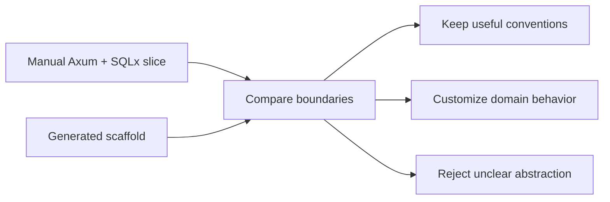

# Application Framework and Scaffolding Lab

## Watch First

<div style={{position: 'relative', paddingBottom: '56.25%', height: 0, overflow: 'hidden', maxWidth: '100%', marginBottom: '1.5rem'}}>
  <iframe
    src="https://www.youtube.com/embed/cJyl9e2oqHY"
    title="Rust REST API Tutorial: Axum, SQLx, Postgres & Docker"
    style={{position: 'absolute', top: 0, left: 0, width: '100%', height: '100%', border: 0}}
    allow="accelerometer; autoplay; clipboard-write; encrypted-media; gyroscope; picture-in-picture; web-share"
    referrerPolicy="strict-origin-when-cross-origin"
    allowFullScreen
  />
</div>

## Why This Matters

Axum handles HTTP well, but it does not define an entire application architecture. Many services repeatedly need auth, migrations, DTOs, services, repositories, CRUD routes, API docs, workers, and config.

Scaffolding can help if the generated code remains readable, editable, and owned by the application.

## What You Will Build

Write a comparison report between the manual Axum + SQLx slice from earlier modules and a generated slice from a predictable explicit-code scaffolding tool.

## Concept

Frameworks and CLI scaffolds should be evaluated by the code they leave behind:

- Are handlers thin?
- Is SQL visible?
- Are services named around use cases?
- Are errors typed where they matter?
- Are generated routes secured by default?
- Can a human change the code without fighting the generator?



## Rust Pattern

Treat generated code as a first draft to review, not a replacement for design:

```text
Generate -> inspect files -> run checks -> read boundaries -> add tests -> simplify -> document decision
```

If you use a CLI scaffold, frame it as one optional lab. The useful command is the one that creates a predictable resource slice you can inspect:

```bash
cargo install <scaffold-cli>
<scaffold-cli> new task_engine
<scaffold-cli> generate resource artifact --fields title:string body:string
cargo test
```

Then inspect generated models, DTOs, services, repositories, routes, migrations, OpenAPI metadata, and worker scaffolds.

## Practice

Keep this mistake out of your first implementation.

Do not adopt a framework because the first demo is fast. The right question is not "can it generate CRUD?" The right question is "does the resulting system stay explicit, secure, testable, and changeable?"

Keep these concrete mistakes out of your work.

- Treating scaffolding as magic.
- Failing to review generated auth, errors, and boundaries.
- Keeping generated generic layers that obscure product behavior.
- Assuming generated code has the same quality as reviewed code.

Use this sequence. Do not move to the next row until you have produced the artifact in the right column.

| Step | Focus | Artifact |
| --- | --- | --- |
| Why application frameworks can help | Repeated backend structure | Framework evaluation criteria |
| Scaffold positioning | Optional Axum + SQLx scaffolding example | Tool note |
| Create a small app | Install, generate, run, inspect docs | Generated app |
| Generate a resource | Inspect model, DTOs, service, repo, migration, OpenAPI | Generated resource review |
| Service-first CRUD review | Validation, business logic, SQL, handlers | Boundary checklist |
| Scoped resources | Scope IDs from paths and context | Scoped route review |
| Workers and LLM hooks | Background jobs and structured integration points | Worker scaffold note |
| When not to use scaffolding | Total control, different stack, confusing generated shape | Adoption decision |

Build this now. Keep each change small enough that you can run `cargo check`, `cargo test`, and inspect the diff.

Write this comparison:

```text
Manual Axum + SQLx slice versus generated slice
- What scaffolding saved
- What still requires human judgment
- What should be customized
- What should not be abstracted
- Whether generated code improved or reduced clarity
```

After your own attempt, use another reviewer or an AI tool as a second pass. Accept a suggestion only when you can explain why it preserves the lesson design.

Ask AI to review the generated slice. Then review the AI review:

- Did it inspect auth and authorization?
- Did it inspect error boundaries?
- Did it inspect SQL visibility?
- Did it identify over-abstraction?
- Did it suggest tests?

You can move on when these statements are true.

- Does generated code compile and pass tests?
- Are generated routes secured intentionally?
- Can resource-specific business rules be added cleanly?
- Is SQL reviewable?
- Are migrations explicit?
- Does the app own the generated code?

## Curated Resources

- [Axum documentation](https://docs.rs/axum/latest/axum/) — the baseline for what the generated web layer should still respect.
- [SQLx documentation](https://docs.rs/sqlx/latest/sqlx/) — the baseline for explicit persistence.

## Next Step

Continue to [Testing, Fixtures, and Code Review Culture](13-testing-fixtures-code-review-culture.md).
