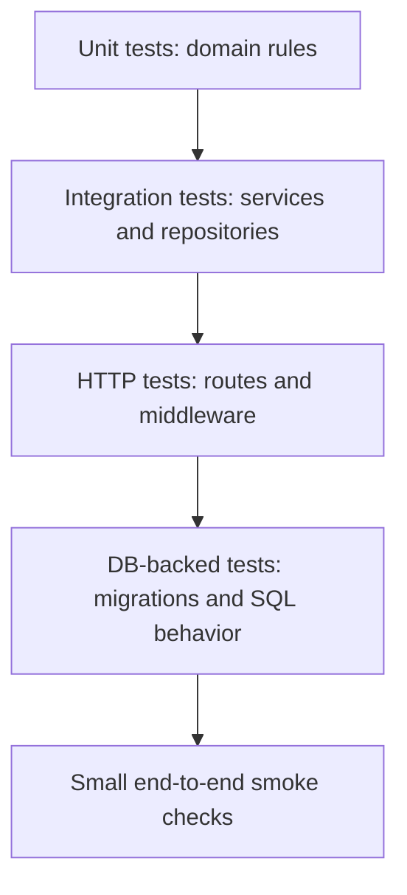

# Testing, Fixtures, and Code Review Culture

## Watch First

<div style={{position: 'relative', paddingBottom: '56.25%', height: 0, overflow: 'hidden', maxWidth: '100%', marginBottom: '1.5rem'}}>
  <iframe
    src="https://www.youtube.com/embed/18-7NoNPO30"
    title="Testing in Rust"
    style={{position: 'absolute', top: 0, left: 0, width: '100%', height: '100%', border: 0}}
    allow="accelerometer; autoplay; clipboard-write; encrypted-media; gyroscope; picture-in-picture; web-share"
    referrerPolicy="strict-origin-when-cross-origin"
    allowFullScreen
  />
</div>

## Why This Matters

Rust code that compiles can still be wrong. Tests, fixtures, and review habits create the confidence to refactor without guessing.

The goal is not maximum test count. The goal is useful feedback at the right boundary.

## What You Will Build

Add unit, integration, HTTP, and DB-backed tests to the task API. Review an AI-generated patch and improve it before merging.

## Concept

Use a testing pyramid that matches risk:



Fast domain tests should catch most logic mistakes. HTTP and database tests should prove boundaries, not repeat every unit test.

## Rust Pattern

Keep tests close to behavior:

```rust
#[cfg(test)]
mod tests {
    use super::*;

    #[test]
    fn assigned_task_can_be_completed() {
        let status = transition(TaskStatus::Assigned, TaskStatus::Completed);
        assert_eq!(status, Ok(TaskStatus::Completed));
    }

    #[test]
    fn draft_task_cannot_be_completed() {
        let status = transition(TaskStatus::Draft, TaskStatus::Completed);
        assert!(matches!(
            status,
            Err(TaskError::InvalidTransition { .. })
        ));
    }
}
```

## Practice

Keep this mistake out of your first implementation.

Avoid tests that only prove mocks were called. Prefer behavior that matters:

```text
Weak: repository.save was called once
Better: completing a task stores completed status and emits a completion event
```

Keep these concrete mistakes out of your work.

- Writing tests that compile but do not assert meaningful behavior.
- Mocking every dependency instead of using small fakes.
- Skipping error cases.
- Ignoring database migrations and SQL behavior.
- Adding benchmarks before correctness is established.

Use this sequence. Do not move to the next row until you have produced the artifact in the right column.

| Step | Focus | Artifact |
| --- | --- | --- |
| Rust testing pyramid | Unit, integration, HTTP, DB, property tests | Test strategy note |
| Domain tests | State transitions, validation, permissions, errors | Domain test suite |
| Axum handler tests | Test app state, request, status, JSON | HTTP tests |
| Database tests | Migrations, fixtures, isolated DBs or transactions | SQL behavior tests |
| Fakes vs mocks | Meaningful capability fakes | Fake repository |
| Documentation tests | Executable public API examples | Doctest |
| Benchmarks | Measure meaningful paths after correctness | Optional benchmark |
| Review checklist | Human review as engineering habit | Patch review note |

Build this now. Keep each change small enough that you can run `cargo check`, `cargo test`, and inspect the diff.

Add tests for:

- valid task creation,
- invalid empty title,
- invalid state transition,
- unauthorized update,
- list pagination,
- repository query for missing record.

Then refactor one function and prove the tests still pass.

After your own attempt, use another reviewer or an AI tool as a second pass. Accept a suggestion only when you can explain why it preserves the lesson design.

Ask AI to add tests for the service. Review whether:

- tests fail for the right reason before the fix,
- both success and error paths are covered,
- fakes are simpler than mocks,
- fixtures are readable,
- database tests verify SQL behavior.

You can move on when these statements are true.

- Does it compile?
- Does it have tests at the right boundary?
- Are errors typed where they matter?
- Are clones intentional?
- Is async used only where needed?
- Are locks scoped narrowly?
- Is the abstraction simpler than the duplication?
- Would another engineer understand this in six months?

## Curated Resources

- [Rust Book: Writing Automated Tests](https://doc.rust-lang.org/book/ch11-00-testing.html) — official baseline for test organization and assertions.
- [Cargo Book: Tests](https://doc.rust-lang.org/cargo/commands/cargo-test.html) — reference for running package, workspace, and targeted tests.
- [proptest documentation](https://docs.rs/proptest/latest/proptest/) — useful when properties are clearer than hand-written examples.

## Next Step

Continue to [Security, Authentication, and API Safety](14-security-authentication-api-safety.md).
