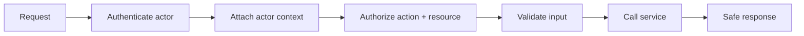

# Security, Authentication, and API Safety

## Watch First

<div style={{position: 'relative', paddingBottom: '56.25%', height: 0, overflow: 'hidden', maxWidth: '100%', marginBottom: '1.5rem'}}>
  <iframe
    src="https://www.youtube.com/embed/NVTO9ebBask"
    title="Using JWTs - Introduction to Axum"
    style={{position: 'absolute', top: 0, left: 0, width: '100%', height: '100%', border: 0}}
    allow="accelerometer; autoplay; clipboard-write; encrypted-media; gyroscope; picture-in-picture; web-share"
    referrerPolicy="strict-origin-when-cross-origin"
    allowFullScreen
  />
</div>

## Why This Matters

Memory safety does not make an API secure. A Rust service still needs authentication, authorization, input validation, safe error responses, secret handling, dependency review, and operational controls.

Security should be designed into the request path, not patched on after routes exist.

## What You Will Build

Add authenticated routes to the task API: create task, assign task, list my tasks, admin-only delete, and service-account access for workers.

## Concept

Ask one question for every protected action:

> Can this actor perform this action on this resource?



## Rust Pattern

Separate authentication from authorization:

```rust
#[derive(Debug, Clone)]
pub struct Actor {
    pub id: UserId,
    pub role: Role,
}

#[derive(Debug, Clone, Copy, PartialEq, Eq)]
pub enum Role {
    User,
    Admin,
    ServiceAccount,
}

pub fn can_delete_task(actor: &Actor) -> bool {
    matches!(actor.role, Role::Admin)
}
```

Attach the actor at the HTTP edge, then pass it into application services as explicit context.

## Practice

Keep this mistake out of your first implementation.

Never trust client-supplied roles:

```json
{
  "task_id": "task_123",
  "role": "admin"
}
```

The actor's identity and capabilities must come from authenticated server-side context, not request body claims.

Keep these concrete mistakes out of your work.

- Trusting client roles or user IDs.
- Logging tokens or secrets.
- Returning raw SQL errors or stack traces.
- Skipping auth on generated routes.
- Treating authentication as authorization.

Use this sequence. Do not move to the next row until you have produced the artifact in the right column.

| Step | Focus | Artifact |
| --- | --- | --- |
| Identity concepts | User, service account, API key, session, token | Identity model |
| Authentication choices | API keys, JWT, sessions, tradeoffs | Auth decision note |
| Authorization | RBAC, ownership, capabilities | Policy functions |
| Axum auth middleware | Extract actor and reject unauthenticated requests | Middleware/extractor |
| Secrets and passwords | Hashing, no secret logs, rotation | Secret handling checklist |
| Input and output safety | Validate payloads, restrict fields, safe errors | Error envelope |
| Supply-chain checks | Audit dependencies and justify crates | Dependency review note |

Build this now. Keep each change small enough that you can run `cargo check`, `cargo test`, and inspect the diff.

Implement:

- authenticated `POST /tasks`,
- `GET /tasks/mine`,
- admin-only `DELETE /tasks/:id`,
- service-account-only worker route,
- tests for unauthorized, forbidden, and allowed requests.

After your own attempt, use another reviewer or an AI tool as a second pass. Accept a suggestion only when you can explain why it preserves the lesson design.

Ask AI to add auth to one route. Review:

- where the actor comes from,
- whether authorization checks the target resource,
- whether errors leak internals,
- whether logs include secrets,
- whether every generated route has a policy.

You can move on when these statements are true.

- Is authentication separate from authorization?
- Is the actor extracted from trusted context?
- Are ownership checks resource-specific?
- Are secrets never logged or returned?
- Are raw infrastructure errors hidden from clients?
- Are dependency additions justified?

## Curated Resources

- [OWASP API Security Top 10](https://owasp.org/www-project-api-security/) — practical API risk categories for services.
- [Argon2 crate documentation](https://docs.rs/argon2/latest/argon2/) — password hashing reference when password auth is needed.
- [jsonwebtoken crate documentation](https://docs.rs/jsonwebtoken/latest/jsonwebtoken/) — common JWT implementation reference; use only with clear validation rules.

## Next Step

Continue to [Observability, Performance, and Deployment](15-observability-performance-deployment.md).
