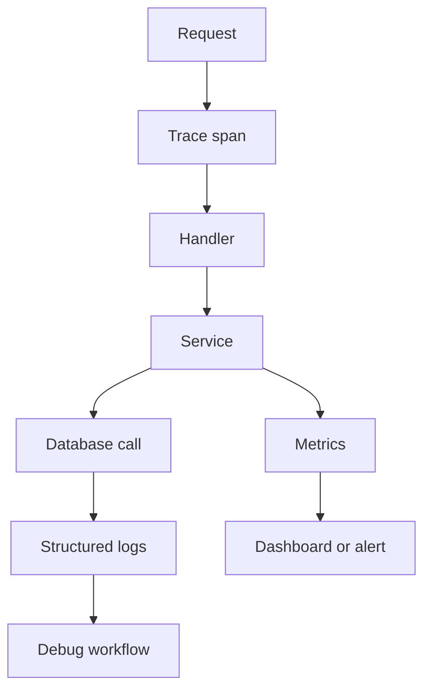

# Observability, Performance, and Deployment

## Watch First

<div style={{position: 'relative', paddingBottom: '56.25%', height: 0, overflow: 'hidden', maxWidth: '100%', marginBottom: '1.5rem'}}>
  <iframe
    src="https://www.youtube.com/embed/21rtHinFA40"
    title="Decrusting the tracing crate"
    style={{position: 'absolute', top: 0, left: 0, width: '100%', height: '100%', border: 0}}
    allow="accelerometer; autoplay; clipboard-write; encrypted-media; gyroscope; picture-in-picture; web-share"
    referrerPolicy="strict-origin-when-cross-origin"
    allowFullScreen
  />
</div>

## Why This Matters

Production Rust services must be operated, debugged, and improved. A fast binary is not enough if the team cannot tell what failed, why it failed, how often it fails, or how to roll it back.

Performance work should start with measurement, not folklore.

## What You Will Build

Prepare the service for deployment with tracing, health/readiness routes, a Dockerfile, CI checks, and a short operations guide.

## Concept

Operational readiness has several paths:



Use logs for events, traces for flow, metrics for trends, and health/readiness checks for orchestration.

## Rust Pattern

Use structured fields:

```rust
#[tracing::instrument(skip(service), fields(task_id = %task_id))]
pub async fn complete_task(
    service: &TaskService,
    task_id: TaskId,
) -> Result<Task, TaskError> {
    let task = service.complete(task_id).await?;
    tracing::info!(status = ?task.status, "task completed");
    Ok(task)
}
```

The log should help answer what happened without parsing a sentence.

## Practice

Keep this mistake out of your first implementation.

Do not add vague logs everywhere:

```rust
println!("here");
println!("done");
```

Useful logs have fields, categories, and correlation IDs.

Keep these concrete mistakes out of your work.

- Adding logs without useful fields.
- Optimizing allocations before measuring a bottleneck.
- Ignoring readiness and migration state.
- Creating Dockerfiles that are large or leak build secrets.
- Running integration tests only locally, not in CI.

Use this sequence. Do not move to the next row until you have produced the artifact in the right column.

| Step | Focus | Artifact |
| --- | --- | --- |
| Structured logging | Fields, request IDs, resource IDs, error categories | Logging setup |
| Tracing | Spans around requests, DB calls, jobs, external calls | Trace instrumentation |
| Health and readiness | `/health`, `/ready`, DB connectivity, migration status | Health routes |
| Metrics | Request counts, latency, queue depth, job outcomes | Metrics plan |
| Performance mindset | Measure first, optimize bottleneck | Profiling note |
| Rust performance basics | Allocation, iterators, hot paths, backpressure | Small optimization exercise |
| Database performance | Indexes, N+1, pool sizing, pagination | Query review |
| Containerization | Release binaries, small runtime image, env config | Dockerfile |
| CI/CD | fmt, clippy, test, audit, image build, integration checks | CI workflow |

Build this now. Keep each change small enough that you can run `cargo check`, `cargo test`, and inspect the diff.

Add:

- request tracing middleware,
- `/health` and `/ready`,
- structured error logs,
- a Dockerfile,
- a CI workflow that runs formatting, linting, tests, and a dependency audit,
- an operations guide with startup, config, migration, and rollback notes.

After your own attempt, use another reviewer or an AI tool as a second pass. Accept a suggestion only when you can explain why it preserves the lesson design.

Ask AI to containerize the service. Review whether:

- it builds in release mode,
- it separates build and runtime stages,
- it avoids copying secrets,
- it handles config through environment,
- it documents how migrations run.

You can move on when these statements are true.

- Can operators tell whether the service is healthy?
- Are request IDs or trace IDs available?
- Are logs structured and safe?
- Are metrics tied to user-visible or operational outcomes?
- Was performance measured before optimization?
- Can the service be built and deployed from CI?

## Curated Resources

- [tracing documentation](https://docs.rs/tracing/latest/tracing/) — structured instrumentation for sync and async Rust.
- [tracing-subscriber documentation](https://docs.rs/tracing-subscriber/latest/tracing_subscriber/) — practical subscriber setup and formatting.
- [Cargo profiles](https://doc.rust-lang.org/cargo/reference/profiles.html) — release builds, debug symbols, and optimization controls.
- [Docker Rust language guide](https://docs.docker.com/language/rust/) — useful baseline for containerizing Rust applications.

## Next Step

Continue to [Beyond Backend](16-beyond-backend-cli-data-protocols-wasm-embedded.md).
