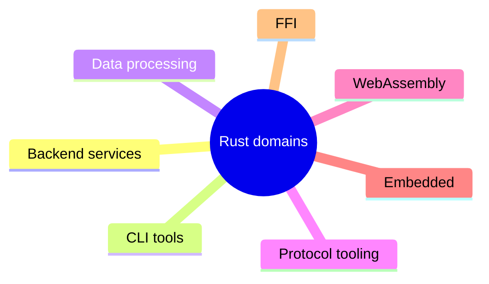

# Beyond Backend

## Watch First

<div style={{position: 'relative', paddingBottom: '56.25%', height: 0, overflow: 'hidden', maxWidth: '100%', marginBottom: '1.5rem'}}>
  <iframe
    src="https://www.youtube.com/embed/5UA9UWWAagc"
    title="Code Your Own CLI With Rust"
    style={{position: 'absolute', top: 0, left: 0, width: '100%', height: '100%', border: 0}}
    allow="accelerometer; autoplay; clipboard-write; encrypted-media; gyroscope; picture-in-picture; web-share"
    referrerPolicy="strict-origin-when-cross-origin"
    allowFullScreen
  />
</div>

## Why This Matters

Rust engineering transfers across domains because ownership, types, errors, concurrency, and boundaries are shared skills. A learner does not need five separate courses immediately, but they should know where Rust appears beyond web APIs.

## What You Will Build

Build one non-web artifact: a CLI that parses logs or events from the Rust service and produces a summary report.

## Concept

Rust often appears in:

- CLI tools,
- parsers,
- data processing,
- protocol and network tooling,
- WebAssembly,
- embedded systems,
- FFI boundaries.



## Rust Pattern

For internal tools, make the CLI boring and useful:

```rust
use clap::{Parser, Subcommand};

#[derive(Debug, Parser)]
#[command(name = "taskctl")]
struct Cli {
    #[command(subcommand)]
    command: Command,
}

#[derive(Debug, Subcommand)]
enum Command {
    Summarize { input: std::path::PathBuf },
    Validate { input: std::path::PathBuf },
}
```

Good CLIs have clear errors, exit codes, help text, and tests around parsing and behavior.

## Practice

Keep this mistake out of your first implementation.

Do not turn this module into seven separate deep tracks. The purpose is orientation plus one useful artifact.

When parsing, do not reach for parser combinators if simple line parsing is enough. When processing data, do not load huge files into memory if a streaming approach is straightforward.

Keep these concrete mistakes out of your work.

- Loading entire large files into memory.
- Producing unclear CLI errors.
- Using complex parsing libraries for simple formats.
- Ignoring exit codes.
- Treating FFI and unsafe boundaries casually.

Use this sequence. Do not move to the next row until you have produced the artifact in the right column.

| Step | Focus | Artifact |
| --- | --- | --- |
| CLI tools with Clap | Commands, config files, errors, exit codes | `taskctl` CLI |
| Parsing with nom or winnow | Logs, protocols, config formats | Parser tradeoff note |
| Data processing | CSV, JSONL, Parquet awareness, Polars | Streaming summary |
| Protocol and network tooling | Binary formats, framing, checksums, typed states | Protocol sketch |
| WebAssembly | Browser, plugin, edge use cases, limits | WASM awareness note |
| `no_std` and embedded awareness | Embedded Rust and HALs | Embedded map |
| FFI awareness | C ABI, safety boundaries, docs | FFI boundary checklist |

Build this now. Keep each change small enough that you can run `cargo check`, `cargo test`, and inspect the diff.

Build `taskctl summarize events.jsonl`:

- read JSONL line by line,
- count jobs by status,
- report first and last timestamp,
- return non-zero exit for malformed lines,
- include tests with small fixture files.

After your own attempt, use another reviewer or an AI tool as a second pass. Accept a suggestion only when you can explain why it preserves the lesson design.

Ask AI to write the log parser. Review whether:

- it streams input,
- error messages include line numbers,
- malformed input is handled deliberately,
- CLI behavior has tests,
- dependencies are justified.

You can move on when these statements are true.

- Is the artifact useful outside the web service?
- Does it handle large inputs safely?
- Are errors actionable?
- Are exit codes meaningful?
- Is the parsing approach proportional to the format?
- Are advanced domains treated with appropriate caution?

## Curated Resources

- [clap documentation](https://docs.rs/clap/latest/clap/) — the standard choice for robust Rust CLIs.
- [nom documentation](https://docs.rs/nom/latest/nom/) — a common parser-combinator library for structured formats.
- [winnow documentation](https://docs.rs/winnow/latest/winnow/) — modern parser combinators with a focus on clarity.
- [Rust and WebAssembly Book](https://rustwasm.github.io/docs/book/) — starting point for Rust-to-WASM work.
- [Embedded Rust Book](https://docs.rust-embedded.org/book/) — orientation for `no_std` and embedded constraints.

## Next Step

Continue to [Macros, Unsafe Rust, and Advanced Escape Hatches](17-macros-unsafe-advanced-escape-hatches.md).
