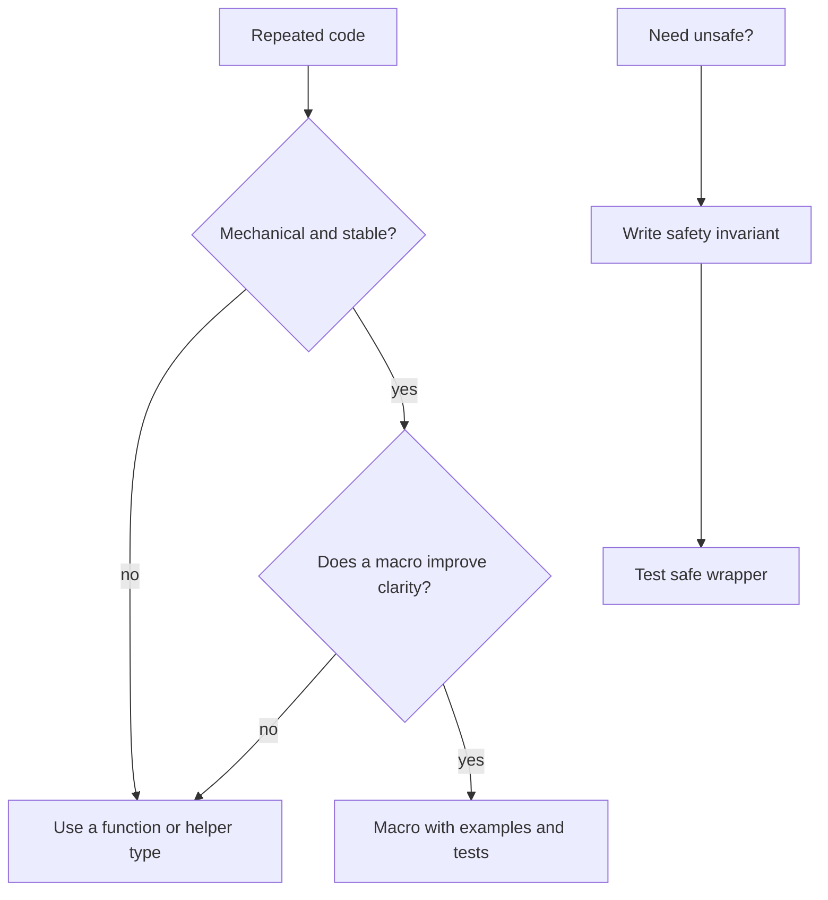

# Macros, Unsafe Rust, and Advanced Escape Hatches

## Watch First

<div style={{position: 'relative', paddingBottom: '56.25%', height: 0, overflow: 'hidden', maxWidth: '100%', marginBottom: '1.5rem'}}>
  <iframe
    src="https://www.youtube.com/embed/7zwjZmpSuYk"
    title="Macros - Idiomatic Rust in Simple Steps Part 16"
    style={{position: 'absolute', top: 0, left: 0, width: '100%', height: '100%', border: 0}}
    allow="accelerometer; autoplay; clipboard-write; encrypted-media; gyroscope; picture-in-picture; web-share"
    referrerPolicy="strict-origin-when-cross-origin"
    allowFullScreen
  />
</div>

## Why This Matters

Macros and unsafe Rust are powerful. They also make code harder to inspect when used casually.

Teach them as deliberate escape hatches after learners have enough taste to ask whether a function, trait, or explicit repetition would be better.

## What You Will Build

Write a small macro for repeated test setup, then write a review note explaining why it is acceptable or why it should be replaced by a function.

## Concept

Advanced Rust should make a system clearer, faster, safer, or more maintainable in a way that ordinary Rust cannot. Otherwise, it is cleverness.



## Rust Pattern

A small macro can be acceptable when it removes stable mechanical repetition:

```rust
macro_rules! task_id {
    ($value:literal) => {
        TaskId::new($value)
    };
}

#[test]
fn task_id_macro_is_readable_in_tests() {
    let id = task_id!("task_123");
    assert_eq!(id.to_string(), "task_123");
}
```

Even then, ask whether a normal helper function is clearer.

## Practice

Keep this mistake out of your first implementation.

Do not create a private language to save a few lines:

```rust
crud_resource!(Task, tasks, task_id, title, status, timestamps, auth, audit);
```

If reviewers cannot see what happens, debugging and security review get worse.

Keep these concrete mistakes out of your work.

- Generating macros for ordinary functions.
- Hiding simple behavior behind hard-to-debug generated code.
- Adding unsafe blocks without stating invariants.
- Treating unsafe as "turn off Rust checks" instead of "take responsibility for specific guarantees."

Use this sequence. Do not move to the next row until you have produced the artifact in the right column.

| Step | Focus | Artifact |
| --- | --- | --- |
| Declarative macros | `macro_rules!`, mechanical repetition | Small test macro |
| Procedural macros | Derive and attribute macros in frameworks | Generated behavior note |
| When macros are a smell | Hidden behavior, bad errors, private mini-languages | Macro deletion exercise |
| Unsafe Rust | Raw pointers, FFI, performance internals, invariants | Safety note |
| Reviewing unsafe or macro-heavy code | Invariants, enforcement, tests, safe alternatives | Review checklist |

Build this now. Keep each change small enough that you can run `cargo check`, `cargo test`, and inspect the diff.

Write a macro that creates repeated test fixtures. Then write a note answering:

- What repetition did this remove?
- Why is the repetition stable?
- Could a function be clearer?
- What errors does the macro produce when used incorrectly?
- How is the macro tested?

If the note is weak, delete the macro and use a helper function.

After your own attempt, use another reviewer or an AI tool as a second pass. Accept a suggestion only when you can explain why it preserves the lesson design.

Ask AI to remove duplication with a macro. Review whether:

- a macro is necessary,
- the generated behavior is inspectable,
- error messages are acceptable,
- tests cover macro expansion behavior,
- reviewers can reason about the code.

You can move on when these statements are true.

- What invariant is being claimed?
- Where is it enforced?
- How is it tested?
- Can this be written safely and clearly instead?
- Does the macro improve clarity or hide behavior?
- Are unsafe blocks documented with precise safety comments?

## Curated Resources

- [Rust Book: Macros](https://doc.rust-lang.org/book/ch20-05-macros.html) — official macro overview.
- [Rust Reference: Unsafe](https://doc.rust-lang.org/reference/unsafe-keyword.html) — precise language reference for unsafe contexts.
- [Rustonomicon](https://doc.rust-lang.org/nomicon/) — advanced unsafe Rust reference; use as a cautionary deep dive, not a beginner path.

## Next Step

Continue to [AI-Assisted Rust Engineering](18-ai-assisted-rust-engineering.md).
