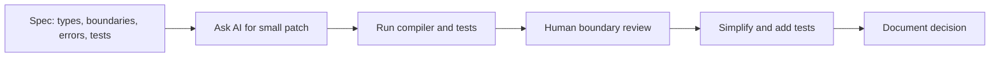

# AI-Assisted Rust Engineering

## Watch First

<div style={{position: 'relative', paddingBottom: '56.25%', height: 0, overflow: 'hidden', maxWidth: '100%', marginBottom: '1.5rem'}}>
  <iframe
    src="https://www.youtube.com/embed/4ftJ42_sdVk"
    title="How to use Claude Code for Rust[FULL GUIDE]"
    style={{position: 'absolute', top: 0, left: 0, width: '100%', height: '100%', border: 0}}
    allow="accelerometer; autoplay; clipboard-write; encrypted-media; gyroscope; picture-in-picture; web-share"
    referrerPolicy="strict-origin-when-cross-origin"
    allowFullScreen
  />
</div>

## Why This Matters

AI can accelerate Rust engineering, especially around boilerplate, compiler explanations, tests, and refactors. It can also produce code that compiles while weakening ownership, errors, security, backpressure, or architecture.

Use AI to move faster without surrendering judgment.

## What You Will Build

Take an AI-generated Axum CRUD slice, review it, simplify it, add typed errors and tests, and write an ADR explaining the final design.

## Concept

AI works best when the human supplies the architecture:



## Rust Pattern

Prompt with constraints:

```text
Implement TaskRepository::find_by_id using SQLx.

Constraints:
- Do not change public domain types.
- Return Result<Option<TaskRow>, sqlx::Error>.
- Keep SQL visible in the repository method.
- Add one test for missing rows and one for existing rows.
- Do not introduce a generic CRUD abstraction.
```

Small prompts make review possible.

## AI-Generated Rust Smell List

- unnecessary `.clone()`,
- too much `Arc<Mutex<_>>`,
- `unwrap()` in production paths,
- `String` everywhere,
- over-generic CRUD,
- domain logic inside handlers,
- flattened errors with `anyhow` everywhere,
- missing tests,
- ignoring backpressure,
- spawning tasks without shutdown,
- hiding SQL behind unreviewable abstraction.

## Practice

Keep this mistake out of your first implementation.

Do not ask for "the whole backend" and then try to review thousands of lines. Ask for one boundary, one implementation, or one test set.

Keep these concrete mistakes out of your work.

- Optimizing for compilable code instead of maintainable code.
- Accepting compiler suggestions without understanding the design cause.
- Creating abstractions that look senior but hide behavior.
- Skipping negative tests and security checks.

Use this sequence. Do not move to the next row until you have produced the artifact in the right column.

| Step | Focus | Artifact |
| --- | --- | --- |
| Spec-first prompting | Types, ownership, errors, tests before implementation | Implementation prompt |
| Prompting with traits and boundaries | One trait, one implementation, one method | Focused patch |
| Compiler-guided iteration | Explain error, identify design assumption | Compiler error note |
| Smell list | Clones, locks, unwraps, generics, missing tests | Smell checklist |
| Human review workflow | Diff, checks, boundaries, tests, simplification | Review transcript |
| AI as reviewer | Boundary leaks, security mistakes, over-abstraction | AI review prompt |
| Senior simplification | Delete clever layers, keep contributors in mind | Simplified patch |

Build this now. Keep each change small enough that you can run `cargo check`, `cargo test`, and inspect the diff.

Generate a CRUD route for `Artifact`. Before accepting it:

- run formatting, clippy, and tests,
- identify every clone and unwrap,
- check whether domain logic is in the handler,
- check whether errors are typed,
- add missing tests,
- write an ADR explaining what you kept, changed, and rejected.

After your own attempt, use another reviewer or an AI tool as a second pass. Accept a suggestion only when you can explain why it preserves the lesson design.

Ask AI to review its own patch for:

- boundary leaks,
- security mistakes,
- over-abstraction,
- missing tests,
- error strategy problems.

Then compare the AI review to your own review. Human judgment decides the final patch.

You can move on when these statements are true.

- Did the prompt provide architecture, or just vibes?
- Is the patch small enough to review?
- Did the compiler fix improve the design?
- Are tests meaningful?
- Were AI shortcuts removed?
- Is the final design documented?

## Curated Resources

- [Rust Book](https://doc.rust-lang.org/book/) — use official semantics to verify AI explanations.
- [Rust API Guidelines](https://rust-lang.github.io/api-guidelines/) — useful standards for reviewing generated public APIs.
- [Cargo Book](https://doc.rust-lang.org/cargo/) — reference for validating dependency, feature, and build changes.

## Next Step

Continue to [Production Service Capstone](19-production-service-capstone.md).
