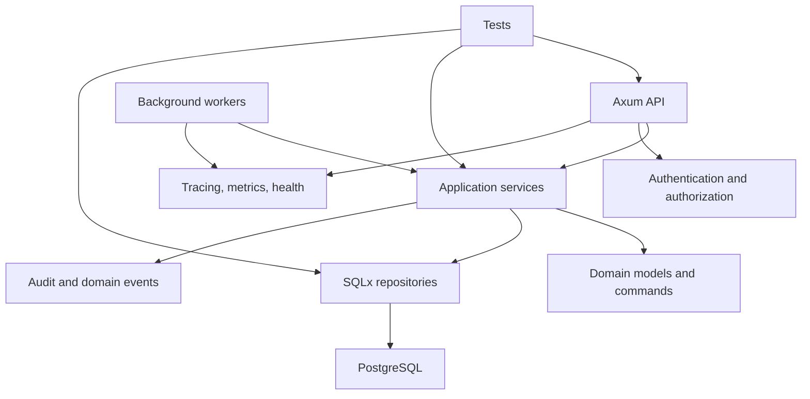

# Production Service Capstone

## Watch First

<div style={{position: 'relative', paddingBottom: '56.25%', height: 0, overflow: 'hidden', maxWidth: '100%', marginBottom: '1.5rem'}}>
  <iframe
    src="https://www.youtube.com/embed/Ka7mRKsTCyE"
    title="Complete Axum 0.8 Tutorial: Build Production REST APIs in Rust (2026 Full Course)"
    style={{position: 'absolute', top: 0, left: 0, width: '100%', height: '100%', border: 0}}
    allow="accelerometer; autoplay; clipboard-write; encrypted-media; gyroscope; picture-in-picture; web-share"
    referrerPolicy="strict-origin-when-cross-origin"
    allowFullScreen
  />
</div>

## Why This Matters

The capstone proves the learner can combine Rust language knowledge with engineering judgment: architecture, ownership, errors, persistence, async work, security, testing, observability, deployment, and review.

It should not feel like a toy TODO app. It should be small enough to finish and real enough to review.

## What You Will Build

Build one production-style Rust service. Choose a domain that fits your goals:

- **Task Engine**: create, assign, run, and review tasks across users and workers.
- **Operator Registry**: register service actors, capabilities, artifacts, and reputation events.
- **Artifact Review Service**: submit artifacts, run checks, collect review decisions, and record audit logs.
- **Job Processing Service**: accept jobs, process them asynchronously, expose status, and retry failures.

Flow Research contributors can adapt these options to Flow-specific operators, tasks, artifacts, jobs, reviews, and reputation. Other learners can use the same architecture for their own domain.

## Concept

The capstone is a system review, not just a feature checklist:



## Required Features

| Area | Required outcome |
| --- | --- |
| Axum API | Create, list, get, update, health, readiness, consistent errors, and documented contracts. |
| SQLx persistence | Migrations, typed queries, transactions, pagination, and scoped resources where relevant. |
| Reusable CRUD layer | Typed IDs, pagination, common error envelopes, resource-specific services, and generic helpers only where justified. |
| Auth and authorization | API key, JWT, or session auth; actor extraction; role or capability checks; protected admin or service-account actions. |
| Background worker | Job processing, event emission, bounded retries, and graceful shutdown. |
| Observability | Tracing, request IDs, structured errors, worker spans, health checks, and basic metrics. |
| Testing | Unit, integration, HTTP, database, and regression tests from review feedback. |
| Documentation | README, API docs, architecture diagram, ADRs, contribution notes, and deployment guide. |
| Optional scaffolding comparison | Use a predictable CLI or explicit-code scaffold for one resource, then compare what it made easier and what you still reviewed manually. |
| Final review | Security, error, abstraction, generated-code, performance, and operations review. |

## Capstone Deliverable

Submit a public repository or reviewable code bundle with working service code, tests, documentation, and a final engineering review. The review should cover what you built, the architecture, key Rust decisions, ownership and state, errors, CRUD reuse, async work, security, observability, what AI helped with, what you rejected or simplified, and what you would improve next.

```md
# Final Engineering Review

- What I built:
- Architecture:
- Key Rust decisions:
- Ownership and state model:
- Error strategy:
- CRUD reuse strategy:
- Async and worker design:
- Security decisions:
- Observability:
- What AI helped with:
- What I rejected or simplified:
- What I would improve next:
```

## Practice

Keep this mistake out of your first implementation.

Do not measure the capstone by feature count alone. A smaller service with clear boundaries, tests, and operational notes is better than a large unreviewable service.

Keep these concrete mistakes out of your work.

- Generating too much code before the architecture is written.
- Creating generic CRUD that hides resource behavior.
- Skipping auth and authorization on "internal" routes.
- Adding workers without shutdown or retry budgets.
- Writing documentation that describes intentions instead of actual behavior.

Build this now. Keep each change small enough that you can run `cargo check`, `cargo test`, and inspect the diff.

Before building, write:

- one-page product brief,
- entity relationship sketch,
- route list,
- worker flow,
- error strategy,
- security policy,
- testing strategy,
- first ADR.

Then implement the smallest vertical slice end to end before adding the second resource.

You can move on when these statements are true.

- Can the service be run locally from the README?
- Does the first vertical slice include API, persistence, tests, auth, and tracing?
- Are domain rules represented as types and services?
- Is SQL explicit and reviewable?
- Are async jobs bounded and cancellable?
- Are errors safe for clients and useful for operators?
- Are AI-generated parts reviewed and simplified?
- Is the final write-up honest about tradeoffs?

## Curated Resources

- [The Rust Programming Language](https://doc.rust-lang.org/book/) — final reference for language concepts.
- [Axum documentation](https://docs.rs/axum/latest/axum/) — API layer reference.
- [Tokio documentation](https://docs.rs/tokio/latest/tokio/) — async and worker runtime reference.
- [SQLx documentation](https://docs.rs/sqlx/latest/sqlx/) — persistence reference.
- [tracing documentation](https://docs.rs/tracing/latest/tracing/) — observability reference.
- [Rust API Guidelines](https://rust-lang.github.io/api-guidelines/) — final review standard for public APIs.

## Completion Standard

You are done when another engineer can clone the repository, run it, understand the architecture, review the security posture, run the tests, and identify the next safe change.
