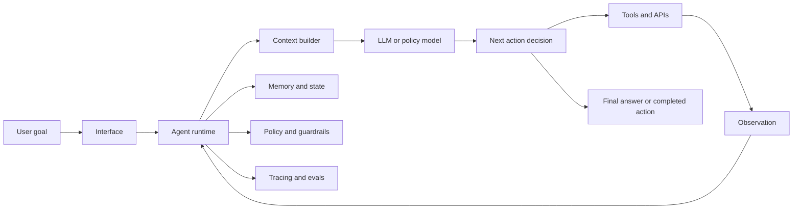
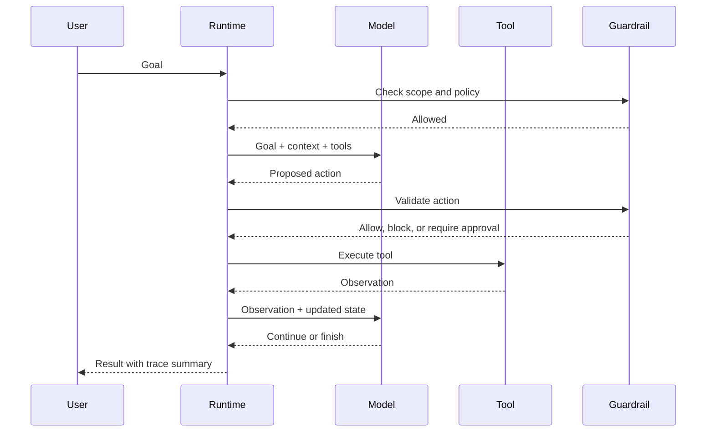

# What Are Agent Systems?

## Watch First

<div style={{position: 'relative', paddingBottom: '56.25%', height: 0, overflow: 'hidden', maxWidth: '100%', marginBottom: '1.5rem'}}>
  <iframe
    src="https://www.youtube.com/embed/4pYzYmSdSH4"
    title="Andrew Ng: State of AI Agents"
    style={{position: 'absolute', top: 0, left: 0, width: '100%', height: '100%', border: 0}}
    allow="accelerometer; autoplay; clipboard-write; encrypted-media; gyroscope; picture-in-picture; web-share"
    referrerPolicy="strict-origin-when-cross-origin"
    allowFullScreen
  />
</div>

Watch for the distinction between a model, a workflow, and an agent. That distinction prevents most early design mistakes.

## Learning Objectives

By the end of this lesson, you will be able to:

- Define an agent system without relying on vague autonomy language.
- Identify the runtime, model, tools, memory, policy, and evaluation layers in an agent product.
- Decide when a deterministic workflow is better than an open-ended agent loop.
- Describe the failure surface that appears when software can choose actions, use tools, and remember state.
- Sketch a small agent architecture that can be tested before it is trusted.

## Mental Model



An agent system is software that repeatedly chooses what to do next in order to pursue a goal. It may use a language model, call tools, retrieve context, update memory, ask a human for approval, or stop when the goal is complete.

The important word is **system**. A model response is not an agent. A prompt is not an agent. A chatbot with no tools and no durable state is usually not an agent. An agent system is the combination of model calls, code, policies, tools, memory, and evaluation that turns a goal into controlled action.

:::info Working Definition
An agent system perceives context, selects actions, executes through tools or workflows, observes results, and adapts its next step under explicit constraints.
:::

## Agent vs Workflow vs Chatbot

| System type | Control path | Good fit | Main risk |
| --- | --- | --- | --- |
| Chatbot | User asks, model answers | Conversation, drafting, explanations | Hallucinated answers |
| Workflow | Code defines the steps | Known business process, predictable inputs | Brittle branching |
| Agent | System decides some steps at runtime | Messy goals, unknown substeps, tool-rich environments | Bad action selection |

Do not build an agent just because the word sounds modern. Use the least autonomous design that solves the job.

A workflow is usually better when:

- the steps are known in advance,
- correctness is easy to check with code,
- the action has financial, legal, or data-loss consequences,
- latency and cost must be tightly bounded.

An agent starts to make sense when:

- the task requires exploration,
- the right tool depends on intermediate results,
- the user goal is underspecified,
- failure can be detected and recovered from,
- the environment can be sandboxed.

## Core Components

### Runtime

The runtime owns the loop. It decides when to call the model, which context to include, how tool results are returned, when to retry, when to stop, and when to escalate to a human.

In Flow terms, Jarvis is a runtime surface: it gives agents a place to execute, observe, and interact with user work.

### Model

The model is a reasoning and language component, not the whole system. It can classify, plan, summarize, write arguments for tool calls, and inspect results.

Treat the model like an unreliable but useful collaborator:

- give it clear inputs,
- constrain its outputs,
- validate important decisions,
- log what it did,
- measure it on real tasks.

### Tools

Tools are the agent's actuators. They turn text decisions into real effects: read a file, search a database, send a message, create a ticket, run tests, or call an API.

Good tool design is narrow, typed, observable, and reversible where possible.

### Memory and State

Memory lets an agent carry information across steps and sessions. State tracks the current task: open goals, pending approvals, selected files, retries, and intermediate artifacts.

Memory is not a dumping ground. Bad memory makes an agent confidently wrong.

### Policy and Guardrails

Policy defines what the agent is allowed to do. Guardrails enforce that policy before the model sees input, before a tool executes, and before output reaches a user or external system.

The higher the authority of the agent, the more guardrails belong outside the prompt.

### Evaluation

Evaluation tells you whether the agent works. For agents, evaluation must inspect both:

- the final outcome,
- the trajectory of actions taken to get there.

An answer can be correct for the wrong reason. A tool call can be valid JSON but the wrong action. A task can complete once and fail under a slightly different user phrasing.

## The Agent Loop

Most practical agents follow a loop:



A production agent loop needs stopping rules. Without them, a model can repeat actions, waste tokens, hit rate limits, or keep trying after the task is already impossible.

Useful stopping rules include:

- maximum number of model turns,
- maximum tool calls,
- maximum cost,
- no-progress detector,
- required human approval,
- completion criteria checked by code or a rubric.

## A Small Runnable Agent Loop

This toy example shows the system shape without calling an LLM. The "policy" decides which tool to use. Real agents often replace that policy with a model call, but the runtime structure remains similar.

```python
from dataclasses import dataclass, field
from typing import Callable


@dataclass
class ToolResult:
    ok: bool
    content: str


@dataclass
class AgentState:
    goal: str
    observations: list[str] = field(default_factory=list)
    steps: int = 0


def search_docs(query: str) -> ToolResult:
    docs = {
        "refund": "Refunds require receipt validation and manager approval.",
        "invoice": "Invoices are available from the billing dashboard.",
    }
    for key, value in docs.items():
        if key in query.lower():
            return ToolResult(True, value)
    return ToolResult(False, "No matching policy found.")


def answer_user(state: AgentState) -> ToolResult:
    evidence = "\n".join(state.observations) or "No evidence collected."
    return ToolResult(True, f"Goal: {state.goal}\nEvidence:\n{evidence}")


TOOLS: dict[str, Callable[[str], ToolResult]] = {
    "search_docs": search_docs,
    "answer_user": lambda goal: answer_user(current_state),
}


def choose_action(state: AgentState) -> str:
    if state.observations:
        return "answer_user"
    return "search_docs"


current_state = AgentState(goal="Can this customer get a refund?")

for _ in range(3):
    current_state.steps += 1
    action = choose_action(current_state)

    if action == "search_docs":
        result = search_docs(current_state.goal)
        current_state.observations.append(result.content)
        continue

    result = answer_user(current_state)
    print(result.content)
    break
else:
    print("Stopped: step limit reached")
```

This small loop already has the bones of a real agent:

- state,
- tool registry,
- action selection,
- observations,
- stopping rule,
- final response.

The model is not the architecture. The model is one replaceable component inside the architecture.

## Design Checklist

Before building an agent, answer these questions:

| Question | Why it matters |
| --- | --- |
| What goal does the agent complete? | Prevents a general assistant from becoming a vague demo. |
| What can it observe? | Defines context and privacy boundaries. |
| What can it change? | Defines real-world authority and risk. |
| What tools does it need? | Forces explicit integration design. |
| What must it never do? | Produces policy and guardrails. |
| How does it know it is done? | Prevents loops and premature completion. |
| How will you evaluate it? | Turns demos into engineering. |

## Flow Context

Every Flow product touches agent systems:

- Jarvis provides runtime and operator surfaces.
- Garden is the workspace where humans and agents coordinate.
- WorkStream distributes tasks and tracks execution.
- Harnessy evaluates output, traces behavior, and closes feedback loops.

The shared engineering problem is not "make an AI do things." It is to build systems where useful autonomy is scoped, observable, reversible, and measurable.

## Common Failure Modes

### Autonomy Without a Job

The agent can browse, write, search, and call APIs, but nobody can state the exact task it reliably completes.

### Tool Access Without Authority Boundaries

The agent can read private data and communicate externally without a policy layer that decides whether that combination is allowed.

### Memory Without Governance

The agent stores stale preferences, incorrect summaries, or private information without expiry, correction, or user control.

### Evaluation Only at the Final Answer

The result looks acceptable, but the agent used the wrong tool, ignored policy, or took a fragile path that will fail next time.

## Exercises

1. Pick a task from your own workflow. Classify it as chatbot, workflow, or agent. Justify the choice with the table above.
2. Draw the agent loop for a Personal Operator that schedules meetings. Include at least three guardrail checkpoints.
3. Write completion criteria for an agent that researches a technical topic and creates a short report.
4. Identify one action the agent should never take automatically. Explain which layer should enforce that rule.

## Self-Assessment

You are ready to move on when you can answer:

- What makes an agent system different from a single LLM call?
- Why is tool authority more important than model intelligence in many production failures?
- What should be logged for every agent run?
- When should you choose a deterministic workflow instead of an agent?

## Further Reading

- [Anthropic: Building effective agents](https://www.anthropic.com/engineering/building-effective-agents)
- [Lilian Weng: LLM Powered Autonomous Agents](https://lilianweng.github.io/posts/2023-06-23-agent/)
- [OpenAI Agents SDK documentation](https://openai.github.io/openai-agents-python/)
- [Russell and Norvig: Artificial Intelligence, intelligent agents overview](https://aima.cs.berkeley.edu/)
