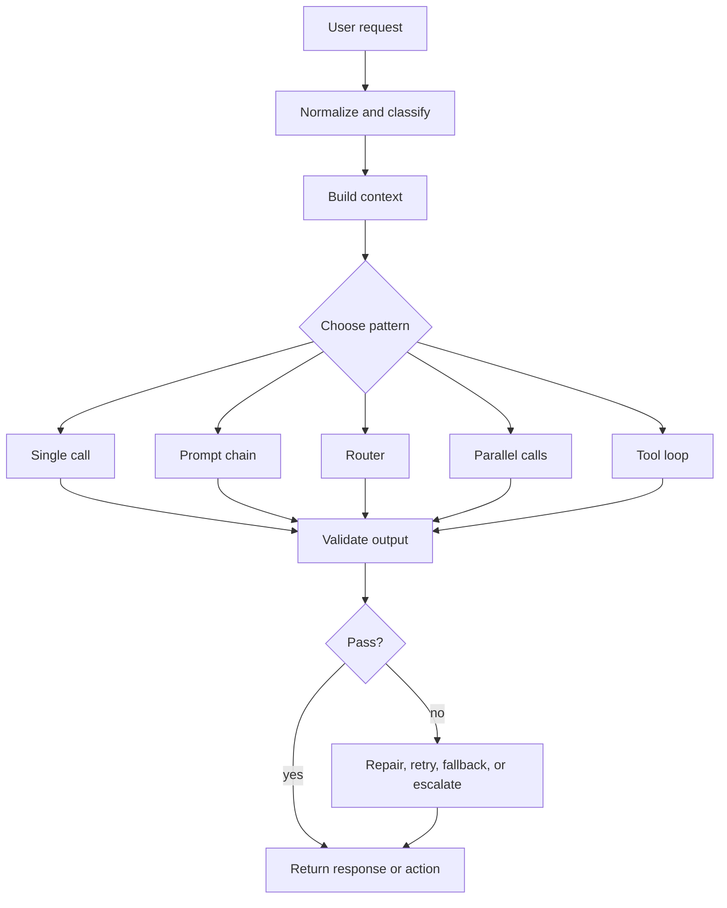
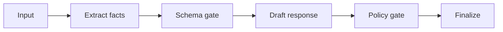
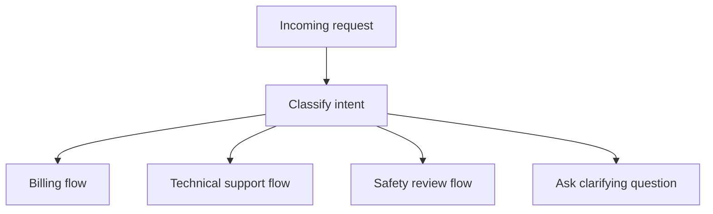
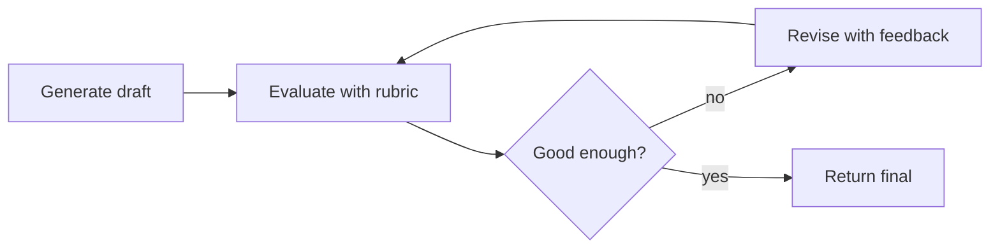
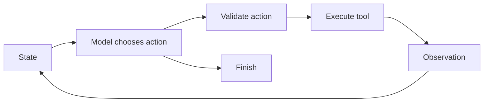

# LLM Orchestration

## Watch First

<div style={{position: 'relative', paddingBottom: '56.25%', height: 0, overflow: 'hidden', maxWidth: '100%', marginBottom: '1.5rem'}}>
  <iframe
    src="https://www.youtube.com/embed/LP5OCa20Zpg"
    title="Tips for building AI agents"
    style={{position: 'absolute', top: 0, left: 0, width: '100%', height: '100%', border: 0}}
    allow="accelerometer; autoplay; clipboard-write; encrypted-media; gyroscope; picture-in-picture; web-share"
    referrerPolicy="strict-origin-when-cross-origin"
    allowFullScreen
  />
</div>

Watch for the practical point: many reliable "agent" products are really carefully orchestrated workflows with a small amount of model judgment.

## Learning Objectives

By the end of this lesson, you will be able to:

- Explain how orchestration turns model calls into a controlled system.
- Choose between single-call, chain, router, parallel, evaluator, and tool-loop patterns.
- Design prompt inputs, schemas, validators, retries, and fallbacks for each step.
- Separate model reasoning from application authority.
- Build a small orchestrator that can be tested without depending on a live model.

## Orchestration Map



LLM orchestration is the application layer that decides:

- what the model sees,
- which model or prompt to use,
- how many calls to make,
- which tools are available,
- how model output is validated,
- what happens when something fails.

Good orchestration reduces the amount of judgment the model must carry. It gives the model smaller jobs with typed boundaries.

:::tip Engineering Rule
Put deterministic logic in code. Use the model for judgment, language, semantic matching, planning, and extraction when code cannot express the rule cheaply.
:::

## The Inputs to a Model Call

A model call is not just a prompt string. It is a structured request.

| Input | Purpose | Failure if neglected |
| --- | --- | --- |
| System instructions | Defines role, scope, and output contract | Drifting behavior |
| User request | Captures the actual goal | Solving the wrong task |
| Retrieved context | Grounds answer in relevant facts | Hallucination or stale facts |
| Tool definitions | Describes callable capabilities | Wrong tool selection |
| Response schema | Makes output machine-checkable | Parsing failures |
| Safety policy | Defines allowed and blocked behavior | Unsafe action |
| Trace metadata | Connects the call to an eval run | No debugging path |

The prompt should not carry everything. Some constraints belong in code: authentication, permissions, rate limits, file-system boundaries, spending limits, and approval requirements.

## Core Orchestration Patterns

### 1. Single Call

Use one model call when the task is narrow and the output can be validated.

Good examples:

- rewrite a paragraph,
- classify a support ticket,
- extract fields from a short document,
- produce a summary from trusted context.

Avoid single-call orchestration when the task needs external data, tool use, or a high-risk action.

### 2. Prompt Chain

A chain breaks a task into fixed stages.



Use a chain when each stage has a clear contract. For example:

1. Extract candidate facts from a lesson draft.
2. Validate that each fact has a source.
3. Generate a learner-friendly explanation.
4. Check the explanation against a rubric.

The cost is latency. The benefit is control.

### 3. Router

A router sends a request to the right path.



Routers are useful when different intents need different prompts, tools, models, or escalation rules.

Do not let a router silently guess high-risk categories. If confidence is low, ask a clarifying question or escalate.

### 4. Parallelization

Parallel calls let you inspect a problem from multiple angles.

Examples:

- one model extracts facts while another checks policy,
- several retrieval queries run at once,
- three candidate plans are generated and a validator selects one.

Parallelization improves coverage, but it can hide cost growth. Track tokens, time, and usefulness per branch.

### 5. Evaluator-Optimizer

An evaluator checks output and sends it back for revision.



Use it when quality is more important than latency. Cap the number of loops. The loop should improve measurable criteria, not just produce different wording.

### 6. Tool Loop

A tool loop lets the model choose an action, observe the result, and continue.



Tool loops are powerful because they handle unknown substeps. They are risky because the action path is dynamic. Add limits, action validation, and tracing from the start.

## Prompt Structure That Holds Up

A reliable orchestration prompt is specific about inputs and outputs.

```text
Role:
You are the router for a learner-support agent.

Task:
Classify the user's request into exactly one route.

Routes:
- lesson_help: learner asks about lesson content
- account_help: learner asks about login, billing, or profile
- safety_review: request mentions harm, harassment, credentials, or data exposure
- unknown: the request is ambiguous

Output:
Return JSON matching this schema:
{"route": "...", "confidence": 0.0, "reason": "..."}

Rules:
- If confidence is below 0.70, use "unknown".
- Do not answer the user directly.
- Do not invent account facts.
```

The output schema matters because downstream code needs to know what it can trust.

## Runnable Example: Router With Validation

This example uses deterministic keyword scoring so it runs anywhere. The same interface could later call a model.

```python
from dataclasses import dataclass
from typing import Literal

Route = Literal["lesson_help", "account_help", "safety_review", "unknown"]


@dataclass
class RouteDecision:
    route: Route
    confidence: float
    reason: str


KEYWORDS: dict[Route, set[str]] = {
    "lesson_help": {"lesson", "exercise", "quiz", "diagram", "code"},
    "account_help": {"login", "password", "billing", "profile", "invoice"},
    "safety_review": {"credential", "delete", "leak", "private", "harass"},
    "unknown": set(),
}


def route_request(text: str) -> RouteDecision:
    tokens = set(text.lower().replace("?", "").split())
    scores = {
        route: len(tokens & words)
        for route, words in KEYWORDS.items()
        if route != "unknown"
    }

    best_route, best_score = max(scores.items(), key=lambda item: item[1])
    confidence = min(1.0, best_score / 2)

    if confidence < 0.7:
        return RouteDecision("unknown", confidence, "Not enough evidence for a route.")

    return RouteDecision(best_route, confidence, f"Matched {best_score} route keyword(s).")


def validate_decision(decision: RouteDecision) -> None:
    if decision.route not in KEYWORDS:
        raise ValueError(f"Invalid route: {decision.route}")
    if not 0 <= decision.confidence <= 1:
        raise ValueError("Confidence must be between 0 and 1.")


examples = [
    "I do not understand the memory lesson exercise",
    "I need a billing invoice",
    "The agent leaked a private credential",
    "Can you help?",
]

for example in examples:
    decision = route_request(example)
    validate_decision(decision)
    print(example, "=>", decision)
```

In a real LLM router, keep the same discipline:

- define allowed routes,
- require a confidence value,
- validate the response,
- send uncertain cases to a safe fallback,
- log the decision for evaluation.

## Error Handling

Treat every model call as an unreliable network dependency plus an unreliable reasoning dependency.

| Failure | Example | Recovery |
| --- | --- | --- |
| Format error | Model returns prose instead of JSON | Retry with schema reminder, then fallback |
| Missing context | Model asks for facts it does not have | Retrieve more or ask the user |
| Wrong route | Billing issue sent to lesson flow | Eval router on labeled examples |
| Tool mismatch | Model calls search instead of database lookup | Tighten tool descriptions and add validators |
| Looping | Model repeats same action | Stop after no-progress threshold |
| Overconfidence | Model invents a result after failed tool call | Return structured errors and require evidence |

## Observability

Log the orchestration, not just the final answer.

Minimum trace fields:

- request ID,
- user-visible goal,
- selected pattern,
- model name,
- prompt/template version,
- retrieved context IDs,
- tool calls and arguments,
- validation failures,
- retries,
- final outcome,
- cost and latency.

Without traces, you will debug by guessing. That is not engineering.

## Flow Context

In Flow products, orchestration appears in several places:

- Jarvis needs a runtime loop that can pause, resume, and recover.
- Garden needs routers that understand workspace context and user intent.
- WorkStream needs orchestration that decomposes tasks without losing accountability.
- Harnessy needs traces and eval hooks to judge both the answer and the action path.

The shared goal is to make agent behavior inspectable enough that a human can trust, debug, and improve it.

## Exercises

1. Choose a Flow task and decide whether it should use a single call, chain, router, parallel call, evaluator loop, or tool loop.
2. Write a JSON schema for the first model output in that orchestration.
3. Define two validation rules that must run in code after the model output.
4. Add one retry rule and one escalation rule.
5. List the trace fields you would need to debug a failure.

## Self-Assessment

You are ready to move on when you can answer:

- Why is orchestration an application concern rather than just prompt writing?
- When does a prompt chain beat an agent loop?
- What should happen when a model returns malformed output?
- Why should tool authority be validated outside the model?

## Further Reading

- [Anthropic: Building effective agents](https://www.anthropic.com/engineering/building-effective-agents)
- [Microsoft Azure Architecture Center: AI agent design patterns](https://learn.microsoft.com/azure/architecture/ai-ml/guide/ai-agent-design-patterns)
- [OpenAI: Function calling and tool use guide](https://platform.openai.com/docs/guides/function-calling)
- [OpenAI Cookbook: Structured outputs introduction](https://cookbook.openai.com/examples/structured_outputs_intro)
