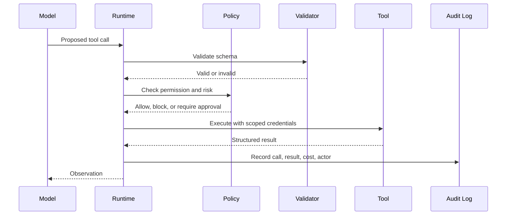

# Tool Calling and Integration

## Watch First

<div style={{position: 'relative', paddingBottom: '56.25%', height: 0, overflow: 'hidden', maxWidth: '100%', marginBottom: '1.5rem'}}>
  <iframe
    src="https://www.youtube.com/embed/VChRPFUzJGA"
    title="Model Context Protocol (MCP): The Key To Agentic AI"
    style={{position: 'absolute', top: 0, left: 0, width: '100%', height: '100%', border: 0}}
    allow="accelerometer; autoplay; clipboard-write; encrypted-media; gyroscope; picture-in-picture; web-share"
    referrerPolicy="strict-origin-when-cross-origin"
    allowFullScreen
  />
</div>

Watch for the integration problem: agents become useful when they can reach tools and data, but every new capability expands the blast radius.

## Learning Objectives

By the end of this lesson, you will be able to:

- Design tool interfaces that are narrow, typed, auditable, and recoverable.
- Explain the difference between tool description, tool selection, and tool execution.
- Apply idempotency, permissions, rate limits, and human approval to agent tools.
- Compare direct function calling, API adapters, and protocol-based integration such as MCP.
- Build a small tool registry with validation and audit logs.

## Tool Calling Map



A tool is a function the agent can ask the runtime to execute. The model should not execute tools directly. It proposes a call. The runtime validates and executes it.

That separation is what keeps authority in software instead of in a generated sentence.

## Anatomy of a Good Tool

| Part | Example | Why it matters |
| --- | --- | --- |
| Name | `create_calendar_hold` | Gives the model a clear action vocabulary |
| Description | "Create a tentative hold, not a confirmed meeting" | Prevents unsafe overuse |
| Input schema | `title`, `start_time`, `end_time`, `attendees` | Makes calls validateable |
| Output schema | `status`, `event_id`, `message` | Lets the model recover from results |
| Permissions | User calendar write scope | Limits blast radius |
| Idempotency key | `request_id + tool_name + normalized_args` | Makes retries safer |
| Audit fields | actor, time, args hash, result | Supports debugging and accountability |
| Risk level | read, write, external-send, destructive | Drives approval policy |

Weak tool:

```text
run_api_call(url, body)
```

Better tool:

```text
create_refund_case(order_id, reason, requested_by)
```

The second tool has domain meaning, a bounded action, and a smaller attack surface.

## Tool Design Principles

### Narrow Tools Beat Universal Tools

A general HTTP tool lets the agent do too much. Prefer domain-specific actions.

Bad:

- `execute_sql(query)`
- `send_http_request(method, url, body)`
- `run_shell(command)`

Better:

- `lookup_order(order_id)`
- `create_support_ticket(customer_id, category, summary)`
- `run_project_tests(test_selector)`

General tools can be useful for developer agents, but they need sandboxing, path restrictions, timeouts, and human review.

### Idempotency Makes Retries Safe

Agents retry. Networks fail. Models repeat themselves. A write tool should handle repeated calls.

For example, if the agent creates the same support ticket twice after a timeout, the tool should return the existing ticket when the idempotency key matches.

```math
idempotency\ key = hash(actor, tool, normalized\ arguments, task\ id)
```

This is not just backend polish. It prevents real duplicated actions.

### Return Structured Errors

Do not return a stack trace to the model. Return an error it can act on.

```json
{
  "ok": false,
  "error_code": "RATE_LIMITED",
  "message": "The calendar API rate limit was reached.",
  "retry_after_seconds": 60,
  "recoverable": true
}
```

The model can reason about this. The runtime can also enforce retry policy without model involvement.

### Separate Read, Write, Send, and Delete

Risk changes by action type:

| Action class | Example | Default policy |
| --- | --- | --- |
| Read | Search docs | Usually allow if user has access |
| Draft | Draft email | Allow, no external side effect |
| Write internal | Create ticket | Allow with audit or confirmation |
| Send external | Send email | Require confirmation for sensitive cases |
| Destructive | Delete file | Require approval or forbid |

Avoid a single tool that can perform all five classes.

## Integration Patterns

### Direct Function Calling

The application defines tools as functions and passes schemas to the model. This is the simplest pattern for a single application.

Use it when:

- tools live in your codebase,
- permissions are local,
- the agent has a small tool set,
- you need tight validation and test coverage.

### API Adapter

The runtime exposes business APIs as safer tool wrappers.

Use it when:

- the underlying API is too broad,
- you need custom auth or approval,
- you want stable names even if vendor APIs change.

### Protocol-Based Integration

Protocols such as Model Context Protocol create a standard way for AI applications to discover and use external tools and resources.

Use it when:

- many tools come from separate services,
- several clients need the same tools,
- tool discovery and interoperability matter,
- you can enforce auth, logging, and policy at the protocol boundary.

Protocol integration does not remove the need for authorization. A tool that is discoverable is not automatically safe.

## Runnable Example: Tool Registry With Policy

```python
from dataclasses import dataclass
from typing import Any, Callable, Literal

Risk = Literal["read", "write", "external_send", "destructive"]


@dataclass
class Tool:
    name: str
    description: str
    risk: Risk
    required_args: set[str]
    handler: Callable[[dict[str, Any]], dict[str, Any]]


def search_lessons(args: dict[str, Any]) -> dict[str, Any]:
    query = args["query"].lower()
    lessons = ["agent systems", "memory and state", "evaluating agents"]
    matches = [lesson for lesson in lessons if query in lesson]
    return {"ok": True, "matches": matches}


def create_ticket(args: dict[str, Any]) -> dict[str, Any]:
    return {
        "ok": True,
        "ticket_id": "TICKET-1001",
        "summary": args["summary"],
    }


TOOLS = {
    "search_lessons": Tool(
        name="search_lessons",
        description="Search published lesson titles.",
        risk="read",
        required_args={"query"},
        handler=search_lessons,
    ),
    "create_ticket": Tool(
        name="create_ticket",
        description="Create an internal support ticket.",
        risk="write",
        required_args={"summary", "priority"},
        handler=create_ticket,
    ),
}


def validate_args(tool: Tool, args: dict[str, Any]) -> None:
    missing = tool.required_args - set(args)
    if missing:
        raise ValueError(f"Missing required arguments: {sorted(missing)}")


def policy_allows(tool: Tool, user_role: str, approved: bool) -> bool:
    if tool.risk == "read":
        return True
    if tool.risk == "write" and user_role in {"mentor", "admin"}:
        return True
    if tool.risk in {"external_send", "destructive"}:
        return approved and user_role == "admin"
    return False


def call_tool(
    tool_name: str,
    args: dict[str, Any],
    *,
    user_role: str,
    approved: bool = False,
) -> dict[str, Any]:
    if tool_name not in TOOLS:
        return {"ok": False, "error_code": "UNKNOWN_TOOL"}

    tool = TOOLS[tool_name]
    validate_args(tool, args)

    if not policy_allows(tool, user_role, approved):
        return {"ok": False, "error_code": "POLICY_DENIED", "risk": tool.risk}

    result = tool.handler(args)
    audit = {
        "tool": tool_name,
        "risk": tool.risk,
        "user_role": user_role,
        "ok": result.get("ok", False),
    }
    print("AUDIT", audit)
    return result


print(call_tool("search_lessons", {"query": "agent"}, user_role="learner"))
print(call_tool("create_ticket", {"summary": "Broken quiz", "priority": "high"}, user_role="mentor"))
print(call_tool("create_ticket", {"summary": "Broken quiz", "priority": "high"}, user_role="learner"))
```

This example demonstrates a key production rule: the model may choose `create_ticket`, but the runtime decides whether that call is valid and allowed.

## Approval Design

Approval is not a modal slapped on top of risk. It needs to show the human what matters.

Good approval prompts include:

- the exact action,
- the target system,
- the data being sent or changed,
- the reason the agent chose the action,
- expected side effects,
- rollback option if one exists.

Example:

```text
Approve action?

Tool: send_email
To: ada@example.com
Subject: Revised project timeline
Agent reason: User asked to notify the project owner after updating the timeline.
Sensitive data: no credentials, no payment data
Rollback: not possible after send
```

## Security Considerations

Tool integration creates three major security problems:

- The model may choose the wrong tool.
- The tool may be called with unsafe arguments.
- Untrusted input may influence a tool call.

Practical defenses:

- validate schemas before execution,
- bind tools to user permissions,
- separate read/write/destructive tools,
- redact secrets before model calls,
- sandbox high-risk tools,
- require confirmation for external or destructive actions,
- log every call,
- test prompt injection cases against tool use.

## Flow Context

In Flow:

- Garden can act as a workspace-level tool registry.
- Jarvis can enforce tool execution boundaries.
- WorkStream can grant task-scoped temporary tools.
- Harnessy can evaluate whether the right tool was chosen with the right arguments.

Tool calling is where agent design becomes product design. Users do not care that the model generated valid JSON. They care whether the system took the right action with the right authority.

## Exercises

1. Define a tool schema for `send_workspace_message`. Include inputs, outputs, errors, and risk level.
2. Split a broad `manage_calendar` tool into at least four safer tools.
3. Write a policy table for read, write, external-send, and destructive tools.
4. Design an audit log row for a failed tool call.
5. Create three prompt injection test cases that try to make a tool act outside its scope.

## Self-Assessment

You are ready to move on when you can answer:

- Why should the model propose tool calls instead of executing them directly?
- What makes a tool idempotent?
- Which tool actions should require human approval?
- What belongs in a structured tool error?

## Further Reading

- [Model Context Protocol documentation](https://modelcontextprotocol.io/docs)
- [OpenAI: Function calling and tool use](https://platform.openai.com/docs/guides/function-calling)
- [Anthropic: Building effective agents](https://www.anthropic.com/engineering/building-effective-agents)
- [OWASP Top 10 for LLM Applications](https://owasp.org/www-project-top-10-for-large-language-model-applications/)
