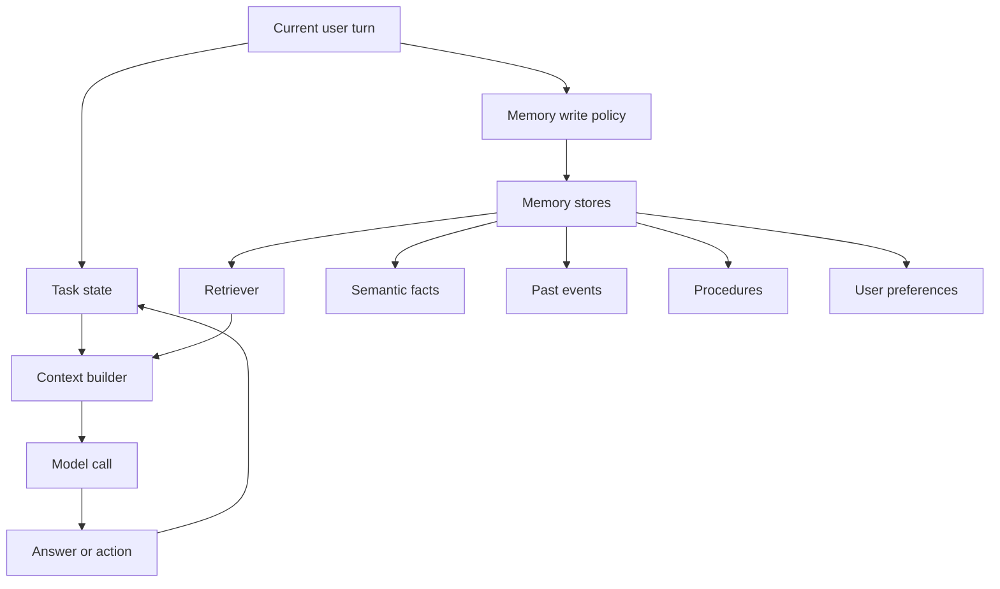
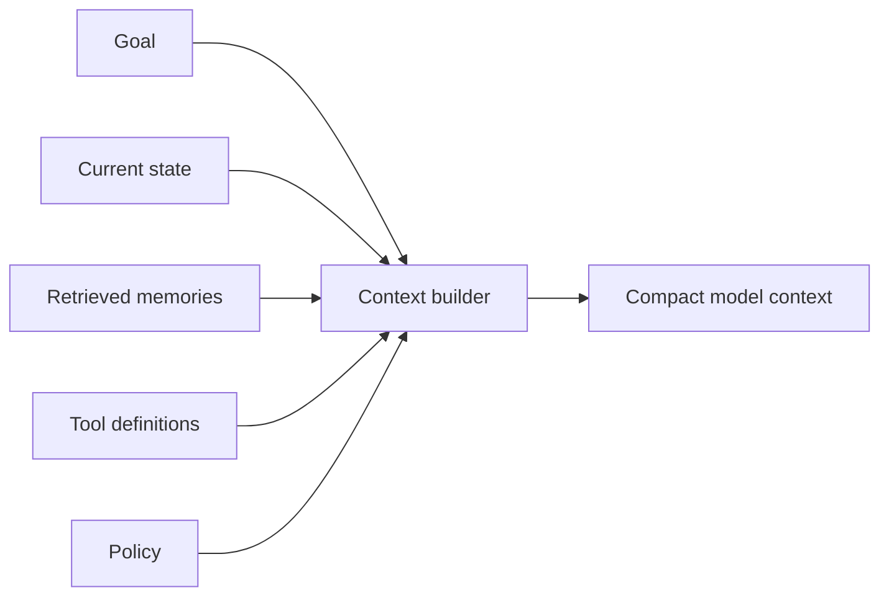
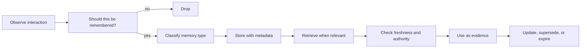

# Memory and State

## Watch First

<div style={{position: 'relative', paddingBottom: '56.25%', height: 0, overflow: 'hidden', maxWidth: '100%', marginBottom: '1.5rem'}}>
  <iframe
    src="https://www.youtube.com/embed/WsGVXiWzTpI"
    title="Build Hour: Agent Memory Patterns"
    style={{position: 'absolute', top: 0, left: 0, width: '100%', height: '100%', border: 0}}
    allow="accelerometer; autoplay; clipboard-write; encrypted-media; gyroscope; picture-in-picture; web-share"
    referrerPolicy="strict-origin-when-cross-origin"
    allowFullScreen
  />
</div>

Watch for the practical split between context engineering, short-term task state, and long-term memory. They solve different problems.

## Learning Objectives

By the end of this lesson, you will be able to:

- Separate operational state from long-term memory.
- Compare working, episodic, semantic, and procedural memory.
- Design a memory write policy that avoids stale, duplicated, and sensitive records.
- Choose between context windows, structured databases, vector search, summaries, and hybrid retrieval.
- Build a small memory store that retrieves relevant records with metadata and expiry.

## Memory Architecture



Memory is information the system may use later. State is information the system needs to complete the current task.

Do not mix them.

State examples:

- current task ID,
- selected tool,
- pending approval,
- retry count,
- partial plan,
- latest tool observation.

Memory examples:

- user prefers concise explanations,
- a workspace uses a specific deployment checklist,
- a past tool call failed because credentials were missing,
- a recurring workflow has a known procedure.

:::warning Important Distinction
State is usually authoritative and current. Memory is retrieved evidence that may be incomplete, stale, or wrong.
:::

## Types of Agent Memory

| Type | What it stores | Example | Storage fit |
| --- | --- | --- | --- |
| Working memory | Current task context | "The user approved step 2" | Runtime state, prompt context |
| Episodic memory | Events and outcomes | "On May 20, the import failed due to missing headers" | Append-only log, database |
| Semantic memory | Facts and preferences | "The team uses Postgres" | Structured DB plus search index |
| Procedural memory | How to do tasks | "Release checklist for docs" | Versioned docs, skills, playbooks |

Vector search is useful, but it is not a memory system by itself. It is a retrieval technique.

## Context Window Is Not Memory

The context window is the information included in one model call. It is temporary, expensive, and limited.

If you put too much into context:

- the model may ignore the important part,
- latency and cost rise,
- old details crowd out current instructions,
- sensitive data may be exposed unnecessarily.

The context builder should decide what to include:



The goal is not maximum context. The goal is sufficient, relevant, current context.

## Memory Lifecycle



A memory system needs write discipline. If every conversation turn becomes memory, retrieval quality drops.

Good memory records include:

- content,
- type,
- source,
- timestamp,
- owner or workspace,
- confidence,
- sensitivity,
- expiry or review date,
- supersedes or superseded-by link.

## Memory Write Policy

Use a write policy before storing memory.

Store memory when:

- the user explicitly asks the agent to remember something,
- the fact changes future behavior,
- the procedure will be reused,
- the event explains a future failure or preference,
- the information can be attributed to a source.

Do not store memory when:

- the content is a one-off detail,
- the fact is uncertain,
- the user has not consented to storing sensitive data,
- the same memory already exists,
- the information belongs in operational state only.

## Retrieval Strategy

Retrieval should combine filters and relevance.

Common filters:

- user ID,
- workspace ID,
- task type,
- memory type,
- freshness,
- permission,
- sensitivity.

Common ranking signals:

- semantic similarity,
- keyword match,
- recency,
- source authority,
- user confirmation,
- successful reuse in past tasks.

For production systems, hybrid retrieval usually beats a single method. Structured facts belong in structured stores. Semantic notes can use vector search. Task logs belong in event tables.

## Runnable Example: Simple Memory Store

This example uses token overlap instead of embeddings so it can run without external services. It still demonstrates metadata, expiry, and retrieval.

```python
from dataclasses import dataclass
from datetime import date
from typing import Literal

MemoryType = Literal["semantic", "episodic", "procedural", "preference"]


@dataclass
class Memory:
    id: str
    memory_type: MemoryType
    text: str
    source: str
    created_at: date
    expires_at: date | None = None
    confirmed: bool = False


def tokenize(text: str) -> set[str]:
    return {
        token.strip(".,:;!?").lower()
        for token in text.split()
        if len(token.strip(".,:;!?")) > 2
    }


def is_active(memory: Memory, today: date) -> bool:
    return memory.expires_at is None or memory.expires_at >= today


def score(query: str, memory: Memory, today: date) -> float:
    if not is_active(memory, today):
        return 0.0

    overlap = len(tokenize(query) & tokenize(memory.text))
    confirmation_bonus = 0.5 if memory.confirmed else 0.0
    procedural_bonus = 0.25 if memory.memory_type == "procedural" else 0.0
    return overlap + confirmation_bonus + procedural_bonus


def retrieve(query: str, memories: list[Memory], today: date, limit: int = 3) -> list[Memory]:
    ranked = sorted(
        memories,
        key=lambda memory: score(query, memory, today),
        reverse=True,
    )
    return [memory for memory in ranked if score(query, memory, today) > 0][:limit]


memories = [
    Memory(
        id="m1",
        memory_type="preference",
        text="Ada prefers concise explanations with code examples.",
        source="user_profile",
        created_at=date(2026, 5, 1),
        confirmed=True,
    ),
    Memory(
        id="m2",
        memory_type="procedural",
        text="Release notes must include migration steps, risk notes, and rollback instructions.",
        source="team_playbook",
        created_at=date(2026, 4, 20),
        confirmed=True,
    ),
    Memory(
        id="m3",
        memory_type="episodic",
        text="The docs build failed because a Mermaid label used unescaped angle brackets.",
        source="build_log",
        created_at=date(2026, 5, 14),
        expires_at=date(2026, 6, 14),
    ),
]

for memory in retrieve("write concise release notes with rollback", memories, date(2026, 6, 1)):
    print(memory.id, memory.memory_type, memory.text)
```

Real systems can replace the scoring function with vector search, BM25, reranking, or learned retrieval. The metadata discipline stays the same.

## Staleness and Conflict

Memory gets worse when old records compete with new facts.

Example:

- March memory: "The release owner is Mira."
- May memory: "The release owner is Chen."

If retrieval returns both, the agent may choose the wrong one. A memory system should support:

- update rather than append when a fact changes,
- `supersedes` links,
- freshness scoring,
- source authority,
- user confirmation for conflicts,
- expiry dates for operational facts.

When the agent is uncertain, it should ask:

```text
I have two conflicting memories about the release owner: Mira from March and Chen from May. Which one should I use?
```

That is better than silently guessing.

## Privacy and User Control

Memory can contain sensitive information. Design for user control early.

Required controls:

- show what the agent remembers,
- allow deletion,
- allow correction,
- avoid storing secrets,
- mark sensitive records,
- isolate memories by user and workspace,
- log memory reads and writes,
- support retention policy.

Sensitive memories should not be retrieved just because they are semantically similar. Permission and purpose must come first.

## Memory Evaluation

Evaluate memory with task-based tests, not just retrieval metrics.

Useful questions:

- Did the agent retrieve the right memory?
- Did it ignore stale or conflicting memory?
- Did it avoid using memory from another user or workspace?
- Did it ask for clarification when memory confidence was low?
- Did memory improve task success without leaking private data?

Useful metrics:

```math
precision@k = \frac{relevant\ memories\ retrieved}{total\ memories\ retrieved}
```

```math
memory\ usefulness = task\ success\ with\ memory - task\ success\ without\ memory
```

The second metric matters most. A memory system that retrieves plausible notes but does not improve outcomes is just cost.

## Flow Context

In Flow:

- Jarvis needs working state to pause and resume agent runs.
- Garden needs workspace memory with clear ownership and access controls.
- WorkStream needs episodic memory for task attempts, failures, and approvals.
- Harnessy needs memory-aware evals that catch stale, cross-user, and hallucinated memory use.

Memory should make agents more accountable, not more mysterious.

## Exercises

1. Design memory records for a Personal Operator. Include fields for type, source, owner, confidence, and expiry.
2. Decide which of these should be stored: a meeting preference, a one-time delivery address, a password, a failed tool call, a team release checklist.
3. Write a retrieval policy for "help me prepare the next release notes."
4. Create a conflict-resolution rule for two memories that disagree.
5. Design an eval that proves memory improves a task instead of just adding context.

## Self-Assessment

You are ready to move on when you can answer:

- What is the difference between state and memory?
- Why is vector search not enough for production memory?
- What metadata should every memory record carry?
- How should an agent handle stale or conflicting memory?

## Further Reading

- [OpenAI Cookbook: Context engineering and memory examples](https://cookbook.openai.com/)
- [LangGraph documentation: Memory](https://langchain-ai.github.io/langgraph/concepts/memory/)
- [CoALA: Cognitive Architectures for Language Agents](https://arxiv.org/abs/2309.02427)
- [Generative Agents: Interactive Simulacra of Human Behavior](https://arxiv.org/abs/2304.03442)
