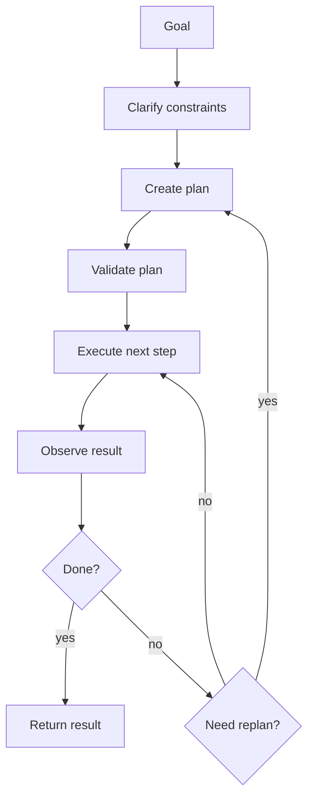
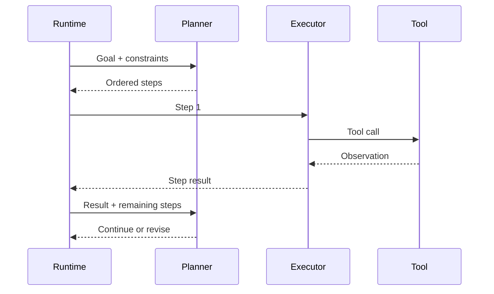
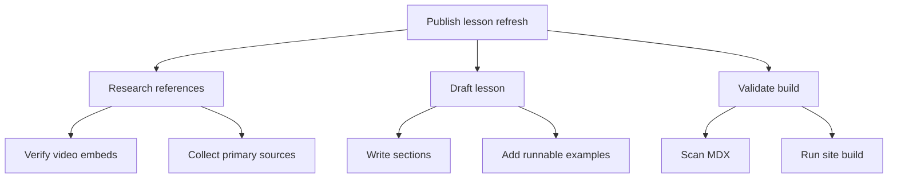

# Planning and Reasoning

## Watch First

<div style={{position: 'relative', paddingBottom: '56.25%', height: 0, overflow: 'hidden', maxWidth: '100%', marginBottom: '1.5rem'}}>
  <iframe
    src="https://www.youtube.com/embed/sal78ACtGTc"
    title="What's next for AI agentic workflows ft. Andrew Ng of AI Fund"
    style={{position: 'absolute', top: 0, left: 0, width: '100%', height: '100%', border: 0}}
    allow="accelerometer; autoplay; clipboard-write; encrypted-media; gyroscope; picture-in-picture; web-share"
    referrerPolicy="strict-origin-when-cross-origin"
    allowFullScreen
  />
</div>

Watch for the four recurring patterns: reflection, tool use, planning, and multi-agent collaboration. This lesson focuses on planning discipline and failure recovery.

## Learning Objectives

By the end of this lesson, you will be able to:

- Explain why agent planning is a control problem, not just a prompting trick.
- Compare single-shot plans, plan-and-execute, ReAct-style loops, reflection, and hierarchical planning.
- Design plans with observable steps, completion checks, and rollback points.
- Identify planning failures: impossible goals, vague substeps, bad tool choice, and no-progress loops.
- Build a small planner/executor that tracks state and recovers from failure.

## Planning Loop



Planning is how an agent turns a goal into steps. Reasoning is how it chooses between options, interprets observations, and adapts when the plan stops working.

The plan is not valuable because it sounds smart. It is valuable when it can guide execution and be checked.

:::tip Practical Rule
A good agent plan names the next action, the tool or evidence needed, the expected result, and the condition for moving on.
:::

## Planning Patterns

### Single-Shot Plan

The model writes the full plan upfront, then the runtime executes it.

Use it when:

- the task is low risk,
- steps are mostly known,
- the plan can be reviewed before action,
- execution does not depend heavily on unknown observations.

Risk: the plan may look complete but fail at step one.

### Plan-and-Execute

The system creates a plan, executes one step at a time, and updates state after each observation.



This is a strong default for work that needs traceability.

### ReAct-Style Loop

ReAct interleaves reasoning, acting, and observing. The model decides the next action after each observation.

Use it when:

- the environment is uncertain,
- tool results change the next step,
- the agent needs to search or inspect before deciding.

Risk: open-ended loops need strict budgets and no-progress detection.

### Reflection

Reflection asks the system to review an output, plan, or trace against criteria.

Good reflection is rubric-based:

- Did the answer use evidence?
- Did every tool call match the task?
- Is a required field missing?
- Is the conclusion supported?

Weak reflection is vague:

- "Make it better."
- "Check your work."

### Hierarchical Planning

Hierarchical planning decomposes a goal into subgoals.



Use it when a flat plan becomes too long to reason about.

## What Makes a Plan Executable?

| Weak step | Executable step |
| --- | --- |
| "Research the topic" | "Find two primary sources and record their URLs" |
| "Improve the code" | "Run tests, identify one failing assertion, patch the smallest responsible function" |
| "Make it safe" | "Add a policy check before `send_email` executes" |
| "Evaluate the agent" | "Run 20 labeled tasks and record task success, tool accuracy, and cost" |

Executable steps have:

- a verb,
- a target,
- a tool or method,
- an expected output,
- a completion check.

## Constraints and Budgets

Plans need boundaries.

Common budgets:

- maximum time,
- maximum tool calls,
- maximum tokens,
- maximum cost,
- maximum retries,
- maximum files changed,
- maximum external messages sent.

Common constraints:

- only use approved sources,
- do not change production data,
- ask before external sends,
- preserve user edits,
- cite evidence,
- stop when tests pass.

Without constraints, an agent may optimize the wrong thing.

## Runnable Example: Planner With Recovery

This example uses a deterministic planner and executor. The structure mirrors a real agent runtime.

```python
from dataclasses import dataclass, field
from typing import Literal

Status = Literal["pending", "done", "failed"]


@dataclass
class Step:
    id: str
    action: str
    expected: str
    status: Status = "pending"
    observation: str = ""


@dataclass
class Plan:
    goal: str
    steps: list[Step] = field(default_factory=list)
    retries: int = 0


def make_plan(goal: str) -> Plan:
    return Plan(
        goal=goal,
        steps=[
            Step("s1", "search_sources", "at least two relevant sources"),
            Step("s2", "draft_summary", "summary includes source evidence"),
            Step("s3", "check_quality", "summary passes rubric"),
        ],
    )


def execute(step: Step) -> Step:
    if step.action == "search_sources":
        step.status = "done"
        step.observation = "Found one source."
    elif step.action == "draft_summary":
        step.status = "failed"
        step.observation = "Cannot draft: not enough sources."
    elif step.action == "search_more_sources":
        step.status = "done"
        step.observation = "Found two more sources."
    elif step.action == "check_quality":
        step.status = "done"
        step.observation = "Rubric passed."
    return step


def should_replan(plan: Plan) -> bool:
    return any(step.status == "failed" for step in plan.steps)


def replan(plan: Plan) -> None:
    plan.retries += 1
    for index, step in enumerate(plan.steps):
        if step.status == "failed" and step.action == "draft_summary":
            plan.steps.insert(
                index,
                Step("s1b", "search_more_sources", "at least three total sources"),
            )
            step.status = "pending"
            step.observation = "Reset after adding source search."
            return


plan = make_plan("Write a sourced summary of agent memory.")

while any(step.status == "pending" for step in plan.steps):
    if plan.retries > 2:
        print("Escalate: too many replans")
        break

    next_step = next(step for step in plan.steps if step.status == "pending")
    execute(next_step)
    print(next_step.id, next_step.action, next_step.status, next_step.observation)

    if should_replan(plan):
        replan(plan)

print("Final plan:")
for step in plan.steps:
    print(step.id, step.action, step.status)
```

The executor does not pretend every failure is recoverable. It checks the plan, adds a missing step, and caps retries.

## Reasoning Outputs: What to Store

Do not require the model to expose long private reasoning to users. For engineering, store concise, inspectable rationales and decisions:

- selected action,
- evidence used,
- rejected alternatives when relevant,
- confidence,
- policy checks,
- reason for escalation.

Good trace entry:

```json
{
  "step": "s2",
  "action": "search_docs",
  "reason": "The task requires current setup instructions before writing an answer.",
  "tool_args": {"query": "agent memory retention policy"},
  "observation": "3 documents returned",
  "next": "summarize evidence"
}
```

This is enough to debug behavior without turning the trace into a wall of unverifiable prose.

## Failure Recovery

| Failure | Signal | Recovery |
| --- | --- | --- |
| Impossible goal | Required tool or data unavailable | Ask user, narrow scope, or stop |
| Vague plan | Steps cannot be executed | Rewrite steps with outputs and checks |
| Bad tool choice | Tool result irrelevant | Re-route or add tool-selection eval |
| Loop | Same action repeated | Stop and summarize blocker |
| Stale observation | Retrieved data conflicts | verify source or ask user |
| Unsafe action | Policy denies step | Escalate or choose safe alternative |

Planning quality is visible in recovery. A plan that only works on the happy path is not robust.

## Multi-Agent Planning

Multiple agents can help when roles are genuinely different:

- researcher gathers evidence,
- planner decomposes work,
- executor calls tools,
- reviewer evaluates output,
- safety monitor checks policy.

Do not split into multiple agents just to make the architecture look advanced. Multi-agent systems add routing, state transfer, duplicated context, and harder debugging.

Use multiple agents when specialization improves measurement or safety.

## Evaluating Plans

Evaluate plans before and after execution.

Before execution:

- Are steps actionable?
- Are required tools available?
- Are risk gates identified?
- Is there a stopping condition?

After execution:

- Did the plan achieve the goal?
- How many steps were wasted?
- Did the agent recover from failed observations?
- Did any step violate policy?

Useful metric:

```math
step\ efficiency = \frac{minimum\ necessary\ steps}{actual\ executed\ steps}
```

Efficiency should never be the only metric. A short unsafe plan is worse than a longer safe one.

## Flow Context

In Flow:

- WorkStream needs plans that can be assigned, paused, resumed, and reviewed.
- Jarvis needs reasoning traces that explain why a tool was selected.
- Garden needs collaborative plans that humans can edit.
- Harnessy needs trajectory evals for plan quality, recovery, and safety.

Planning is where agent systems become operational. A good plan can be inspected by humans and executed by software.

## Exercises

1. Turn this vague goal into executable steps: "Improve the onboarding docs."
2. Add budgets and constraints to the plan.
3. Write a recovery rule for a failed search step.
4. Design a reflection rubric with five pass/fail checks.
5. Decide whether the task should use one agent or multiple roles. Explain why.

## Self-Assessment

You are ready to move on when you can answer:

- What makes a plan executable?
- How is ReAct different from a fixed prompt chain?
- Why do planning loops need budgets?
- What should a planner do when a required tool is unavailable?

## Further Reading

- [ReAct: Synergizing Reasoning and Acting in Language Models](https://arxiv.org/abs/2210.03629)
- [Tree of Thoughts: Deliberate Problem Solving with Large Language Models](https://arxiv.org/abs/2305.10601)
- [Reflexion: Language Agents with Verbal Reinforcement Learning](https://arxiv.org/abs/2303.11366)
- [Anthropic: Building effective agents](https://www.anthropic.com/engineering/building-effective-agents)
