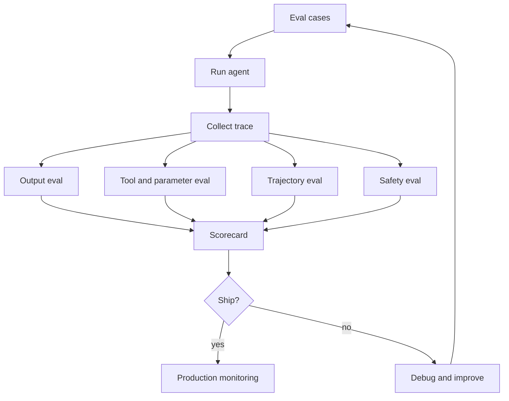

# Evaluating Agents

## Watch First

<div style={{position: 'relative', paddingBottom: '56.25%', height: 0, overflow: 'hidden', maxWidth: '100%', marginBottom: '1.5rem'}}>
  <iframe
    src="https://www.youtube.com/embed/Xfl50508LZM"
    title="Ship Real Agents: Hands-On Evals for Agentic Applications"
    style={{position: 'absolute', top: 0, left: 0, width: '100%', height: '100%', border: 0}}
    allow="accelerometer; autoplay; clipboard-write; encrypted-media; gyroscope; picture-in-picture; web-share"
    referrerPolicy="strict-origin-when-cross-origin"
    allowFullScreen
  />
</div>

Watch for the shift from manual demos to eval suites. Agents need outcome checks and trajectory checks because the path can fail even when the final answer sounds plausible.

## Learning Objectives

By the end of this lesson, you will be able to:

- Explain why evaluating agents is different from evaluating single model responses.
- Design output, component, trajectory, safety, and production-monitoring evals.
- Build a small golden dataset with deterministic and judge-based checks.
- Choose metrics for task success, tool accuracy, cost, latency, safety, and recovery.
- Use eval results to make release decisions instead of relying on demos.

## Evaluation Map



Agent evaluation measures whether an agent reliably completes tasks within constraints. It must inspect the final result and the sequence of decisions that produced it.

Traditional software tests ask: did this function return the expected value?

Agent evals ask:

- Did the agent understand the goal?
- Did it choose the right tools?
- Did it pass the right arguments?
- Did it use relevant context?
- Did it recover from errors?
- Did it avoid prohibited actions?
- Did it finish within cost and latency budgets?
- Did the final output satisfy the user need?

## What to Evaluate

| Layer | Question | Example check |
| --- | --- | --- |
| Output | Is the final answer correct and useful? | Rubric, exact match, citation check |
| Router | Did the agent choose the right route? | Labeled intent dataset |
| Tool selection | Did it choose the right tool? | Expected tool name |
| Tool parameters | Were arguments valid and safe? | Schema and value checks |
| Retrieval | Did it use relevant context? | Precision@k, source coverage |
| Trajectory | Was the action path efficient and logical? | Trace judge or path rules |
| Safety | Did it avoid prohibited behavior? | Adversarial test suite |
| Runtime | Did it respect budgets? | Cost, tokens, latency, step count |
| Recovery | Did it handle failures? | Timeout and malformed-result cases |

The best eval suite mixes deterministic checks, model-based judges, and human review.

## Start With a Task Definition

Weak:

```text
Evaluate the support agent.
```

Better:

```text
The support agent succeeds when it classifies a learner request, retrieves the relevant lesson source, answers with grounded guidance, and escalates account or safety issues without inventing policy.
```

This definition tells you what to test.

## Golden Datasets

A golden dataset is a set of inputs with expected behavior.

Include:

- common cases,
- edge cases,
- adversarial cases,
- tool failures,
- missing data,
- ambiguous requests,
- safety-sensitive requests.

Small, high-quality datasets beat huge vague datasets. A 30-case eval that captures real failures is more useful than 1,000 generic prompts.

Example row:

```json
{
  "id": "support-014",
  "input": "I cannot access the memory lesson exercise.",
  "expected_route": "lesson_help",
  "expected_tools": ["search_lessons"],
  "must_include": ["Memory and State"],
  "must_not_include": ["billing"],
  "risk": "low"
}
```

## Deterministic Evals

Use deterministic checks when success can be expressed in code.

Good fits:

- JSON schema validity,
- required fields,
- tool name,
- argument range,
- forbidden phrase,
- citation count,
- latency threshold,
- no external send occurred.

Deterministic checks are fast, cheap, and stable. Use them wherever possible.

## LLM-as-a-Judge Evals

Use a judge model when the property is semantic:

- helpfulness,
- faithfulness to source,
- answer completeness,
- tone,
- relevance,
- whether a multi-step trajectory makes sense.

Judge prompts need rubrics and labels, not vibes.

Weak:

```text
Is this good?
```

Better:

```text
Classify the answer as pass or fail.

Pass if:
- every factual claim is supported by the provided sources,
- the answer directly addresses the user's request,
- the answer does not invent account or billing policy.

Fail otherwise. Return only: pass or fail.
```

Judge models must be evaluated too. Compare judge decisions against human-labeled examples before trusting the scores.

## Trajectory Evals

Trajectory evals inspect the path.

Example trace:

```json
[
  {"step": 1, "tool": "classify_request", "args": {"text": "..."}},
  {"step": 2, "tool": "search_lessons", "args": {"query": "memory lesson exercise"}},
  {"step": 3, "tool": "draft_answer", "args": {"sources": ["memory-and-state"]}}
]
```

Trajectory failures include:

- correct answer after wrong tool,
- unnecessary repeated calls,
- skipped retrieval,
- unsafe tool before approval,
- action based on stale memory,
- no escalation when confidence is low.

For agents, path quality is product quality. The path determines cost, latency, safety, and debuggability.

## Runnable Example: Small Eval Harness

This example evaluates a toy agent with deterministic checks.

```python
from dataclasses import dataclass


@dataclass
class EvalCase:
    id: str
    user_input: str
    expected_route: str
    expected_tool: str
    must_include: str


@dataclass
class AgentRun:
    route: str
    tools: list[str]
    answer: str
    cost_cents: float


def toy_agent(user_input: str) -> AgentRun:
    text = user_input.lower()
    if "billing" in text or "invoice" in text:
        return AgentRun("account_help", ["create_ticket"], "I created an account support ticket.", 0.2)
    if "memory" in text:
        return AgentRun("lesson_help", ["search_lessons"], "The Memory and State lesson explains memory records.", 0.3)
    return AgentRun("unknown", [], "I need one more detail to route this.", 0.1)


def evaluate(case: EvalCase) -> dict[str, object]:
    run = toy_agent(case.user_input)
    checks = {
        "route": run.route == case.expected_route,
        "tool": case.expected_tool in run.tools,
        "content": case.must_include.lower() in run.answer.lower(),
        "cost": run.cost_cents <= 1.0,
    }
    return {
        "case_id": case.id,
        "passed": all(checks.values()),
        "checks": checks,
        "run": run,
    }


cases = [
    EvalCase(
        id="lesson-001",
        user_input="I need help with the memory exercise.",
        expected_route="lesson_help",
        expected_tool="search_lessons",
        must_include="Memory and State",
    ),
    EvalCase(
        id="account-001",
        user_input="I need a billing invoice.",
        expected_route="account_help",
        expected_tool="create_ticket",
        must_include="ticket",
    ),
]

results = [evaluate(case) for case in cases]
pass_rate = sum(result["passed"] for result in results) / len(results)

for result in results:
    print(result["case_id"], result["passed"], result["checks"])

print("pass_rate", pass_rate)
```

Real eval harnesses add model calls, traces, datasets, screenshots, tool mocks, and CI integration. The core loop is the same:

1. Load cases.
2. Run agent.
3. Score output and trace.
4. Store results.
5. Compare against release thresholds.

## Metrics

Useful agent metrics:

```math
task\ success\ rate = \frac{successful\ tasks}{total\ tasks}
```

```math
tool\ accuracy = \frac{correct\ tool\ calls}{total\ tool\ calls}
```

```math
escalation\ precision = \frac{correct\ escalations}{all\ escalations}
```

```math
unsafe\ action\ rate = \frac{prohibited\ actions\ executed}{prohibited\ action\ attempts}
```

Also track:

- median and p95 latency,
- token cost per successful task,
- step count,
- retry count,
- no-progress stops,
- human override rate,
- user correction rate,
- regressions by prompt or model version.

## Release Gates

Define thresholds before running evals.

Example:

| Metric | Release threshold |
| --- | --- |
| Task success | At least 90 percent on golden set |
| Tool selection accuracy | At least 95 percent |
| Unsafe action rate | 0 percent |
| Citation requirement | At least 98 percent |
| p95 latency | Under 8 seconds |
| Cost per successful task | Under target budget |
| No-progress loops | 0 unresolved loops |

Do not average away safety failures. A 98 percent overall score can hide one unacceptable action.

## Debugging With Evals

When an eval fails, classify the failure:

- bad instruction,
- missing context,
- wrong route,
- wrong tool,
- bad tool parameter,
- tool failure,
- stale memory,
- unsafe policy decision,
- poor final synthesis,
- judge error.

Then change one thing at a time:

- prompt,
- model,
- retrieval,
- tool description,
- schema,
- policy,
- memory write rule,
- fallback behavior.

Rerun the same eval set after each change. Otherwise, you will not know what improved the system.

## Production Monitoring

Offline evals are necessary but incomplete. Production has new users, new phrasing, changed APIs, and unexpected data.

Monitor:

- sampled traces,
- policy denials,
- tool errors,
- latency,
- cost,
- user feedback,
- escalation outcomes,
- drift in route distribution,
- new prompt injection attempts.

Turn production failures into new eval cases. That is how the suite becomes more valuable over time.

## Flow Context

Harnessy is Flow's evaluation layer. It should evaluate:

- final artifacts,
- route decisions,
- tool calls,
- memory use,
- safety boundaries,
- human approval behavior,
- WorkStream completion criteria.

Good evals make agent work legible. They let contributors improve the system without guessing whether a change helped.

## Exercises

1. Create five eval cases for an agent that answers questions about a codebase.
2. Add expected route, expected tool, must-include, and must-not-include fields to each case.
3. Write one deterministic check and one LLM-as-a-judge rubric.
4. Define release thresholds for task success, tool accuracy, latency, and unsafe action rate.
5. Take one hypothetical failure and classify its root cause.

## Self-Assessment

You are ready to move on when you can answer:

- Why is final-answer evaluation insufficient for agents?
- When should you use deterministic checks instead of a judge model?
- What is a trajectory eval?
- How should production failures feed back into the eval suite?

## Further Reading

- [DeepLearning.AI: Evaluating AI Agents](https://www.deeplearning.ai/courses/evaluating-ai-agents)
- [Arize: Agent observability and tracing](https://arize.com/ai-agents/agent-observability/)
- [OpenAI Evals repository](https://github.com/openai/evals)
- [AgentBench: Evaluating LLMs as Agents](https://arxiv.org/abs/2308.03688)
